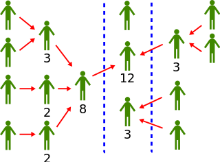

# Vote du TAO


TAO est actuellement dans le processus de proposition, et la présentation sera soumise au vote des détenteurs de jetons à l'automne..


## Le Commencement...

Au départ, Aragon était géré de manière centralisée par ses fondateurs, Luis Cuende et Jorge Izquierdo. Avec un leadership issu de milliers d'heures d'investissement en actions de sueur, ils ont délégué le travail directement aux employés qui ont concrétisé la vision centrale du leadership dans une "méthode en cascade" de gouvernance.

Au fil du temps, Aragon a adopté une stratégie de vote par jeton qui permet aux détenteurs de jetons de voter sur les décisions de l'entreprise. Les détenteurs de jetons votent selon une approche de démocratie pondérée dans laquelle 50 jetons équivalent à 50 votes, 500 jetons équivalent à 500 votes, etc. Cette méthode a permis de créer des opportunités uniques pour que de nouvelles idées entrent dans l'écosystème, mais dans la pratique, l'un des plus grands dilemmes a été l'engagement. Peut-être une évolution du paradoxe du vote abordé il y a plus de 200 ans par le pionnier de la gouvernance Nicolas de Condorcet, Aragon (et de nombreuses autres DAO) a redécouvert que pour la plupart des gens, le coût d'un vote judicieux dépasse la valeur des résultats.

## Le Transfert des fonds Aragon...

Pour mettre les choses au point, en mai 2022, Aragon a voté pour "transférer les fonds du projet Aragon vers une DAO Aragon gouvernée par un ANT (délégué)." Cette décision implique de déplacer des centaines de millions de dollars d'un système de gouvernance à un autre sur la blockchain Ethereum. Il s'agit d'une "grosse affaire" et d'une opportunité spectaculaire d'assister et de participer à un processus de gouvernance qui n'aurait jamais été possible sans l'accès à la suite d'outils blockchain maintenant disponibles.  Et pourtant, seuls 46 des [13 000 portefeuilles détenteurs de jetons ont voté](https://etherscan.io/token/0xa117000000f279d81a1d3cc75430faa017fa5a2e), ce qui représente moins de 4 % du total des jetons émis. Dans le secteur, on dit souvent que ce n'est "pas idéal".™

Nous ne sommes pas du tout seuls dans notre effort pour augmenter l'engagement et améliorer les résultats. Dans de nombreuses DAO, les taux de participation aux votes se situent dans une fourchette de 1 à 3 %, et obtenir un taux d'engagement de 5 à 10 % est presque impossible. L'un des avantages passionnants des mécanismes de vote numérique est qu'ils nous permettent d'explorer de nouvelles approches que les produits traditionnels, papier et crayon, ne pourraient jamais envisager sérieusement. &#x20;

[La démocratie liquide](https://en.wikipedia.org/wiki/Liquid\_democracy) est l'un de ces systèmes qui a été mis en avant au cours des deux dernières décennies par des groupes tels que le [Parti pirate allemand](https://en.wikipedia.org/wiki/Pirate\_Party\_Germany) dans le but d'accroître l'engagement en permettant aux utilisateurs de déléguer temporairement leur pouvoir de vote à d'autres utilisateurs et d'inciter ou de contraindre ceux qui ont reçu une délégation de pouvoir à agir en conséquence, brisant ainsi le paradoxe.&#x20;

> L'image ci-dessous montre un exemple de vote démocratique délégué où plusieurs niveaux de délégation se produisent. Par exemple, deux électeurs délèguent leurs votes à un troisième électeur, puis cet électeur délègue les trois votes qu'il contrôle à un autre délégué qui finit par voter pour une décision ou un candidat...

<figure><figcaption>
Un exemple de vote démocratique délégué
</figcaption></figure>

En 2021, l'équipe [Token Engineering Commons](https://tecommons.org/) a publié un tableau de bord de configuration https://config.tecommons.org/config/1 pour soutenir son travail sur le [vote par conviction](https://medium.com/giveth/conviction-voting-a-novel-continuous-decision-making-alternative-to-governance-aa746cfb9475), un mécanisme expérimental qui exploite certaines des possibilités techniques dérivées des outils de vote entièrement numériques tels qu'Aragon. L'équipe a organisé une série de "Param Parties" qui ont débouché sur le lancement d'un jeton communautaire.

Avec le vote pour financer la gouvernance décentralisée ([Approuver 72k pour financer la gouvernance décentralisée S1 (dGov) du 1er mai au 31 août 2022.](https://voice.aragon.org/processes/#/0x21b2ea5345d2e0c941dd44ff4c43fc4683088b846ddb3234d1690b0000000008)) l'équipe dGov a travaillé sur une variété de propositions, y compris la décision de travailler avec Blossom labs, General Magic pour reprendre le travail qu'ils avaient fait pour TECommons et fournir un produit et un processus similaire à celui de la communauté Aragon. Le financement et la surveillance ont été assurés par le sous-DAO exécutif, la communication et les notes budgétaires ayant lieu sur le [forum](https://forum.aragon.org/t/financial-proposal-demoing-a-tao-voting-dao/3622).

[Le vote Tao](https://token-engineering-commons.gitbook.io/tec-handbook/governance/voting-tools-and-methods/tao-voting) est une variation de la démocratie liquide développée par le Token Engineering Commons avec un ensemble limité de paramètres :

* [Soutien requis](https://forum.aragon.org/t/tao-voting-support-required/3663) - quel est le soutien total requis pour qu'une proposition soit adoptée ?&#x20;
* [Quorum minimum](https://forum.aragon.org/t/tao-voting-minimum-quorum/3664) - pourcentage minimum de soutien symbolique requis.&#x20;
* [Durée du vote](https://forum.aragon.org/t/tao-voting-vote-duration/3665) - durée du vote (généralement en jours) d'une proposition.&#x20;
* [Délai d'exécution](https://forum.aragon.org/t/tao-voting-execution-delay/3668) - délai d'exécution après l'adoption d'une proposition.&#x20;
* [Vote délégué](https://forum.aragon.org/t/tao-voting-delegated-voting-period/3666) - il s'agit de la période de temps, pendant la durée du vote, pendant laquelle les délégués peuvent exprimer les votes qui leur ont été attribués. Lorsque cette période prend fin, les délégués ne peuvent plus voter.&#x20;
* [Fin silencieuse](https://forum.aragon.org/t/tao-voting-quiet-ending-period-and-quiet-ending-extension/3667) - vérifie si les résultats sont inversés pendant la dernière partie de la durée du scrutin et ajoute du temps de vote en cas d'inversion.&#x20;
* [Dépôt de proposition et de défi](https://forum.aragon.org/t/deposit-and-challenge-deposit/3669) - un montant fixe de fonds utilisé comme garantie requise pour créer une proposition.&#x20;
* [Période de règlement](https://forum.aragon.org/t/settlement-period/3670) - si une personne estime qu'une certaine proposition est malveillante, contient une erreur ou n'est pas conforme au pacte communautaire, elle peut [contester la proposition.](https://forum.1hive.org/t/disputable-honey-pot-celeste-and-agreement-user-process/1343)

> En utilisant un tableau de bord (image ci-dessous) avec quelques paramètres à l'écran, nous allons **engager** la communauté dans une discussion sur les valeurs et les risques associés au **processus délégué**. Ce tableau de bord est lié à des discussions sur chaque paramètre et sert à nous aider à façonner la structure de gouvernance de notre DAO à l'avenir.

<figure><figcaption>
Le tableau de bord avec quelques paramètres sur l'écran utilisé pour faire participer la communauté.
</figcaption></figure>

Bien que ces paramètres ne prétendent pas englober toute l'étendue des possibilités de la démocratie liquide, ils nous donnent un point de départ pour explorer les opportunités, les risques, les succès et les échecs. Nous espérons que vous travaillerez avec nous pour faire la lumière sur ces idées et poursuivre cette recherche vivante en cours.

Il existe des centaines d'excellents articles sur le sujet et en voici quelques-uns :

* [The Convergence of Iterative Delegations in Liquid Democracy in a Social Network -](https://arxiv.org/pdf/1904.05775.pdf)
* [https://en.wikipedia.org/wiki/Liquid\_democracy](https://en.wikipedia.org/wiki/Liquid\_democracy)

> <mark style="color:purple;">**Vous avez une question ? Laissez vos commentaires ici sur notre forum**</mark>** 👇**


