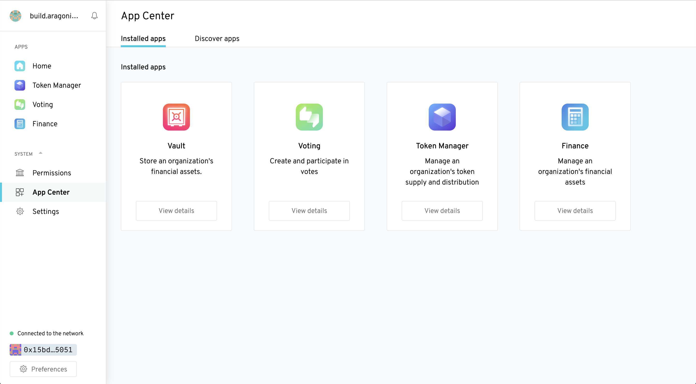

# App Center

The Aragon client includes an App Center where **users can manage** their currently **installed apps** and **discover new ones**.

<figure><figcaption></figcaption></figure>

As of **Aragon 0.7 Bella**, the App Center only allows users to **view and manage upgrades for already installed applications**. However, enabling app installations from inside the client is an ongoing research effort and is planned in the roadmap. In the meantime, you can use the CLI to install new applications or instances into your organization ([see guide](../guides/custom-deploy.md)).

The App Center also currently exposes a heavily curated selection of available or upcoming applications in its "Discover" tab. To submit an application into the "Discover" tab, please follow the steps in [Submitting Your App to the App Center](submitting-your-app-to-the-app-center.md).

> <mark style="color:purple;">**Do you have a question? Leave your comments here at our Discourse forum**</mark>** 👇**


