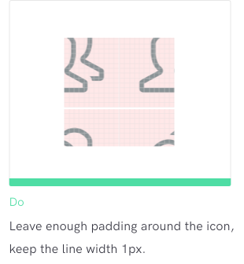
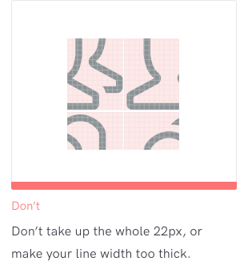
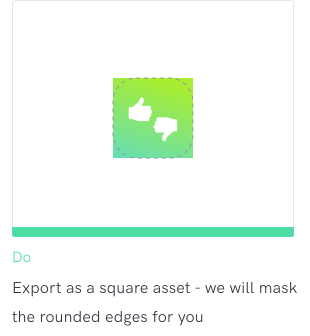
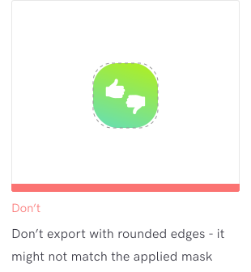
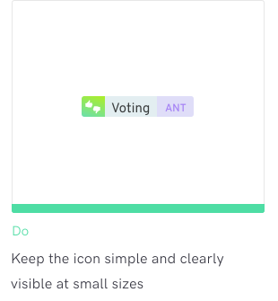
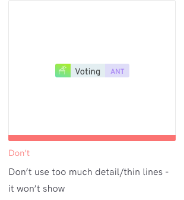
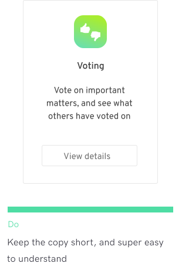
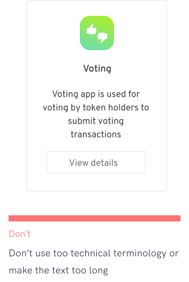

# Preparing Assets

## Preparing Assets for App Publishing

Before you publish your Aragon app, you will need to prepare a few types of assets in order for the Aragon client to display it correctly and differentiate it from other apps.

The main assets are:

* App menu icon (SVG)
* Large app icon (SVG or PNG)
* App badge icon (SVG or PNG)
* Screenshots (PNG)
* Short description (text only)
* Long description (Markdown or text)

\
In the next sections, we will describe the requirements for each asset one by one. Templates are also provided to help you prepare everything.


If you are looking for a design tool you could use [Figma](https://www.figma.com/) or [Canva](https://www.canva.com/en\_gb/) among other options


## Icons 

### Menu icon 

This icon is used on the left-hand app navigation panel of the Aragon client.\
\
:white\_check\_mark: **Size** of the icon, including padding, is **22x22 px**. The padding should be at least 3px or more on each side, depending on the icon shape

:white\_check\_mark: **Color** of the icon should be **#888888** so that the Aragon client can automatically colorize the icon in different app states

:white\_check\_mark: **Line width** of the icon shape should be 1px so your app icon will look consistent with others. Sticking to the pixel grid is also recommended for sharp rendering

:white\_check\_mark: Export to **SVG** for App Center submissions \

<figure><figcaption></figcaption></figure>

 

<figure><figcaption></figcaption></figure>

### Large app icon 

The large app icon will be displayed in the Aragon client's App Center, and unique icons will help users to visually differentiate between apps. The large app icons may be displayed in various sizes, so you should target at least 192x192px when designing the icon.\
\
:white\_check\_mark: Try to have some visual similarity to the App menu icon - otherwise users may be confused after installing the app

:white\_check\_mark: The core Aragon apps (Finance, Token Manager, and Voting) have a **gradient background** and a **white cutout shape** - but it’s up to you to choose the branding and style for your app icon

:white\_check\_mark: Export to **SVG** or high res (192x192px) **PNG** for App Center submissions

:white\_check\_mark: The exported icon should be **square**. The Aragon client will automatically apply a mask with rounded edges

&#x20;

### App badge icons 

The app badge icon can be used in the UI whenever the app is referenced in other apps. The badge is a default aragonUI component, and has some neat extra features, like being able to view the contract address and version of an app quickly.\
\
:white\_check\_mark: This should be visually the same icon as the Large app icon. However, if your Large app icon has a lot of detail, you may want to reduce the level of detail for the app badge icon as it’s smaller

:white\_check\_mark: Export to **SVG** or high res (48x48px) **PNG** for App Center submissions

:white\_check\_mark: The exported icon should be **square**. The Aragon client will automatically apply a mask with rounded edges

&#x20;

## Screenshots 

The screenshots will be shown in your app's expanded App Center page, to show users a preview of your app before deciding to install it.\
\
:white\_check\_mark: Include 2-8 main screens of your app - so it’s easy to see what it does

:white\_check\_mark: You can include both desktop and mobile (portrait) screenshots

:white\_check\_mark: Desktop (landscape) screenshots should be 16:10 aspect ratio, minimum resolution **2560 px × 1600 px** (they will be automatically resized)

:white\_check\_mark: Mobile (portrait) screenshots should be 9:16 aspect ratio, minimum resolution **1080 px x 1920 px** (they will be automatically resized)

:white\_check\_mark: Export to **PNG** for App Center submissions

## App description 

The description of your app is very important for users to quickly understand what it does. The App Center can render two descriptions: a short preview and a longer, detailed description.

### **Short description**

This is shown on your app's card in the App Center - it will be the first impression of your app, so make it count!\
\
:white\_check\_mark: Maximum 3 lines of text, max character count 60

:white\_check\_mark: Keep it very easy to understand at a glance

:white\_check\_mark: Don’t repeat the app name in the short description

&#x20;

### **Long description**

The long description will be shown in your app's expanded App Center page. We recommend using a concise, informative paragraph followed by a short list of main features. Potential users will likely skim through this, so make it easy to digest.\
\
:white\_check\_mark: Maximum character count 400

:white\_check\_mark: Ideally a short paragraph about the main app function, then a list of features

:white\_check\_mark: Keep it simple to understand for all types of users

:white\_check\_mark: You can use Markdown for rich text

