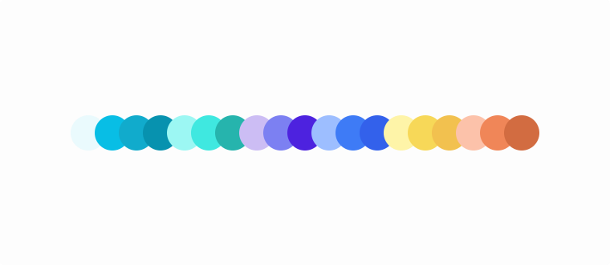
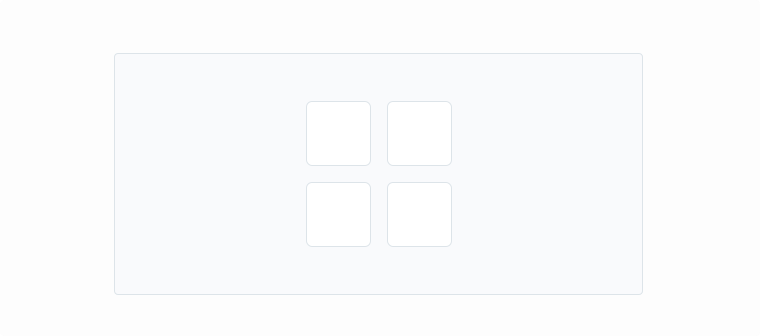
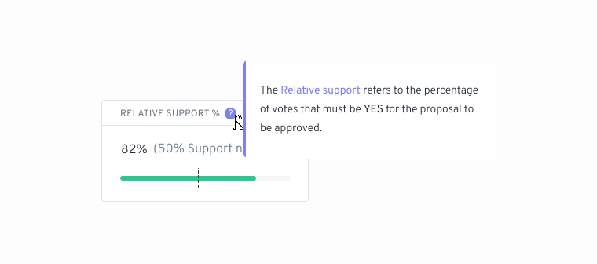
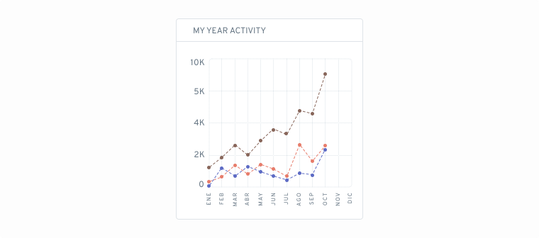

# Color

## Colors 

These principles are the framework upon which we have built our system for how color is used in Aragon.

<figure><figcaption></figcaption></figure>

* **Precision:** We defined a small number of primary colors for core interactions (and task-based contexts) and a sufficient number of secondary colors to create more ascetic / decorative illustrations, app icons and graphs.
* **Accessible:** We should never use color alone to convey information. Provide sufficient contrast between the elements and meet the minimum accessibility guidelines to better serve color blind or people with low vision.
* **Focus:** We should use color purposefully to help focus users’ attention with the task at hand. Colors convey meaning and complement the content hierarchy following a clear rationale.
* **Clarity:** Developers and designers should be able to easily refer to particular colors defined in the system. Color names are easily understood, memorable, and spark meaningful conversations between designers and developers (shades changes, contrast corrections, etc.).
* **Consistent:** Color should be applied throughout a UI consistently and celebrate the brand it represents.\

## Color naming conventions 

There are two common approaches when it comes to name color names: Declarative or natural color names and semantic or abstract color names. We’ve combined both approaches to create a more flexible and theme-able design system.

## Aragon Colors 

<figure><figcaption></figcaption></figure>

**Grey scale**

<figure><figcaption></figcaption></figure>

**Primary colors**

<figure><figcaption></figcaption></figure>

**Secondary colors**&#x20;

<figure><figcaption></figcaption></figure>

<figure><figcaption></figcaption></figure>

<figure><figcaption></figcaption></figure>

<figure><figcaption></figcaption></figure>

<figure><figcaption></figcaption></figure>

<figure><figcaption></figcaption></figure>

<figure><figcaption></figcaption></figure>

<figure><figcaption></figcaption></figure>

**Functional colors**&#x20;

<figure><figcaption></figcaption></figure>

<figure><figcaption></figcaption></figure>

<figure><figcaption></figcaption></figure>

## Usage 

The Aragon Gradient (AragonBlue + AragonTurquoise) is used to convey the most relevant action on the page as well as statuses in Aragon UI. We use it for the primary buttons and selected and active states in various components.

## Branded 

Primary colors are used to emphasize primary buttons, interactive areas, component states, and progress indicators.

<figure><figcaption></figcaption></figure>

## Interface 

Base theme colors are used to visualize all UI objects: typography, backgrounds, iconography, etc.

<figure><figcaption></figcaption></figure>

## Contextual 

Functional colors are used to convey the current status of the interface: primary objects include contextual buttons, help and feedback objects, transient elements, etc.

<figure><figcaption></figcaption></figure>

## Aesthetics 

Additional colors are used for data visualization, illustrations, and iconography.

<figure><figcaption></figcaption></figure>

> <mark style="color:purple;">**Do you have a question? Leave your comments here at our Discourse forum**</mark>** 👇**


