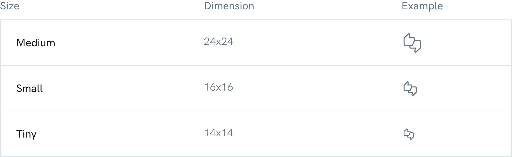
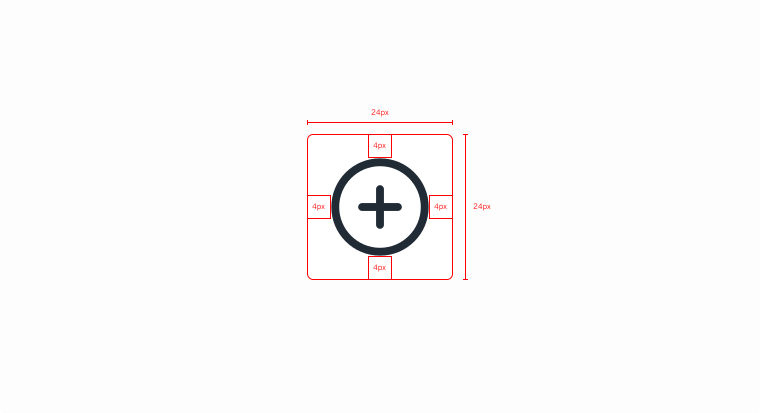
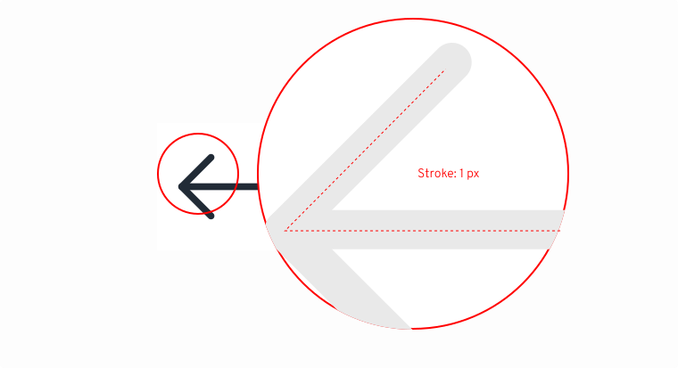
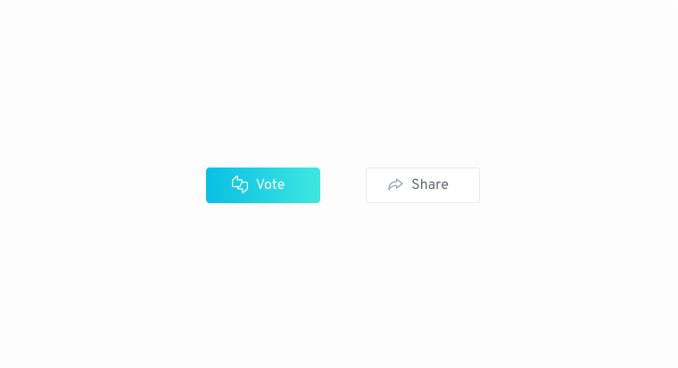

# Iconography

## Our Iconography 

Used sparingly, the icons provide increased meaning and visual importance to sections of content and user actions. Our published set consists of about 100 custom-drawn icons divided into nine categories, with a back catalog of another 400 that can be added as needed.

<figure><figcaption></figcaption></figure>

## Sizes 

Each icon comes in at least three sizes, “medium” and “small”, with a smaller number in a “tiny” size. This set is available in aragonUI and for [download](https://hack.aragon.org/docs/assets/designSystem/guidelines/icons/Aragon\_icons.zip) as PNGs or SVGs.

<figure><figcaption></figcaption></figure>


Important: Don’t resize the icons.


## Icon specification 

**Inner spacing**\
It is important to respect the inner spacing within our icons, in this case we will apply 4px, in other cases of more vertical icons, these spaces may vary between 2px, 4px, and 8px in more extreme cases.

<figure><figcaption></figcaption></figure>

**Stroke thickness**\
Consistency is very important to us. An element that makes all the icons consistent with each other is the thickness of its stroke; the thickness will be defined by 1px on the 24px x 24px icons.

<figure><figcaption></figcaption></figure>

**Icons colors**\
The color of the icons will always be # 8FA4B5 on the secondary buttons, thus helping to understand the concept of the action. Regarding the color of the icons inside the main buttons, this will be #FFFFFF.

<figure><figcaption></figcaption></figure>

## Icons library 

<figure><figcaption></figcaption></figure>

<figure><figcaption></figcaption></figure>

<figure><figcaption></figcaption></figure>

<figure><figcaption></figcaption></figure>

<figure><figcaption></figcaption></figure>

<figure><figcaption></figcaption></figure>

<figure><figcaption></figcaption></figure>

<figure><figcaption></figcaption></figure>

<figure><figcaption></figcaption></figure>

I\_cons credits: <mark style="color:purple;">Cole Belmis</mark> & <mark style="color:purple;">Owi Sixseven</mark>\_
