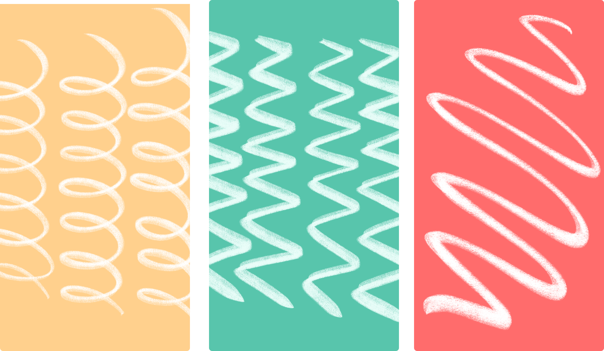
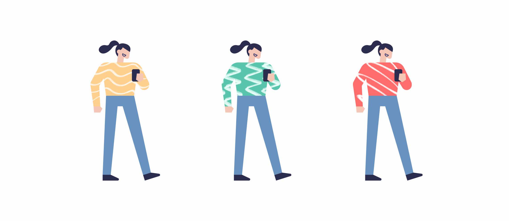
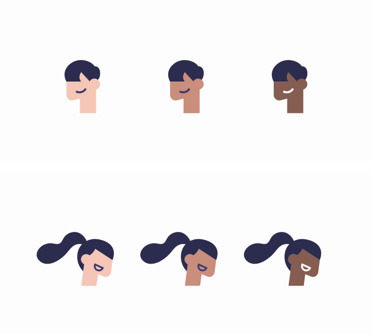
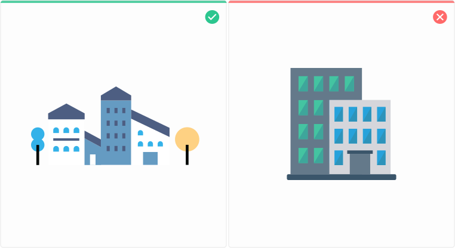
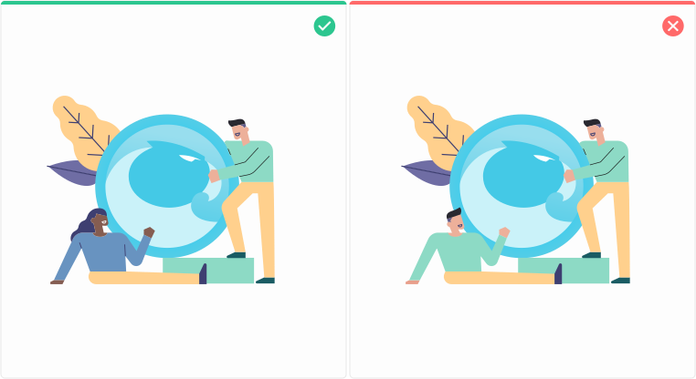

# Illustrations

## Illustration 

Illustration is a key element of the brand system.

<figure><figcaption></figcaption></figure>

* It makes complex ideas more accessible.
* It represents our brand - personality, voice, and platform - in an efficient and clear way.
* It can scale up or down depending on the context.
* It can change tone and speak directly to users depending on the job to be done and the user's emotional state.
* It can evolve with Aragon as we grow, and as we iterate on our product and marketing messages.
* Just like the written word, illustrations exist to tell stories and thoughtfully convey ideas - they should not be used as decoration or without consideration.

## Illustration principles 

**Be bold**\
Our illustration style takes larger-than-life achievements and makes them human and relatable. Being bold means taking on massive goals, feeling empowered, and being confident that those goals are achievable. It's not about being loud, noisy, or over-the-top. It's about setting a goal, and acknowledging the inherent complexity in getting things done. We use clean shapes, plenty of white space, and balanced color ratios to ensure that the scene never feels too chaotic.\\

**Be optimistic**\
Our illustrations feature future-forward narratives that center around teams working together to improve the world around them. The Aragon illustration style reflects our belief that a team is capable of tackling any task, no matter how big or complex. Stylistically, bright color and a sense of low-gravity lend a lightness and buoyancy to our storytelling, driving home the point that when we work together, anything is achievable.\\

**Be practical, but with a wink**\
Though our illustration style is slightly fantastical, it should never feel impractical or naive. We reinforce the real-life nature of teamwork through perspective and depth. We add in 'wink' through slight tweaks to the dimension of people and things. We ensure that the illustration narrative is both inspiring and empowering, which means that we thoughtfully use metaphors (e.g. unicorns) when appropriate, as well as clear, literal representations of real-life concepts.

## Textures and colors 

**Textures**\
The use of textures will give our illustrations an organic look.

<figure><figcaption></figcaption></figure>

<figure><figcaption></figcaption></figure>

**Colors**\
A good color palette has a massive impact on the final result of an illustration. Select colors that may fit conceptually and help convey the narrative of the illustration.

<figure><figcaption></figcaption></figure>

**Skin tones**\
The use of different skin tones helps us illustrate human diversity and promote representation.

<figure><figcaption></figcaption></figure>

## Types of illustration 

**HERO**\
Our illustration style takes larger-than-life achievements, and makes them human and relatable.

<figure><figcaption></figcaption></figure>

**SPOT**\
Spot illustrations are the simplest and most literal expression of a concept. Because they are often used in the product as an empty state, or in a composition with other spot illustrations, they are small and simple. They occasionally include some atmospheric background elements - depending on the design.

<figure><figcaption></figcaption></figure>

**ICONS**\
Icon illustrations are the best way to represent a basic concept. These icons have only one tone of color, with a basic soft blue gradient. They usually do not include any people, using only objects and forms to represent the ideas.

\\

<figure><figcaption></figcaption></figure>

## Correct use of illustrations 

It is important to make proper use of the illustrations in terms of color, proportions, shapes. Below are just some examples of illustration Do's and Don'ts.\\

**RESPECT THE COLOR CODE**\
The color code is important when creating our illustrations, it is essential that the basic Aragon Gradient is part of some element within our illustration.

<figure><figcaption></figcaption></figure>

**ILLUSTRATION STYLE**\
One of the most important rules that we should respect is the consistency within the style of illustration. We should never use another type of illustration or mix styles.

<figure><figcaption></figcaption></figure>

**INCLUSION AND DIVERSITY**\
It’s our duty to fight for breaking down gender identity and ethnic stereotypes in order to promote equality with our designs. Illustrations can be used as a powerful tool to help us build a path to diversity and inclusion. We will also avoid repeating characters within the same illustration.

<figure><figcaption></figcaption></figure>
