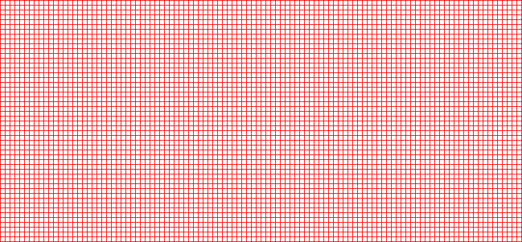
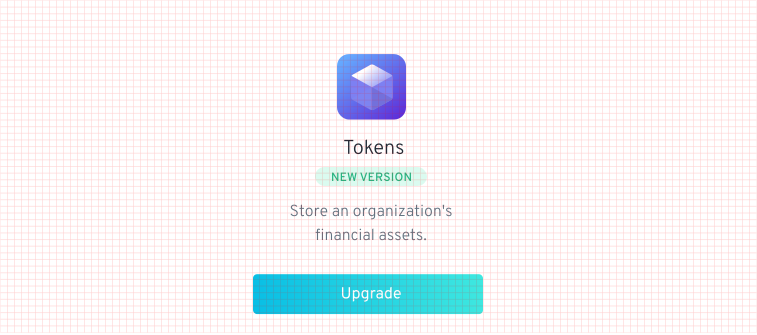
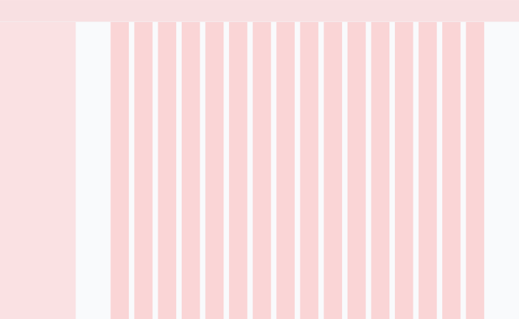
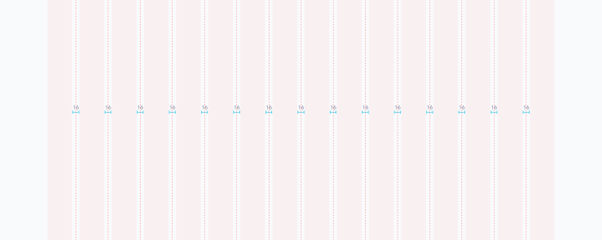
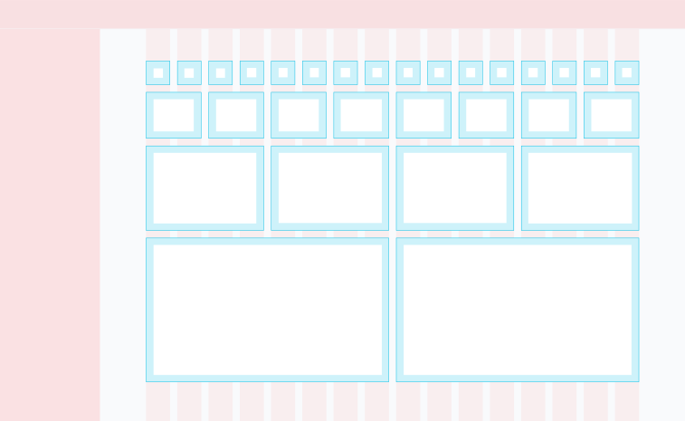
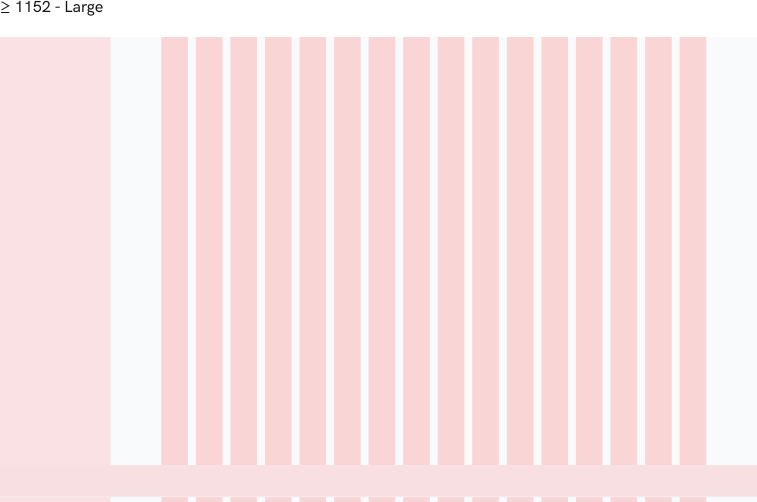
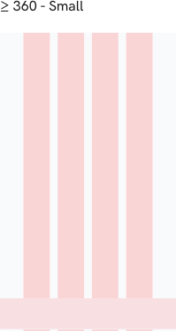

# Layout

## 8-point Grid System 

The layout grid is used as a reference to build and position all the components. It also helps to define the spacing between different elements, improving data consumption through better legibility.&#x20;

All the UI elements and the spacings around them (paddings, margins, and gutters) align to an 8x8 square baseline grid for all viewport sizes, using multiples of 8 (8px / 16px / 24px / 32px / 40px / 48px / 56px and so on) to reach an aesthetically pleasing composition.

<figure><figcaption></figcaption></figure>

This system will help us create consistency across layouts and also ensure predictability when building and placing new elements.

Grids help us work more efficiently, reducing the number of decisions to make while maintaining a quality rhythm between the elements. It also ensures the entire system shares the same visual language between designers and developers.&#x20;

<figure><figcaption></figcaption></figure>

## Column system 

A 16-column grid is used to distribute the elements evenly and horizontally. With this structure, all layouts will be built on the horizontal axis with an equal amount of white space (16px) separating the columns.&#x20;

<figure><figcaption></figcaption></figure>

<figure><figcaption></figcaption></figure>

<figure><figcaption></figcaption></figure>

## Gutters 

This is a flexible system that allows for a lot of different combinations. The padding inside the modules matches the outer margin, with a total of 16px. For closely related content, consider a gutterless grid. Apply gutters when content warrants more separation.

<figure><figcaption></figcaption></figure>

## Breakpoint Table 

In this table we define the values for the different breakpoints we target with our responsive design:

| Breakpoint | Type   | Columns | Padding | Margin |
| ---------- | ------ | ------- | ------- | ------ |
| >= 360px   | small  | 4       | 16px    | 16px   |
| >= 768px   | medium | 8       | 16px    | 16px   |
| >= 1152px  | large  | 16      | 16px    | 16px   |

## Responsive layout 

These are the points at which our components and content will respond to provide the user with the best possible layout to consume information and interact with the elements on the screen.

<figure><figcaption></figcaption></figure>

<figure><figcaption></figcaption></figure>

