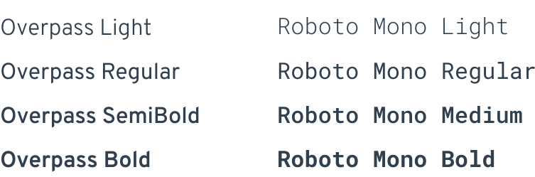
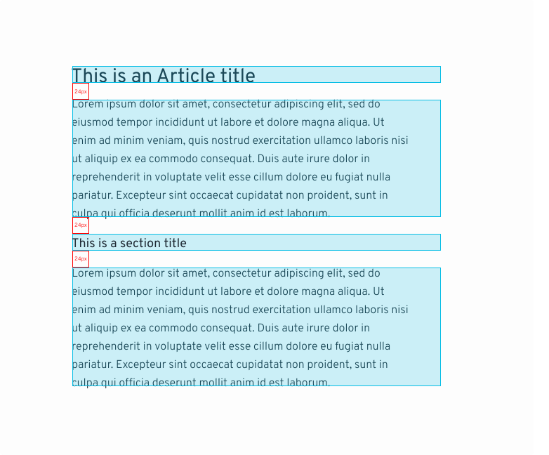
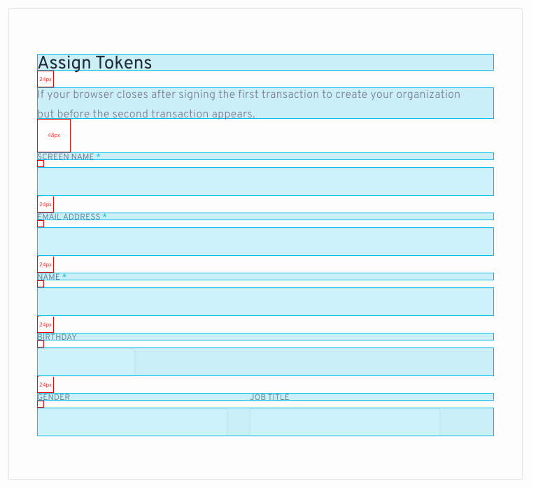
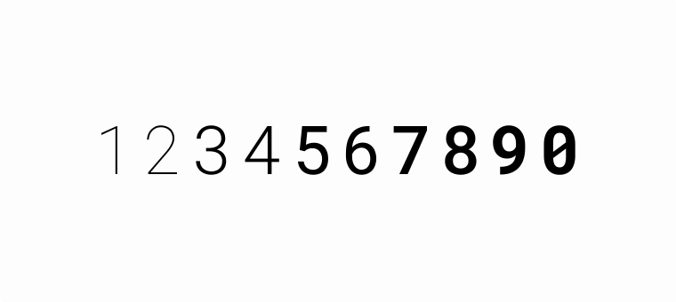
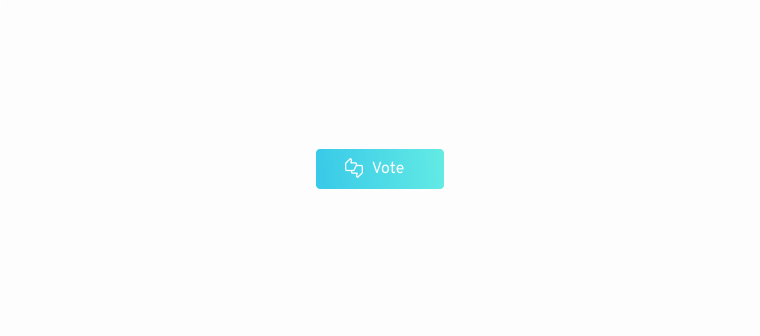
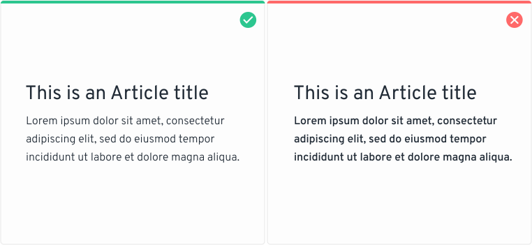
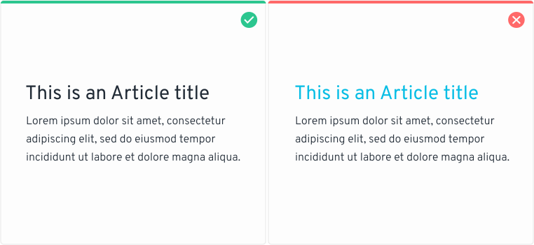
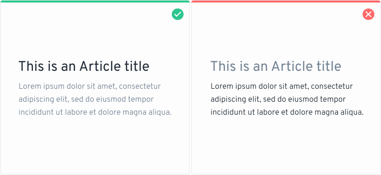
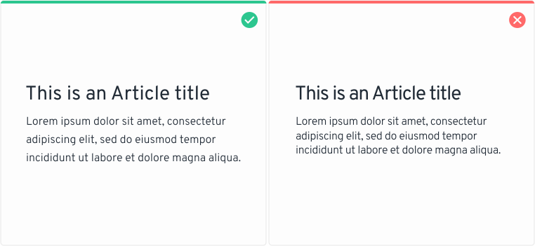

# Typography

## Typography in use 

Our brand font is Overpass and comes in two weights, 400 and 600. We have five “title” variations used for headings and three “body” sizes used for body copy and labels.

<figure><figcaption></figcaption></figure>

## Family in use 

<figure><figcaption></figcaption></figure>

## Text styles 

Text styles are used to enhance the information with additional visual attributes that convey meaning such as the font size, line spacing, text alignment, and text colors.

## Vertical Rhythm 

To maintain consistency in the vertical rhythm of the text, we will use 24px separations between the titles and the paragraphs. These separations can also be applied at the top and bottom of the blocks.

<figure><figcaption></figcaption></figure>

<figure><figcaption></figcaption></figure>

## Use of the monotype font 

The use of the “Roboto Monotype” typeface is intended exclusively for numerical components such as addresses. The use of these typefaces for the numerical elements is focused on improving the readability experience.

<figure><figcaption></figcaption></figure>

**Badges**\
One of its main uses is for the numerical content on address badges.

<figure><figcaption></figcaption></figure>

## Correct use of typography 

It is important to make proper use of typography in terms of thickness, alignment, separation, and layout. Below are some examples of typography Do's and Don'ts.\

**RESPECT THE HIERARCHY**\
In order to respect the content hierarchy, it is important to make proper use of weights, thus differentiating the titles of the paragraphs.

<figure><figcaption></figcaption></figure>

**CORRECT USE OF COLOR**\
The correct use of color will be important when creating our blocks of text. It is essential to never improvise or use random colors, neither in the title, nor in the paragraph.

<figure><figcaption></figcaption></figure>

The use of color will help us generate a logical hierarchy in our paragraphs. It is important to always be consistent with the use of colors.

<figure><figcaption></figcaption></figure>

**CORRECT USE OF KERNING**\
It is extremely important to respect the kernings and the text lines in order to achieve a balanced layout on our paragraphs.

<figure><figcaption></figcaption></figure>

