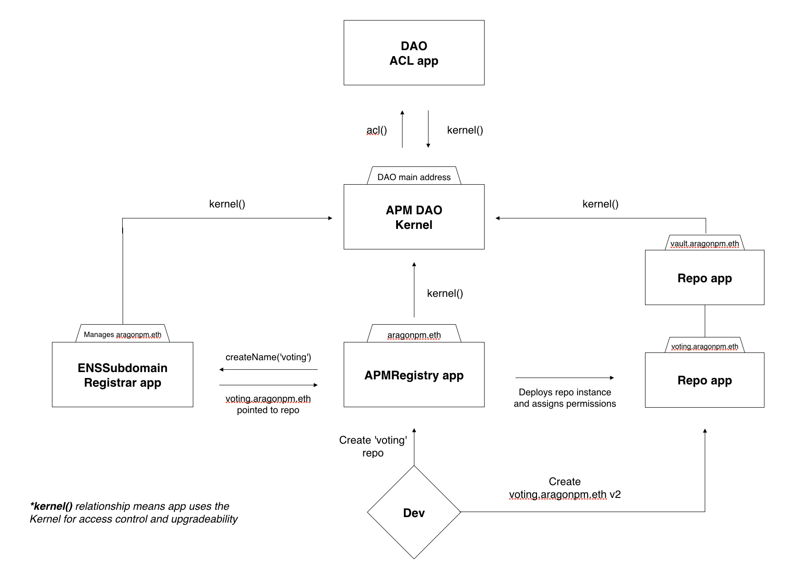
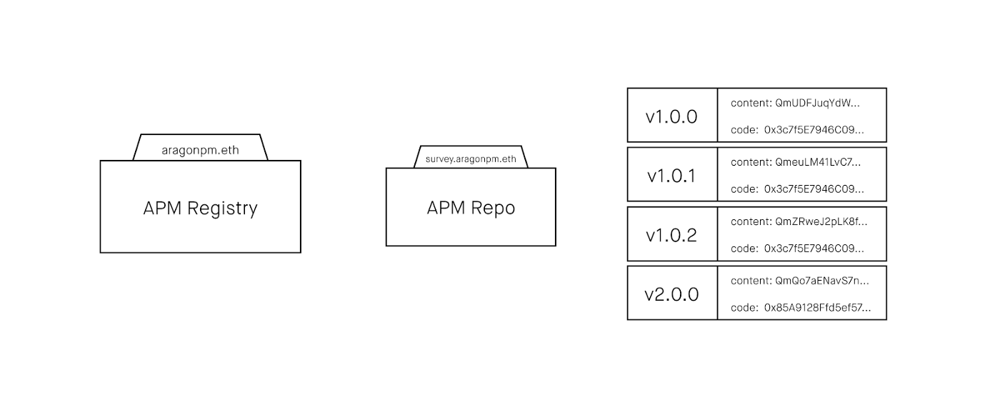
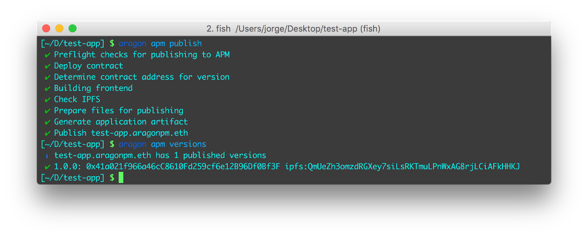

# Architecture

## aragonPM Architecture: Registries, Repos and versions


The architecture of an aragonPM DAO **👇.**


<figure><figcaption></figcaption></figure>

As a DAO, each aragonPM registry includes a number of installed applications, including one APMRegistry, one ENSSubdomainRegistrar, and many Repo instances.&#x20;

The aragonPM registry controls a [Ethereum Name Service](https://ens.domains/) (ENS) domain through its ENSSubdomainRegistrar, allowing each new created Repo to be assigned its own subdomain. This gives users the ability to **find repos with human-readable names**, such as `voting.aragonpm.eth`.

We envision that many aragonPM registries will be created for different purposes and types of packages. For Aragon, we use the `aragonpm.eth` registry to host our core components. We also have the `open.aragonpm.eth` registry for community developed packages, where anyone can create repos.

At the repo level, each repo can have **its own rules** that govern **how new versions can be published** using the [Access Control List](../the-basics/permissions.md) from aragonOS. This allows for setting up different types of processes depending on the importance of the repo or the nature of the upgrade (major, minor or patch).


A Repo is created in a Registry and can have many versions published over time **👇.**


<figure><figcaption></figcaption></figure>

A repo keeps a versioned history of content and smart contract code tuples. The content is an on-chain reference to a blob of data that lives off-chain (we currently support IPFS or HTTP addressing). By using IPFS we have the assurance of the **integrity** of the data and that it hasn't changed since it was published. We recommend always publishing using a content-addressed network, like IPFS, but having HTTP is useful for testing or less critical code.

The smart contract code only applies to packages that have an on-chain contract component associated with a particular version. It can be the **implementation code for** [**upgradeable Proxies**](../the-basics/upgradeability.md) or a smart contract that can be directly used. By having these code addresses stored on-chain, smart contracts can use aragonPM directly to get the latest version of the code for a repo.

aragonPM gives users **complete transparency** over all deployments and **traceability** of what the process of publishing a new version entailed.

It is important to point out that aragonPM acts as the reference to what the last version of a repo is but **all upgrades are opt-in** and users of the repo, such as Aragon organizations, need to decide to upgrade or keep using an old version through their own governance mechanisms. Automatically upgrading all users of a repo is extremely dangerous regardless of the upgrade governance mechanism. That's why all upgrades are opt-in and must be started by the user. Someone could, however, build an auto-update contract that users could allow to automatically update their dependencies.

## Interacting with aragonPM: apm.js and aragonCLI 

In order to interact with aragonPM registries, we have built [apm.js](https://github.com/aragon/apm.js) as a standalone JS library to inspect aragonPM repos, get their different versions, and fetch the referenced content. The library also allows interaction with aragonPM contracts for creating new repos or versions.

The [aragonCLI](../aragoncli/) also uses apm.js to provide a great developer experience for creating and publishing new versions of Aragon apps as aragonPM repos. The CLI's aragonPM commands, accessible through `aragon apm`, are the easiest way to manage aragonPM repos.


Using the aragonCLI to publish a version to an aragonPM repo and inspect it **👇.**


<figure><figcaption></figcaption></figure>

> <mark style="color:purple;">**Do you have a question? Leave your comments here at our Discourse forum**</mark>** 👇**


