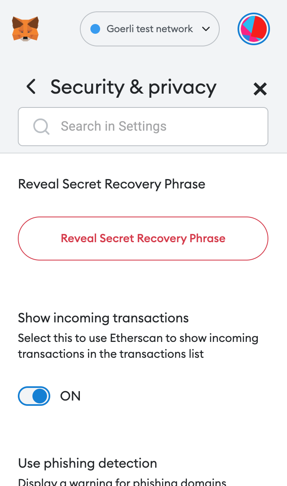

# Change Quorum using EVMcrispr


This guide will show you how to change the minimum Quorum (turnout) needed for votes in your DAO to pass using [**EVMcrispr**](https://evm-crispr.blossom.software/#/).

EVMcrispr is a powerful tool that combines a domain-specific language with a Javascript library to interact with Aragon DAOs.


First thing, open EVMcrispr [here](https://evm-crispr.blossom.software/#/) and click 'Open Terminal'. Now, this screen should appear:


Next delete all the text in the terminal:


Click 'Connect' to connect to your Web3 Provider (Metamask for most users).


**Warning**

Make sure you connect an Account to EVMcrispr which also has signing permission on your DAO.


We are now going to write the commands to change the mimimum Quorum Percentage.

To change the minimum Quorum Percentage for your DAO you will have to connect to your DAO with `connect <dao-name-or-address`.  Next we add `token-manager voting` because the `token-manager` app has the `CREATE_VOTES_ROLE` needed to forward actions to `voting` the app we will interact with. This is what we have so far:

```
connect <dao-name-or-address> token-manager voting
```

Now we will write the second command line for the EVMcrispr terminal. First to add is `exec` which is a command used to perform transactions DAOs. Next we add `voting` the app we will interact with. This is what we have so far:

```
connect <dao-name-or-address> token-manager voting
exec voting
```

We are not ready however. When we look in the source code of the Voting App on [Github](https://github.com/aragon/aragon-apps/blob/631048d54b9cc71058abb8bd7c17f6738755d950/apps/voting/contracts/Voting.sol) we can find a function to change the minimum accepted Quorum Percentage, this is exactly what we need:

```solidity
function changeMinAcceptQuorumPct(uint64 _minAcceptQuorumPct)
    external
    authP(MODIFY_QUORUM_ROLE, arr(uint256(_minAcceptQuorumPct), uint256(minAcceptQuorumPct)))
{
    require(_minAcceptQuorumPct <= supportRequiredPct, ERROR_CHANGE_QUORUM_PCTS);
    minAcceptQuorumPct = _minAcceptQuorumPct;

    emit ChangeMinQuorum(_minAcceptQuorumPct);
}
```

We will now add this function to the commands for the terminal to call it. We will have to add `changeMinAcceptQuorumPct(uint64 _minAcceptQuorumPct)`, but first we will replace `uint64 _minAcceptQuorumPct` with your desired minimum Quorum Percentage.

This is expressed as a percentage of `10^18` , so for example `100% = 10^18` and `1% = 10^16`. Say you want a new minimum Quorum of 25%, then you need to add 16 zeroes to 25 coming to `250000000000000000`


**Warning**

The **minimum Quorum Percentage can never be higher than the required Support Percentage** for votes within your DAO! So make sure that the required Support Percentage of your DAO is 55% or more. If not, use a percentage lower than the required Support Percentage for this tutorial (otherwise you will run into an issue later).


Now add `changeMinAcceptQuorumPct 250000000000000000` to the commands for the terminal:

```
connect <dao-name-or-address> token-manager voting
exec voting changeMinAcceptQuorumPct 250000000000000000
```

The commands are ready! Copy/ paste them in the terminal and click the 'Forward ...' button:



Sign the transaction from your Web3 Provider and it should now execute successfully.


**Warning**

Use your DAO address in case of your DAO name in case of this error:

`Error: ENS <dao-name>.aragonid.eth not found in rinkeby, please introduce the address of the DAO instead.`


We are almost ready but first open your DAO in the web browser. The url should be:

`https://client.aragon.org/#/<dao-name-or-address>`

Next go to the Voting app since this change has automatically generated a vote. Now you (and enough of your DAO members) need to approve the vote for it to pass:

.png>)


**Warning**

The change will can only be **enacted** when the remaining voting time has run out. In the case of this example, the `Time remaining` is `23H:59M:12S` :point\_up:


When the voting time has run out click on 'Enact this vote' and sign the transaction with your Web3 Provider:

.png>)

Once this is done the minimum Quorum Percentage should have been adjusted to 25%. You can double check this by creating a new vote. When you open the vote, the `MINIMUM APPROVAL` should have been adjusted to `>25% needed`.


If you made it this far, well done! :clap:


