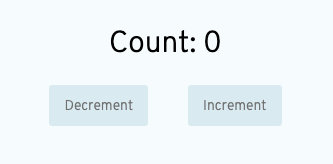
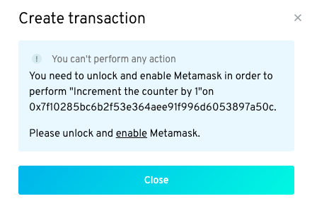
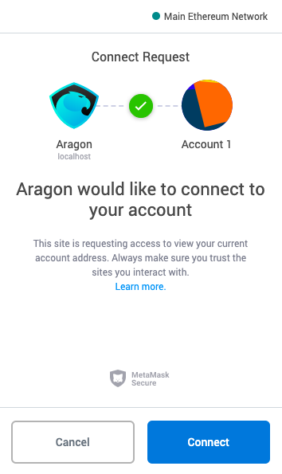
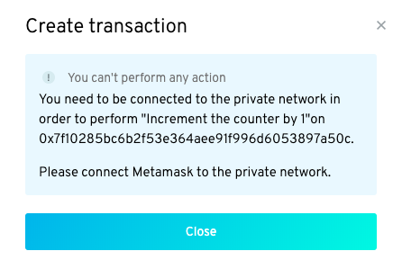
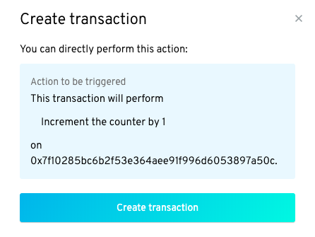
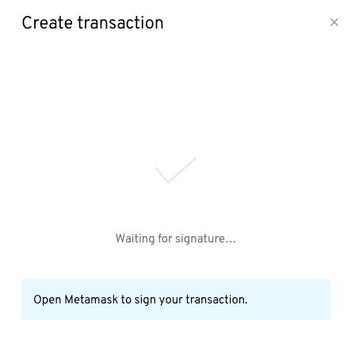
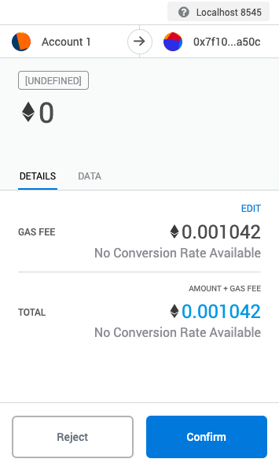
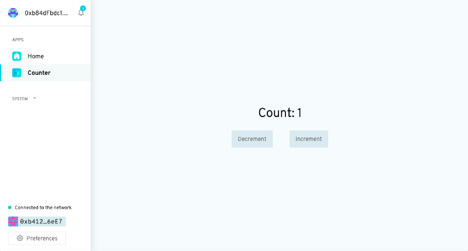

# Sign a transaction with Metamask

## Select the _first-dao_ account on Metamask

Login to your Metamask wallet, select the _first-dao_ account which you have imported (see [here](import-your-seed-wallet-in-metamask.md) how to do this) and select **Localhost 8545**.&#x20;

## Increment the Counter

Navigate to your DAO (on [localhost:3000](http://localhost:3000/)) and click on the _Increment_ button in the Counter app.&#x20;

<figure><figcaption></figcaption></figure>

You should see a panel slide in from the right with an error message. The message (in a blue box) basically says you can't perform any actions unless you enable Metamask.&#x20;

<figure><figcaption></figcaption></figure>

You should see that the final line inside the blue box reads: **Please unlock and enable Metamask**. Click on _enable_ and open up Metamask again.

You should see a connection request from Aragon. Click on the _Connect_ button to accept it.&#x20;

<figure><figcaption></figcaption></figure>

Now go back to the Counter app.&#x20;

## A possible error&#x20;


If you haven't connected your Metamask account to the right network (in this case private network Localhost 8545) you got an error message 😔.



If you have connected your Metamask account to the right network you can skip this section and go [here](metamask.md#confirmthetransaction).


In our example, the message says we need to connect MetaMask to the private network.&#x20;

<figure><figcaption></figcaption></figure>


Why are we getting this error?


Remember, Metamask defaults to selecting the main Ethereum network when you make a transaction. But our DAO is actually running on a private local network, not the mainnet.


Why are we using a private network?


Remember that using the mainnet requires purchasing ETH with real money. And that using the mainnet or testnets requires us to download the entire past transaction history of the blockchain: this takes a considerable amount of time, and requires a lot of local disk space. In contrast, a private network requires almost no local disk space and can be operated without having to purchase ETH with real money. So it's perfect for rapid experimentation and testing.

Remember, we can connect to a local (private) network by opening up Metamask and selecting **Localhost 8545**. So let's go ahead and do that.

Close the panel and open MetaMask again. Now, click on the selected network  -  _Main Ethereum_ Network -  and select _Localhost 8545_ from the dropdown menu that appears.&#x20;

<figure><figcaption></figcaption></figure>

You should now see that your account has some ETH. Quite a lot in fact. Unfortunately, this is not real ETH, but it will allow you to perform transactions within your local private network (in other words, increment and decrement the counter).

Now, go back to the _Counter app_, and click on the _Increment_ button again.

## Confirm the transaction 

This time, instead of an error message, you should see an explanation of the action you are about to perform.&#x20;

<figure><figcaption></figcaption></figure>

Double check that the action that's about to be triggered is the one you wish to perform. Then click on _Create transaction._

The app will now signal to you that it's waiting for your signature.&#x20;

<figure><figcaption></figcaption></figure>

Open MetaMask again to sign your transaction. You'll be asked to confirm a transaction from Account 1 (your account) to the address of your newly created DAO. The total amount you're sending is about 0.001 ETH: basically just the _Gas fee_.

&#x20;

<figure><figcaption></figcaption></figure>

In case you're unfamiliar with the concept of **Gas**, the **Gas fee** is what's used to incentivize miners to add your transaction to the blockchain. You can think of it as a small tip. Remember that this transaction is taking place on a local (private) network, so this isn't real money. If you're happy with the details of the transaction, click on _Confirm_.

Now, if you go back to you're first DAO you should see that the counter has finally  incremented!&#x20;

<figure><figcaption></figcaption></figure>


If you've made it all the way here, well done! You've just signed your first blockchain transaction with Metamask. 🎉🎉😊


> <mark style="color:purple;">**Do you have a question? Leave your comments here at our Discourse forum**</mark>** 👇**


