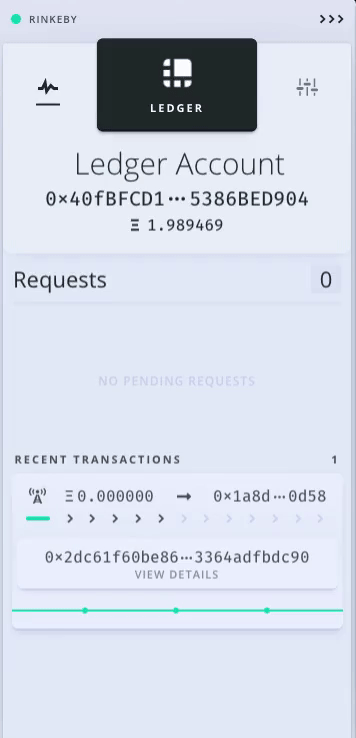

# Sign a Transaction with Frame

This guide will help you to get started with Frame and interact with a DAO using a hardware wallet. How to setup Frame go [here](./).

To take full advantage of Frame, we recommend you have `aragonCLI` installed as well. If you already have it, skip to the next section, otherwise run:

```
npm install -g @aragon/cli
```

If you're having trouble with this step, you should take a look at the installing [aragonCLI](../../../aragoncli/) section or the [troubleshooting guide](../../troubleshooting-and-faq.md). If that doesn't fix things, please don't hesitate to reach out to us on Discord in the [#questions channel](https://discord.gg/KVd7WWky).

### Signing your first transaction <a href="#signing-your-first-transaction" id="signing-your-first-transaction"></a>

In this section, we are going to interact with an already [deployed DAO on Rinkeby](https://client.aragon.org/#/0x16b3C84d4DB149590981F2d3A36e14Db96069730) that allows anyone to mint any amount of `FRAME` tokens to any address. We will use an `aragonCLI` command to execute a function on the [Token Manager app](https://client.aragon.org/#/0x16b3C84d4DB149590981F2d3A36e14Db96069730/0x1a8d8bb7eb5ac6e6f51df5e65d301c7e5dd00d58/) installed on the DAO. You may find it helpful to learn more about [`dao exec` command](../../../aragoncli/dao-commands.md#dao-exec) before continuing.

The first step is to run this command in your terminal (click the copy button to copy the entire command):

```
dao exec 0x16b3C84d4DB149590981F2d3A36e14Db96069730 0x1A8D8BB7eB5aC6E6F51dF5E65d301c7e5dD00D58 mint <address> <amount> --env aragon:rinkeby --use-frame
```

Replace `<address>` with an address of your choice (as the token minting recipient) and `<amount>` with the amount of tokens you would like to mint for the address (remembering to apply the token's decimals, e.g. 10^18). The options `--env` and `--use-frame` tell `aragonCLI` that we want to interact with Rinkeby to use Frame as the transaction signing provider.

**Permissions**

After running the command, you should see this error message in your terminal:

```
✖ Returned error: Permission denied, approve AragonCLI in Frame to continue
```

Don't worry, we just need to grant `aragonCLI` permission to access your account on Frame. You may have seen Frame ask for this earlier on setup. Approve the request to continue.&#x20;

<figure><figcaption></figcaption></figure>

**Signing**

Now run the command again. This time, Frame will ask you to sign the transaction that aragonCLI generated (this can take a minute). Sign and then confirm it from your hardware device. In a couple of seconds, the transaction should be mined.

&#x20;

<figure><figcaption></figcaption></figure>


Congratulations 🎉! You've just signed your first transaction with Frame. Navigate to the [live Aragon DAO's Token Manager](https://client.aragon.org/#/0x16b3C84d4DB149590981F2d3A36e14Db96069730/0x1a8d8bb7eb5ac6e6f51df5e65d301c7e5dd00d58/) to see the minted `FRAME` tokens for your chosen address.


**Viewing transactions**

Finally, if you click on the "View details" button, Frame will open the transaction's details on Etherscan.

&#x20;

<figure><figcaption></figcaption></figure>


> <mark style="color:purple;">**Do you have a question? Leave your comments here at our Discourse forum**</mark>** 👇**



