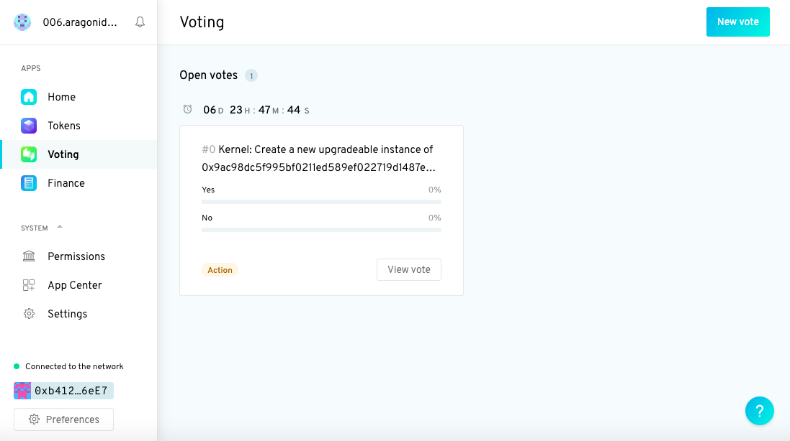
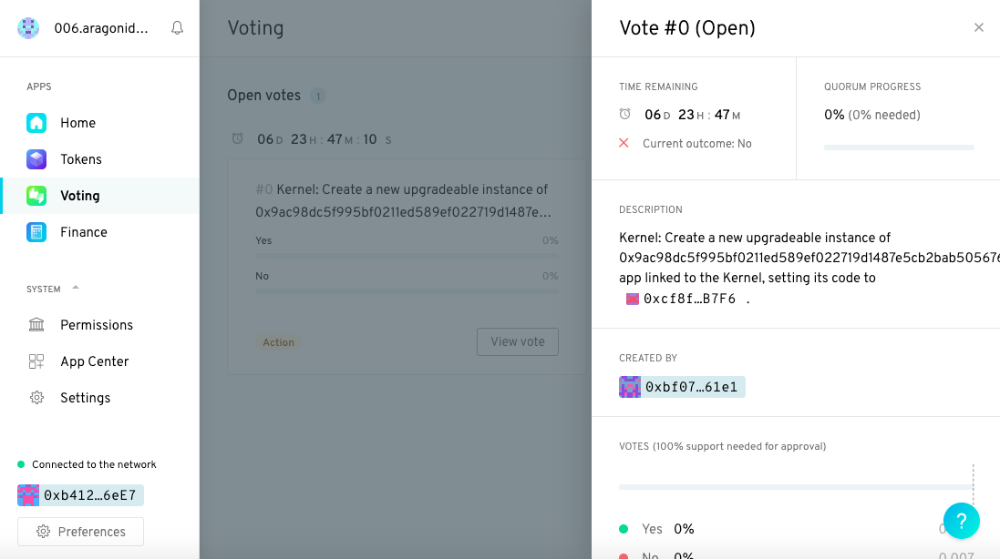
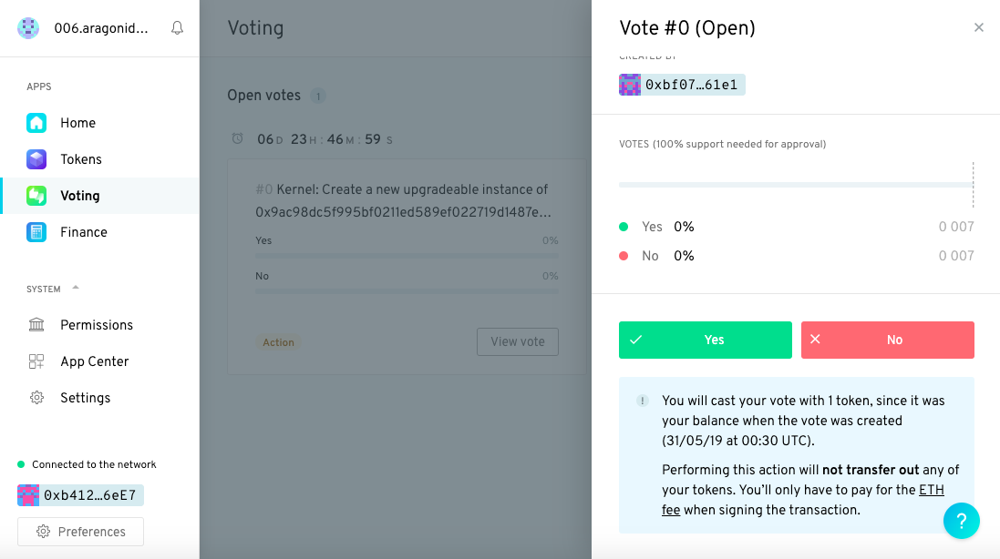
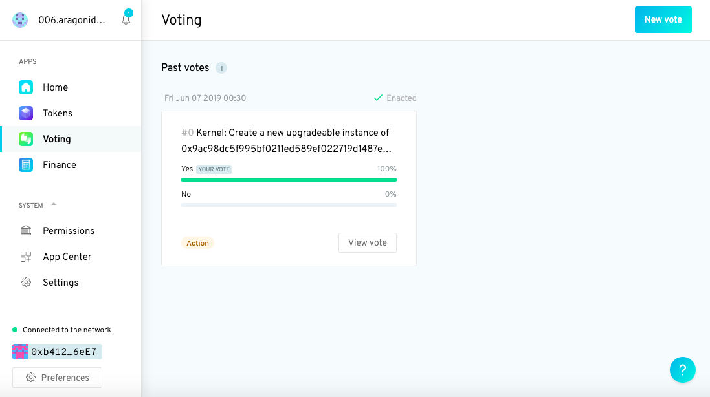

# Installing Aragon Agent from aragonCLI

## Prerequisites <a href="#prerequisites" id="prerequisites"></a>

While there are no formal prerequisites to this guide, it'll be helpful for you to have a basic understanding of both our [Voting](https://documentation.aragon.org/products/aragon-client/explore-template-dao/what-are-apps/voting-app) and [Token Manager](https://documentation.aragon.org/products/aragon-client/explore-template-dao/what-are-apps/token-app) apps. Apart from that this guide should be self-contained.

## Installing the Agent App

### 1. Create a Company DAO <a href="#1-create-a-company-dao" id="1-create-a-company-dao"></a>

Before we start, you'll need to head over to [Aragon](https://aragon.org/) and create a new DAO with the company template. If you're not sure how to do that, please have a look [here](https://documentation.aragon.org/products/aragon-client/how-to-create-a-dao-using-aragon-client/use-company-template).

The first thing you'll be asked to do is to choose the network for your organization. For the purposes of this guide, we'll choose **Ethereum Rinkeby (Testnet)**. If you need help with this go [here](https://documentation.aragon.org/products/set-up-metamask/getting-started-with-rinkeby-testnet).

Then when you select the Company template you can choose to install the Agent app as an optional app, select this and click **Use this template**:



Only for Company, Membership, and Reputation templates, it is possible to install the Agent app from the onset! If you want to install the Agent app after setting up your DAO, or if you use a different template continue with this guide.


When setting up the DAO you'll be asked to set three parameters for your organization, the **support**, the **minimum approval**, and the **vote duration**.

Set them to these defaults:

* Support: 100%
* Min. Approval: 0%
* Duration: 168 hours (or 1 week)

### 2. Install aragonCLI <a href="#2-install-aragoncli" id="2-install-aragoncli"></a>

The [aragonCLI](../../aragoncli/) (Command Line Interface) is what we use to create, interact with, and develop Aragon apps.

If you haven't done so already, install aragonCLI from NPM by running the following command:

`npm install -g @aragon/cli`


Hopefully, it installed successfully 😊.



If not, we recommend you take a quick look at the installing aragonCLI section of our [troubleshooting guide](../../aragoncli/). It should help diagnose and fix the problem 🧐.

If that still doesn't fix things 😟, please reach out to us in our [#questions-channel](https://discord.gg/XgCeeKYd) on the Discord Server. We're more than happy to help.


Note that aragonCLI v5.4.0 was the first version to include support for Agent.

If you're unsure which version of aragonCLI you have, run the following command in your terminal:

`aragon -v`

If your version number is less than `7.0.3`, or if it's been a while since you last installed the aragonCLI, we recommend you reinstall it (by running the `npm install` command above).

### 3. Install the Agent app <a href="#3-install-the-agent-app" id="3-install-the-agent-app"></a>

Now that we've installed aragonCLI 🎉, we're ready to install the Agent app.

aragonCLI installs the [`aragon dao` ](../../aragoncli/dao-commands.md)commands. We use these to interact directly with our DAO from the command line. They're also available directly using the `dao` shortcut.


**Warning**

For this step it is necessary to install **Frame Wallet.** You can import the Metamask wallet you used to setup your DAO into Frame Wallet. [Here](../how-to-sign-with-web3-providers/setting-up-a-frame-wallet/) you can read how.


We'll use the the [`dao install`](../../aragoncli/dao-commands.md) command to install the Agent app. `dao install` takes two arguments:

1. The address or aragonID name of an Aragon DAO.
2. The package name of an Aragon app published to [aragonPM](../../aragonpm/) (for the Agent app this would be agent or agent.aragonpm.eth).

So in our case, to install the Agent app, include your DAO address or name and run the following command:

```
dao install <dao-address-or-name> agent --use-frame --env aragon:rinkeby
```


**Warning**

Make sure you open the right address account in your Frame wallet. Also make sure that the Ethereum address you use to sign the transaction with is holding tokens of your DAO. Otherwise you might run into this error:

`→ Cannot find transaction path for executing action`


Now Frame wallet should come with a pop-up requesting to sign a transaction (note: this can take a few minutes)! Sign and the Agent app will install:


The command included the `--use-frame` flag to use Frame wallet and the `--env` flag to use Rinkeby. If you have a custom IPFS, it can be defined with the `--ipfs-rcp` flag.

<details>

<summary>Tell me more about Aragon IPFS and these global options.</summary>

The `--env` flag allows us to specify the network (environment) we want to use. In our case we've created our organization on rinkeby so we pass in `aragon:rinkeby`.

Note that if we had chosen the **Ethereum Mainnet** as the network for our organization we would have passed `aragon:mainnet` instead of `aragon:rinkeby` as the argument to `--env`.

The `--ipfs-rpc` flag allows us to point to an IPFS node that has the files we are looking for. In our case it is pointed automatically to the Aragon network IPFS node, so we do not have to use the flag.

If you want to point to a custom IPFS node, include the flag:

`--ipfs-rcp <ipfs-url>`

However, since IPFS propogation is slow, it's better to point directly to the aragon IPFS node.

</details>


The Agent app does not yet appear in your DAO UI (User Interface). A **vote** has been generated (in the true spirit of democracy) to confirm installation of the app.


To confirm the vote:

1. Click on the **Voting** app icon in the left panel. You should see you have one open vote.

<figure><figcaption></figcaption></figure>

2\. Click on the **View vote** button. You should see a panel pop up on the right hand side.

<figure><figcaption></figcaption></figure>

3\. Scroll to the bottom of the panel and click on the big green **Yes** button.

<figure><figcaption></figcaption></figure>

4\. Sign the transaction with your favourite web3 provider (like Metmask or [Frame](../how-to-sign-with-web3-providers/setting-up-a-frame-wallet/frame.md)) and voila! That's all there is to it. When you click on the Voting app again you should see the vote has passed with a 100% Yes vote.

<figure><figcaption></figcaption></figure>

Well done installing the Agent app. :tada: Let's now proceed to give the Voting app permission to use the Agent app to execute actions and to make it appear in the UI as well.
