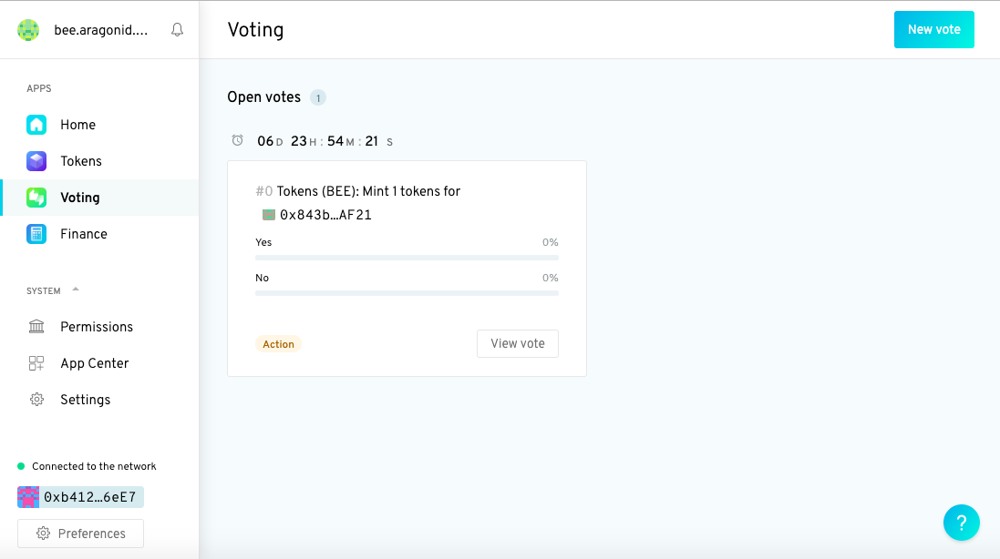
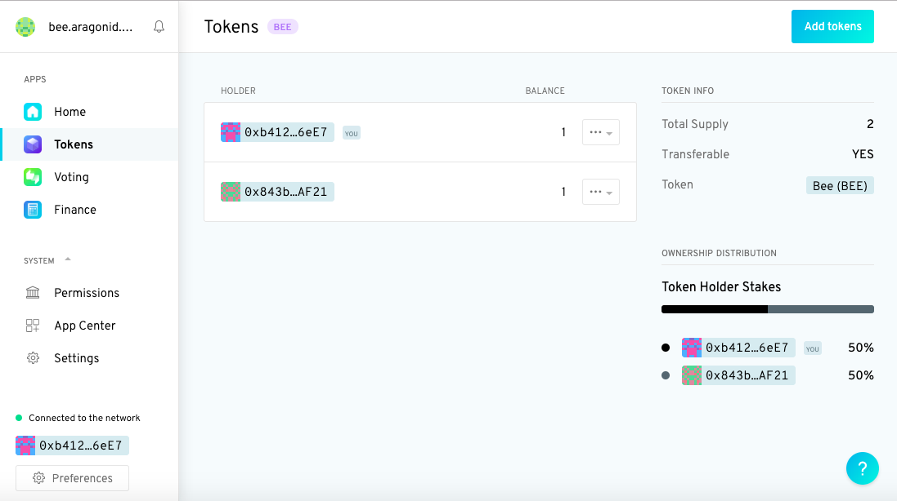
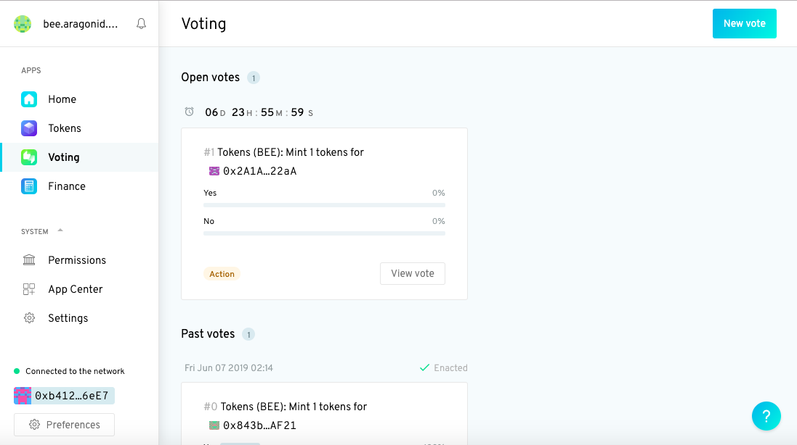
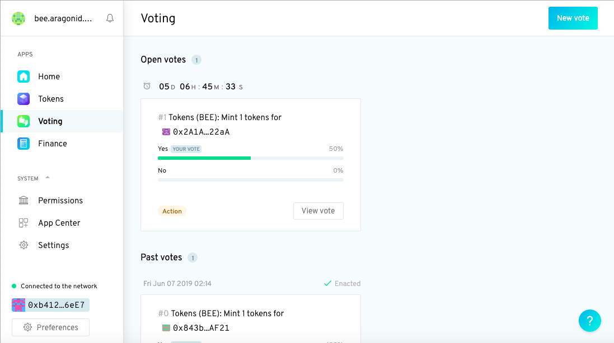
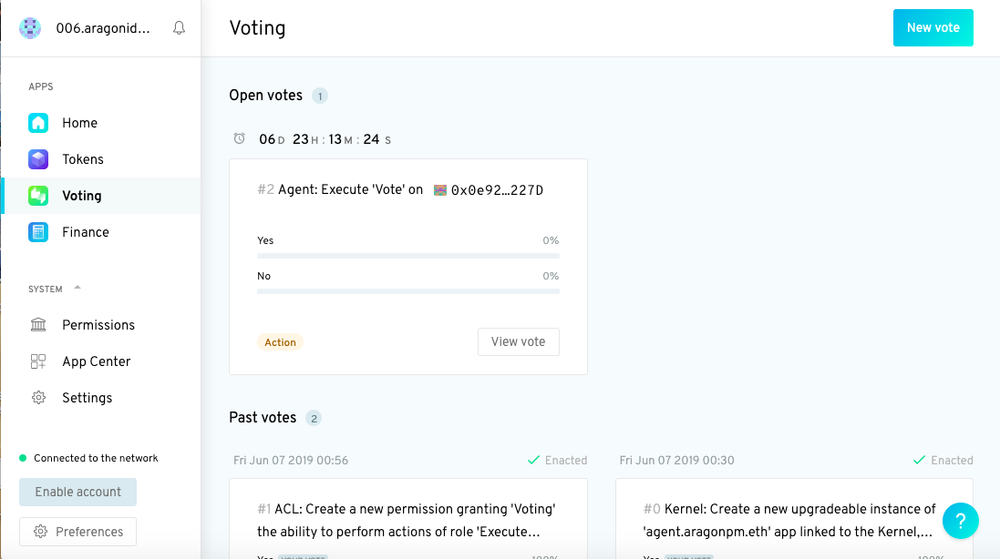
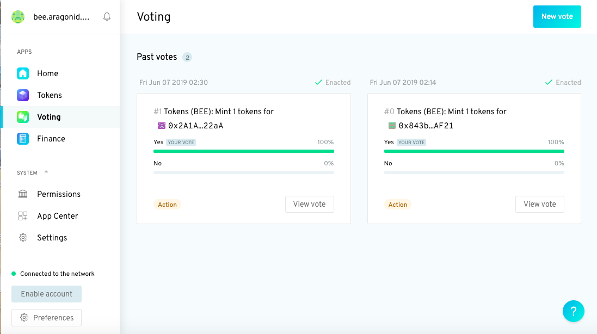
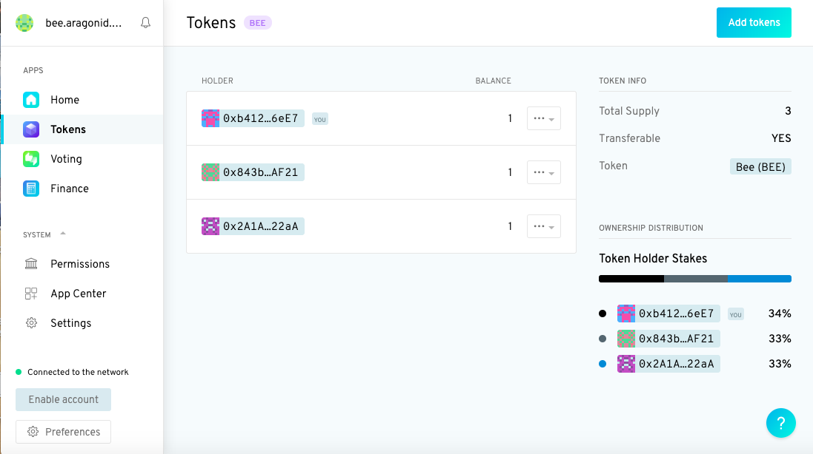

# Interacting with Aragon Agent


In case you have not yet installed the Agent app, check [here](installing-aragon-agent-from-aragoncli.md) how to do it.


### Introducing dao act <a href="#introducing-dao-act" id="introducing-dao-act"></a>

`dao act` is the main way we'll interact with Aragon Agent. It's the command we use to perform transactions with the Agent app directly from aragonCLI.

According to the documentation:


`dao act` provides some syntax sugar over `dao exec` for executing actions using Agent app instances in a DAO.


Like `dao exec` it takes at least three arguments:

1. The address of the Agent app you want to use to perform an action.
2. The address of an **external contract** or **the address of an app** within a DAO.
3. The [full signature](https://www.4byte.directory/) of the method we wish to execute in either the external contract or the app we specified in the second argument -- note that by the full signature we mean the [human readable function signature](https://solidity.readthedocs.io/en/v0.5.3/abi-spec.html#function-selector).


For example if we wanted to execute the `vote` method of a Voting app we would pass in its full signature `vote(unint256,bool,bool)` as the third argument. And if we wanted to execute the `confirmTransaction` method of a [Gnosis Multisig](https://wallet.gnosis.pm/#/wallets) we would pass in `confirmTransaction(uint256)`.


The remaining arguments are the parameters which the method we specified will be executed with.

Don't worry if it's not completely clear to you how `dao act` works at this stage. The following use cases will help you develop some intuition for it!

### Use case: Voting in another organization <a href="#use-case-voting-in-another-organization" id="use-case-voting-in-another-organization"></a>

Let's start by seeing how we can use the Agent app to allow one Aragon organization to participate as a stakeholder in another.

#### 1. Create another Democracy DAO <a href="#1-create-another-democracy-dao" id="1-create-another-democracy-dao"></a>

The first step is to create another Democracy DAO. Exactly the same as before, head over to [Aragon](https://client.aragon.org/#/) and choose the following defaults:

* Support: 100%
* Min. Approval: 0%
* Duration: 168 hours (or 1 week)

If you're not sure how to do that, please have a look [here](https://documentation.aragon.org/products/aragon-client/how-to-create-a-dao-using-aragon-client/use-company-template).

#### 2. Mint a token to allow our first DAO (A) to vote in our new DAO (B) <a href="#2-mint-a-token-to-allow-our-first-dao-a-to-vote-in-our-new-dao-b" id="2-mint-a-token-to-allow-our-first-dao-a-to-vote-in-our-new-dao-b"></a>

We've now created two Democracy DAOs -- let's call them **A** and **B**. A has an Agent app, B doesn't. We want to allow A to vote in B.

Remember that A needs to be a tokenholder of B to be able to vote in B. And that A's Agent app acts its external interface.

In other words, A's Agent app allows it to participate as a stakeholder in B.

This means that to allow A to vote in B we need to mint a token for A's Agent app in B.

To do this run:

```
dao exec <dao-B-address-or-name> <token-manager-address-dao-B> mint <agent-app-address-dao-A> 1000000000000000000 --use-frame --env aragon:rinkeby
```


For this step it is necessary to install **Frame Wallet**. You can import the Metamask wallet you used to setup your DAO into Frame Wallet. [Here](../how-to-sign-with-web3-providers/setting-up-a-frame-wallet/) you can read how.


Remember, you can find the addresses of the apps in any of your DAOs by running:

`dao apps <dao-address-or-name> --all --use-frame --env aragon:rinkeby`



**Warning**

If execution of the command fails with the error: `→ No functions specified in artifact for..`

Or with the error: `→ Cannot find transaction path for executing action`

Make sure the address you sign the transaction with has both created the DAO and is owner of DAO tokens.


As you can see, we are using the `dao exec` command to interact with the `mint` method of B's [Token Manager](https://documentation.aragon.org/products/aragon-client/explore-template-dao/what-are-apps/token-app) app.

[`mint`](https://github.com/aragon/aragon-apps/blob/master/apps/token-manager/contracts/TokenManager.sol#L104) is used to create new tokens and assign them to a receiver. It takes two arguments: a receiver address, and the amount of tokens to be created.

In our case the receiver is A's Agent App, and the amount of tokens to be created is 1.

However, you should notice that instead of writing `1` as the second argument to `mint` we've gone with `1000000000000000000`.

This is because the token created by the [company template](https://github.com/aragon/dao-templates/tree/master/templates/company) has 18 decimals, so 1 unit of a token is actually `0.000000000000000001` tokens. This is not what we want.

In order to mint a full token from the CLI we need to pass the full number, which will then be interpreted with 18 decimals. In our case this is a 1 followed by eighteen 0s, or `1000000000000000000`.


Finally, the usual warning: running the above command will trigger a vote in B to create and send a token to A's Agent App: we'll need to vote **Yes** to confirm the minting of the token.


You can do this either directly through the UI in the web browser or by running:

```
dao exec <dao-B-address-or-name> <voting-app-address-dao-B> vote 0 true true --use-frame --env aragon:rinkeby
```


If you have a custom IPFS, it can be defined with the `--ipfs-rcp` flag.


On the UI, the vote will look something like this.&#x20;

<figure><figcaption></figcaption></figure>

Once you've voted **Yes**, switch over to the Token Manager app (click on **Tokens** in the left sidebar).&#x20;

<figure><figcaption></figcaption></figure>


You should see that you've successfully added another token holder (your Agent app)! 🎉😊


#### 3. Create a vote in B to add a third entity <a href="#3-create-a-vote-in-b-to-add-a-third-entity" id="3-create-a-vote-in-b-to-add-a-third-entity"></a>

As in step 2, we'll run `dao exec` again, except this time the first argument to `mint` will be the address of the third entity we want to add to B.

```
dao exec <dao-B-address-or-name> <token-manager-address-dao-B> mint <third-entity-address> 1000000000000000000 --use-frame --env aragon:rinkeby
```

Running the above will create an open vote in B. Again we'll need to vote _yes_ to confirm the minting.&#x20;

<figure><figcaption></figcaption></figure>

As before, you can either do this through the UI or run the same command we ran at the end of step 2 with one small modification:


This time the first argument to `vote` will be a `1` and not a `0`, since the id of this new vote is 1. Remember that vote ids start at zero and increment by one each time a vote is created.


If you go to the Voting app after you've voted, you'll see that the **Yes** vote is only 50%.&#x20;

<figure><figcaption></figcaption></figure>

That's because only one out of two token holders have voted. The other token holder (A's Agent app) still has to vote.

#### 4. Use A's Agent app to take part in B's vote <a href="#4-use-a-s-agent-app-to-take-part-in-b-s-vote" id="4-use-a-s-agent-app-to-take-part-in-b-s-vote"></a>

In order to close and enact the vote, we'll use A's Agent app to vote yes to adding a third entity to B.

To do this we need to use the `dao act` command we introduced at the beginning of this section.

Remember that `dao act` takes at least three arguments:

* The first is the address of the Agent app you want to use to perform an action. In our case, this is the address of A's Agent app.
* The second is the address of an **external contract** or the address of an app within a DAO. In our case this is the address of B's [Voting app](https://documentation.aragon.org/products/aragon-client/explore-template-dao/what-are-apps/voting-app).
* The third is the [full signature](https://developer.mozilla.org/en-US/docs/Glossary/Signature/Function) of the method we wish to execute in either the external contract or the app we specified in the second argument. In our case the method is [`vote`](https://github.com/aragon/aragon-apps/blob/master/apps/voting/contracts/Voting.sol#L154) and its full signature is `vote(unint256,bool,bool)`.
*   Finally, the remaining arguments are the arguments which the method -- in our case `vote` -- will be executed with. We can see from the signature that `vote` takes three arguments: an integer, a boolean, and a boolean. In our case we will pass in: `1`, `true` and `true`.

    * The first (`1`) is the id for the vote we want to interact with. This is always an integer. Remember that vote ids start at 0 and increment by 1 each time a vote is created.
    * The second (`true`) specifies which way we want to vote: true means yes and false means no.
    * And the third (`true`) specifies whether the contract should check if a vote already has enough support to be executed. If it does, the Voting app will perform the action that was being voted on, and the vote will be close. `true` means check if this vote can be executed, `false` means don't check.


So in our case, we run:

```
dao act <agent-app-address-dao-A> <voting-app-address-dao-B> "vote(uint256,bool,bool)" 1 true true --use-frame --env aragon:rinkeby
```

The result of this command will be to trigger a vote in A on whether to allow A's Agent app to execute the vote in B.&#x20;

<figure><figcaption></figcaption></figure>

#### 5. Confirm the vote/action in A <a href="#5-confirm-the-vote-action-in-a" id="5-confirm-the-vote-action-in-a"></a>

The final step is to confirm the vote in A.

Again, we can do this either through the UI or by running:

```
dao exec <dao-A-address-or-name> <voting-app-address-dao-A> vote 2 true true --use-frame --env aragon:rinkeby
```


Note that we passed in a vote id of `2` as the first argument to `vote`. That's because this is the third vote created in A, and vote ids start at 0.


Once you've confirmed the vote, if you head over to B's voting app again you should see that the vote to mint one token for your chosen third entity now has 100% support.&#x20;

<figure><figcaption></figcaption></figure>

Finally, to double check that your chosen entity has really been added as a stakeholder in B, click on B's Token Manager (named **Tokens** in left panel).&#x20;

<figure><figcaption></figcaption></figure>

You should see there are now three tokenholders, each with equivalent stakes.


If you've made it this far, congratulations! 😊🎉


You've just used the Agent app to allow one Aragon organization to participate as a stakeholder in another!

On the next iteration of this guide we will explain 3 new use cases:

1. Interacting with Compound
2. Creating an Aragon Trust
3. Opening a Maker CDP

Stay tuned!

## Further resources <a href="#further-resources" id="further-resources"></a>

* [Dynamic Permissions for Organization “Actions” with Signer Integration](https://forum.aragon.org/t/dynamic-permissions-for-organization-actions-with-signer-integration/116)
* [Agent app, arbitrary actions from DAOs](https://forum.aragon.org/t/agent-app-arbitrary-actions-from-daos/275)
