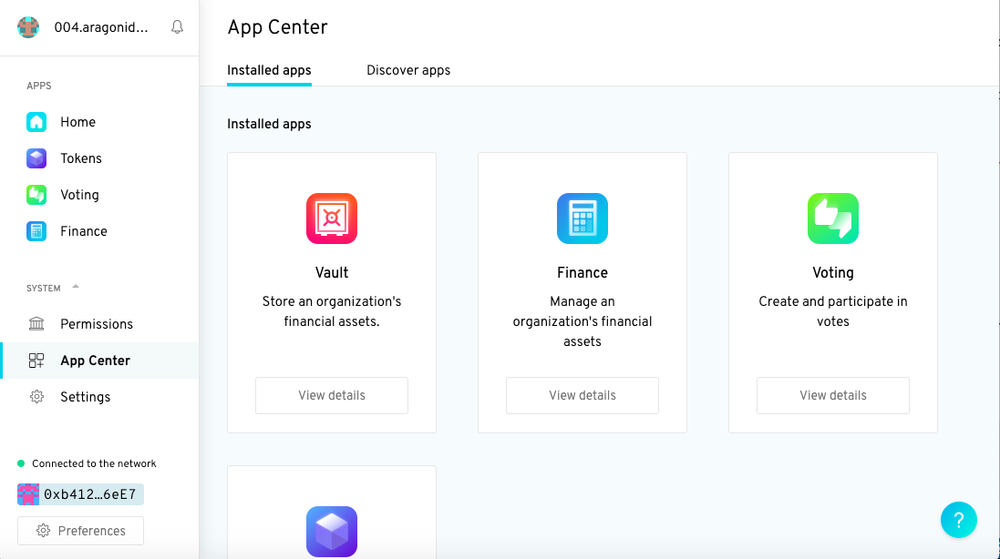
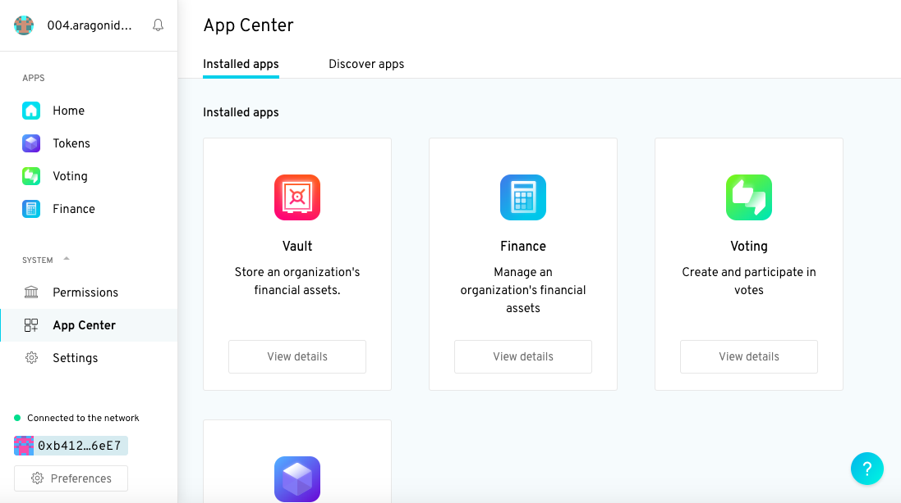
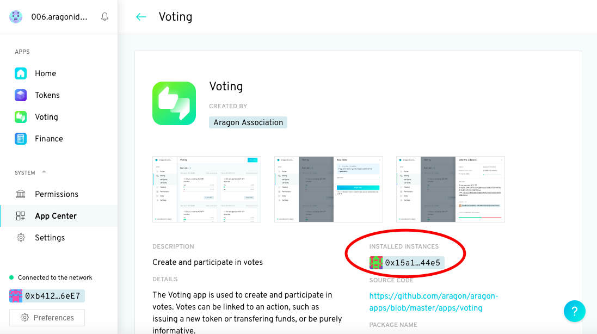
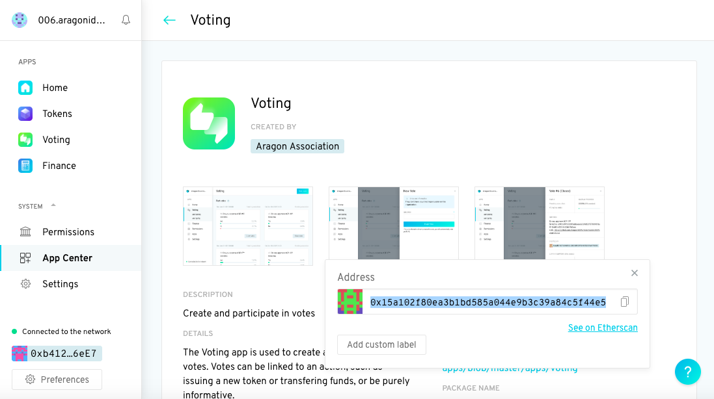
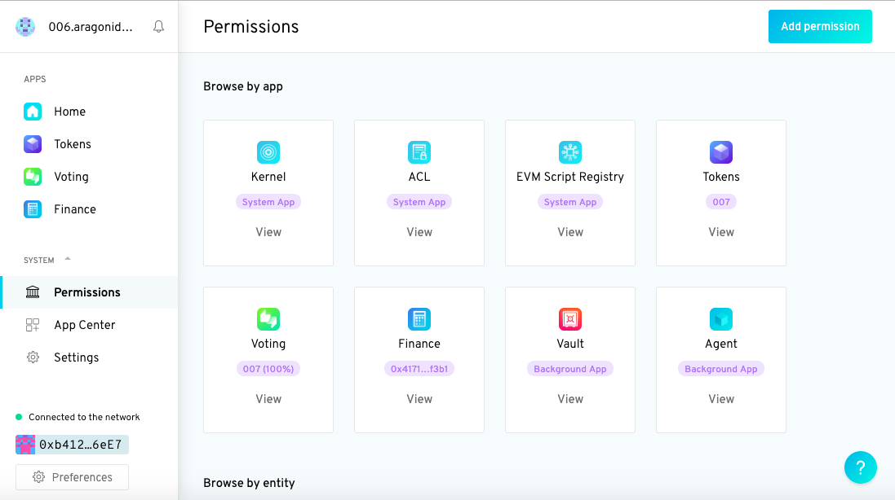

# Setting and Checking permissions

In this guide we're going to give the Voting app permission to use the Agent app to execute actions.


To assign these permissions we need to get a hold of the Ethereum address of the Agent app -- remember **Agent is a fully-fledged Ethereum account** -- as well as the address of the Voting app in our DAO.


The Agent app address can be found by running the [`dao apps`](../../aragoncli/dao-commands.md) command. `dao apps` takes one argument: the address or name of an aragon DAO.

By default it only returns apps with permissions. But we can use the `--all` option to get it to return apps without permissions.

From the command line run:

```
dao apps <dao-address-or-name> --all --use-frame --env aragon:rinkeby
```

You should see a table that looks something like this:


This can take a couple of minutes


| App                    | Proxy address                                | Content                                               |
| ---------------------- | -------------------------------------------- | ----------------------------------------------------- |
| `kernel`               | `0xa25fb31870bc492d450012ae32dafa72af9e82c3` | `(No UI available)`                                   |
| `acl`                  | `0xfefb0cdb7a1fac257815d52ba82776f98dc70205` | `(No UI available)`                                   |
| `evmreg`               | `0x9087db02300ef24b116daf0426b6ba22b28a0c79` | `(No UI available)`                                   |
| `voting@v2.0.4`        | `0x15a102f80ea3b1bd585a044e9b3c39a84c5f44e5` | `ipfs:QmPjWU51opgTVnXwAhYAWasL2CaiYHqy2mXdXtzqfC8sKx` |
| `vault@v3.0.1`         | `0x952a18185da912984e0bc8a830ba98f8151976af` | `ipfs:QmeMabCnkA5BtTTszqqRztYKCXZqE9VQFH4Vx7dY9ue2nA` |
| `finance@v2.0.5`       | `0x4171f7ac1a4606b93093e8648e2f9a16c59cf3b1` | `ipfs:QmeMLs4jHya89khHVSubLaao9cZW6ELZUoYPHkwCUwKBH7` |
| `token-manager@v2.0.3` | `0xbf07e1c74a72aa60df3ddf3115d15575d27e61e1` | `ipfs:Qmb9Bv3J9AuXD5auY1WNwiJeohnYRhyso7XMULs7EZ8eTG` |

Followed directly by another that looks like this:

| Permissionless app | Proxy address                                |
| ------------------ | -------------------------------------------- |
| `agent`            | `0x843bfA21a040E742ec32b8F6991e182D9655AF21` |

The 'permissionless app' is the Agent app we've just installed. Its address is listed under **Proxy address** in the bottom table. In this guide that's `0x843bfA21a040E742ec32b8F6991e182D9655AF21`. Yours will be slightly different however.

You should see that you can also find your Voting app's address by looking up the **Proxy address** of the voting app in the first table. In this guide that's `0x15a102f80ea3b1bd585a044e9b3c39a84c5f44e5`. Again, yours will be different!

Another way you can find your Voting app's address is to use the UI:

1. Click on **App Center** in the left panel to see your installed apps.&#x20;


<figure><figcaption></figcaption></figure>

2\. Click on the **View details** button under the voting app.&#x20;

<figure><figcaption></figcaption></figure>

3\. Click on the blue box under **Installed instances** (see inside the red ellipse in the image below).&#x20;

<figure><figcaption></figcaption></figure>

4\. You should see a small pop up appear with a header that says **Address**. Under the header is the address of your voting app. It should look something like `0x15a102f80ea3b1bd585a044e9b3c39a84c5f44e5`. Again, yours will be different!&#x20;

<figure><figcaption></figcaption></figure>


Note: the above process works with any permissioned app!


Once you've located your Agent and Voting app addresses, run the following command to give your Voting app permission to use the Agent app to execute actions.

```
dao acl create <dao-address-or-name> <agent-address> EXECUTE_ROLE <your voting app address> <your voting app address> --use-frame --env aragon:rinkeby
```

You should see a transaction appear in Frame Wallet. Sign and you should see the following appear in the terminal:

```
✔ Executing createPermission on <dao-address-or-name>.aragonid.eth

✔ Successfully executed: "Execute desired action as a token holder"
```


The Agent app does not yet appear in your DAO UI (User Interface). A **vote** has been generated (in the true spirit of democracy) to confirm the Voting app permission to use the Agent app to execute actions .


To confirm the vote:

Find the vote in the **Voting** app (left menu bar). Then **View vote**, click **Yes** and sign the transaction with your favourite web3 provider (like [Frame](../how-to-sign-with-web3-providers/setting-up-a-frame-wallet/frame.md)) and voila!&#x20;



Now the **Agent** app should appear in the left menu bar! :partying\_face:


### 5. Check permissions

As a final step, let's verify that permissions have been set properly through the UI:

1. Click on the **Permissions** menu option in the left panel. You should see the Agent app at the end of the second row. Click on it.&#x20;


<figure><figcaption></figcaption></figure>

Under **Actions available on this app** should see that the Voting app now manages who has the ability to execute actions for the Agent app:

.png>)


Well done! Now it's time to start interacting with Aragon agent!

