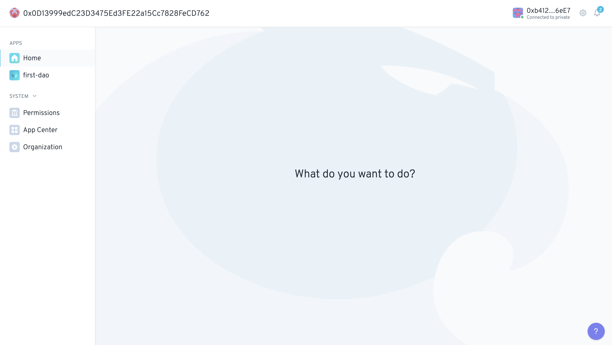

# Quick start

## Up and running <a href="#up-and-running" id="up-and-running"></a>

Now that we've got you all excited, let's go through what you need to get started building with Aragon 😊


Note before starting: Windows is not officially supported by aragonCLI at the moment.

For more support about using Windows go [here](../guides/troubleshooting-and-faq.md).


## Environment setup

### Node.js <a href="#nodejs" id="nodejs"></a>

First off, we need to be sure we have the right version of Node.js installed to prevent errors.


Dependencies of aragonCLI are constantly [updated](https://github.com/aragon/aragon-cli/pulls?q=) which result in Node version errors. Use [**NVM**](https://techstacker.com/run-multiple-node-versions-node-nvm/) to install and select the right Node version. For compatibility across OS use **`Node v12.7 LTS`** version.


Also using _yarn_ instead of _npm_ as package manager is advised in some cases. Find how to install [yarn](https://classic.yarnpkg.com/lang/en/docs/install/#mac-stable).


To see which version of Node you have installed, from the command line run:

```
node -v
```


### Web3 provider <a href="#web3-provider" id="web3-provider"></a>

Next, we'll need what we call a [web3 provider](before-starting.md) to actually sign and send transactions to the Ethereum (or another) blockchain.

In general, if you have a hardware wallet, we recommend you use [Frame](https://frame.sh/) as your web3 provider -- we'll go over how to do this in the[ tutorial](../guides/your-first-aragon-app.md) that follows.&#x20;

For now in this section, to interact with the **Aragon app** we'll be using Metamask. If you haven't please proceed with the installation of [Metamask.](https://documentation.aragon.org/products/set-up-metamask)

### The aragonCLI <a href="#the-aragoncli" id="the-aragoncli"></a>

The [aragonCLI](../aragoncli/) (or Aragon Command Line Interface) is a tool used for complex interactions with DAOs, like installing a new app, granting permissions with specific parameters or executing transactions through the [Agent app](../guides/the-agent-app/).

Now install aragonCLI from the command line running:

```
npm i -g @aragon/cli
```


Again: It is recommended to have [**NVM**](https://techstacker.com/run-multiple-node-versions-node-nvm/) installed so that you can switch to **`Node v12.7 LTS`** to install the cli. At the moment the product isn't compatible with the later versions of node anymore.

If the installation takes a long time don't worry. It can happen, wait until the process is completed (sometimes it takes 30 min!).

Check with `aragon -v` whether the package has indeed installed.



If you're having trouble with this step, you should take a look at the installing aragonCLI section of the [**troubleshooting guide**](../guides/troubleshooting-and-faq.md). If that doesn't fix things, please don't hesitate to reach out to us in the [#dev-space channel](https://discord.gg/DHgjDnp9) off our Discord server.


### The Aragon Builder plugin <a href="#the-aragon-buidler-plugin" id="the-aragon-buidler-plugin"></a>

The [Aragon Builder plugin](https://github.com/aragon/buidler-aragon) is a user-friendly tool for developing apps on top of Aragon. The plugin is automatically installed when using the boilerplate templates but we can suggest to install now with the following command:

```
npm i @aragon/buidler-aragon
```

## Getting Started  <a href="#quick-start" id="quick-start"></a>

In order to get up and running quickly, **we’ll build our first DAO** using some basic scaffolding. Just like real scaffolding in a construction site, when we talk about scaffolding in this context, we mean a simple prebuilt structure for your project, on top of which you can build the real one.

To create your first (scaffolded) DAO, from the command line run:

```
npx create-aragon-app first-dao.aragonpm.eth
```


Don't worry about fully understanding this line right now. Really. We'll cover that in the [tutorial ](../guides/your-first-aragon-app.md)coming up. Right now, you just need to know that the scaffolding relies on some generated code, magically created by the `create-aragon-app` command.



If you're unsure what the difference is between `npx` and `npm`, we recommend you read through this [medium post](https://medium.com/@maybekatz/introducing-npx-an-npm-package-runner-55f7d4bd282b) and this [stackoverflow post.](https://stackoverflow.com/questions/50605219/difference-between-npx-and-npm)


Now if you look at your terminal, you should see a five step process:

:white\_check\_mark:`Preparing initialization`

:white\_check\_mark:`Cloning app template`

:white\_check\_mark:`Preparing template`

:white\_check\_mark:`Installing package dependencies`

:white\_check\_mark:`Created new application first-dao.aragonpm.eth in first-dao.`

Once all 5 have ticks next to them, you should run the following:

```
cd first-dao
yarn start
```

where:

* `cd first-dao`, just moves us into the directory where the scaffolded app was created.
* `yarn start`, sets up everything for us in the background so we can quickly live test our DAO.


If you've made it this far congrats 🤗. You've just created your first DAO! It’s running on your local network and as soon as it's ready it will open in your browser at [localhost:3000](http://localhost:3000/)!


## Interacting with your first DAO <a href="#interacting-with-your-first-dao" id="interacting-with-your-first-dao"></a>

Once your browser is open at the right address, you should see a screen that looks like the one below.

<figure><figcaption><p>DAO Home</p></figcaption></figure>

As you can see on the left, this DAO is made up of two Aragon apps:

* Home
* first-dao (Counter)

Right now, we're in the Home app. This app just displays a welcome message with no possible user interactions.

Click on first-dao to open up the (slightly) more interesting Counter app.


Right now the count is at 0. Let's increment it.

Note that incrementing the counter triggers a blockchain transaction that saves the new value to the chain. But before the transaction can be sent, we need to sign it (to prove it was us that really sent it).

Click on the + button, which opens a Metamask transaction and sign it. For help on how to sign a transaction on Metamask go through these steps:


First of all, you have to connect your _first-dao_ app to Metamask. [Here](../guides/how-to-sign-with-web3-providers/set-up-metamask/) you can learn to setup a Metamask wallet. [Here](../guides/how-to-sign-with-web3-providers/set-up-metamask/import-your-seed-wallet-in-metamask.md) how to import your _first-dao_ seed phrase. And [here](../guides/how-to-sign-with-web3-providers/set-up-metamask/metamask.md) on how to sign a _first-dao_ transaction using Metamask.&#x20;


After the transaction is completed, you should see Count: 1.


Done! We hope you enjoyed that 😊!&#x20;


## Next steps <a href="#next-steps" id="next-steps"></a>

Now that you’ve built your first DAO, feel free to take a look at the docs. If you're interested in understanding things at a deeper level go ahead to this [tutorial](../guides/your-first-aragon-app.md)!&#x20;

