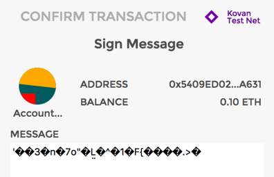
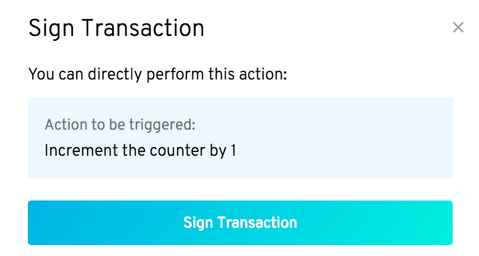

# Human readable transactions


Keeping **users informed.**


## How does it work?

A big part of Aragon is user-friendliness, and one of the most unfriendly things in the Ethereum world is transaction data.&#x20;

Examine this screenshot of a transaction in MetaMask:

<figure><figcaption><p>UTF8 string in MetaMask</p></figcaption></figure>

Would you know what this transaction does? Not even a developer could tell. This is why we created **Radspec**.

**Radspec is a secure alternative to Natspec**. Natspec was supposed to be a way to describe transactions from a Natspec _expression_ and some transaction data.

The issue with Natspec, however, is that it is insecure. Any JavaScript can execute in Natspec which opens up a lot of potential attacks, like cross-site scripting, which might successfully phish users.

## How to use Radspec <a href="#how-to-use-radspec" id="how-to-use-radspec"></a>

It's as easy as adding `@notice` to functions in the smart contracts.

```solidity
contract Counter is AragonApp {
    /**
     * @notice Increment the counter by `step`
     */
    function increment(int step) auth(INCREMENT_ROLE) external {
        // ...
    }

    /**
     * @notice Decrement the counter by `step`
     */
    function decrement(int step) auth(DECREMENT_ROLE) external {
        // ...
    }
}
```

These Radspec expressions are **written in comments in your source code**, and they will be grabbed by `aragon` and bundled with your app.

The [Aragon client ](the-aragon-client.md)will display these _with_ the transaction a user is about to perform so that they have a clear understanding of what they're about to sign.

<figure><figcaption><p>Screenshot of signer showing Radspec</p></figcaption></figure>


Our Radspec expressions show up while signing a transaction.


Obviously, this is a super trivial example as we are not actually evaluating anything but we could instead write something more complex.


> <mark style="color:purple;">**Do you have a question? Leave your comments here at our Discourse forum**</mark>** 👇**


