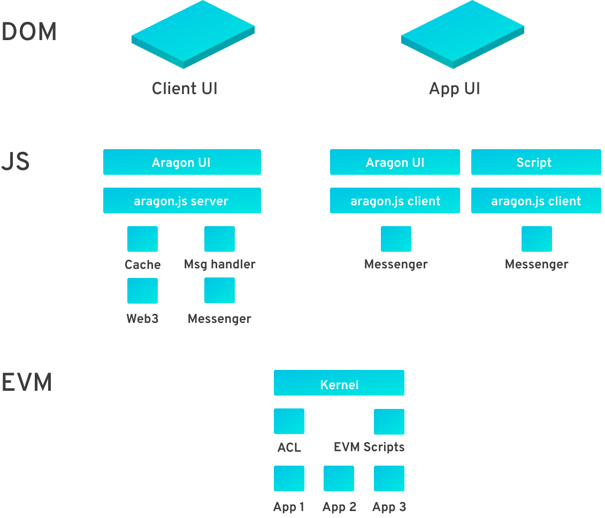

# Tech Stack


For <mark style="color:blue;">**creating DAOs, dapps**</mark> and <mark style="color:blue;">**protocols**</mark>.


From a technical perspective, Aragon can be seen as an **operating system for human organizations**. Therefore, the **Aragon stack** can be thought of as an **operating system**, just like macOS or Linux.

A computer operating system manages which processes have access to the computer's resources. They do that with the following components:

* A Kernel, which has drivers that let the software control the hardware
* A permission system, to manage which processes can access each resource
* A self-upgrade system, for bugs and enhancements

You wouldn't want a Tetris app to own full control over your computer's RAM. That would enable tampering with other apps or stealing precious information. Similarly, you wouldn't want a CryptoKitties app to have full control over the funds of your DAO.

The role of the OS, and in this case of the Aragon stack, is to create an environment in which **apps can abstract over the underlying resources** while ensuring security.

You can read more and see how they work [here](https://documentation.aragon.org/products/aragon-client/explore-template-dao/what-are-apps).

## The layers of the stack 

<figure><figcaption></figcaption></figure>


This is a diagram of the Aragon stack, from the Ethereum Virtual Machine to the User Interface


## The Kernel 

The Kernel is a very simple smart contract. It keeps track of an Access Control List (ACL) app which it uses for **permission management of the entire DAO**.

The Kernel also knows where to find its installed apps and handles upgradeability of the apps by keeping references to the actual code that apps run.

You can read more about the Kernel [here](../aragonos/reference-documentation.md#kernel).&#x20;

## Permission management 

In conventional operating systems you just have normal users and admins but for decentralized governance, you need much more.

aragonOS contains a **rich permissions system**. Any resource or functionality can be assigned a **role**. Only entities that have permission to call that role can access that resource. Those permissions are all set in the [Access Control List](permissions.md).

With aragonOS, permissions work the following way:


_Entity **E**_ can call _Function **F**_ (protected by _Role **R**_ and parameterized by _Params **P**_...) on _App **A,**_&#x20;

&#x20;                                                                     only&#x20;

Only if _Entity **E**_ holds a permission for _Role **R**_ on _App **A**_ and their arguments to _Function **F**_ satisfy _Rules **R**_.&#x20;

A _Permission Manager **M**_ can revoke or reassign that permission.


Which simplified would be:


An entity can call a function on an app and its manager can revoke or reassign that permission.


This enables a great amount of flexibility in permission configuration. You can read more about Permissions [here](https://documentation.aragon.org/products/aragon-client/explore-template-dao/system-setting/permissions-setting).

## Permission escalation 

In a conventional OS there is usually just one way to escalate permissions, by using tools like `sudo`.

With aragonOS, since permissions are so rich, there may be **many paths to escalate permissions**.

#### **Example:**

A token holder may have permission to create a vote, and the voting app may have permission to withdraw funds. In that case, the Aragon client tells the user that option when they attempt to withdraw funds.&#x20;

Users can show their intent for performing an action by trying to execute it directly without having to know the process for executing the action. By traversing the Access Control List, Aragon can automatically determine the path needed for executing the action.

## Full sandboxing 

Permission management is key for allowing security at the smart contract level. This is similar to the Kernel, filesystem and process security in a conventional OS.

Yet the Aragon client is a frontend too, so security is also paramount in the UI environment. This is similar to how many operating systems impose **app sandboxing**. An app shouldn't be able to access or tamper with another running app. It would be disastrous if a malicious app could inject code or modify the frontend of another app.

Aragon's approach to frontend sandboxing is a combination of **sandboxed iframes** and **cross-origin messaging** through a custom RPC protocol built specifically for Aragon. Apps do not have direct access to Web3 or Ethereum.

The Aragon Client uses [aragonAPI ](../aragonapi/)to provide apps APIs for accessing smart contracts, displaying notifications and signing transactions. When signing transactions, a panel opens up in the client, not in the app. Apps cannot prompt users to sign transactions directly and they cannot interact with the contracts of other apps—in reality, they can only send action "intents". Thus all transactions are securely handled by the Aragon Client, decreasing the attack surface.

You can read more about the Aragon Client [here](the-aragon-client.md).

## Cohesive UI 

It is commonly thought that iframes degrade the user experience and are not best practice. Though [aragonUI](../aragonui/) uses iframes, it has been built to mitigate this issue. Additionally, it allows all apps to look and behave the same to provide a consistent experience for users across Aragon apps.

You can read more about aragonUI [here](../aragonui/).

