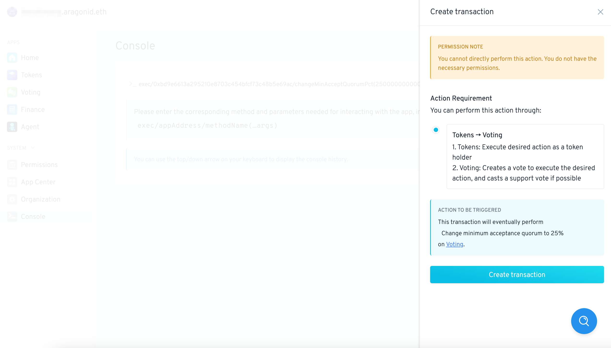

# Cambiar Quórum usando Aragon Console


Esta guía le mostrará cómo cambiar el quórum mínimo (participación) necesario para que se aprueben los votos en su DAO usando Aragon Console.


Abra su DAO, agregando `/console`al final de su dirección web de DAO. La URL se vería así:`https://client.aragon.org/#/<your-dao-name>/console`


Reemplace `<your-dao-name>`con el nombre de su DAO en la URL anterior


Debería ver algo como lo siguiente:

<figure><figcaption></figcaption></figure>

A continuación, seleccione `Exec` el cuál es un comando utilizado para realizar transacciones DAO.

Ahora debería ver la siguiente pantalla. Seleccione `Voting`, ya que creará un cambio en la aplicación de votación:

<figure><figcaption></figcaption></figure>

En el código fuente de la aplicación de votación en [Github](https://github.com/aragon/aragon-apps/blob/631048d54b9cc71058abb8bd7c17f6738755d950/apps/voting/contracts/Voting.sol) , puede encontrar una función para cambiar el porcentaje de quórum mínimo aceptado, exactamente lo que necesitamos:

```solidity
function changeMinAcceptQuorumPct(uint64 _minAcceptQuorumPct)
    external
    authP(MODIFY_QUORUM_ROLE, arr(uint256(_minAcceptQuorumPct), uint256(minAcceptQuorumPct)))
{
    require(_minAcceptQuorumPct <= supportRequiredPct, ERROR_CHANGE_QUORUM_PCTS);
    minAcceptQuorumPct = _minAcceptQuorumPct;

    emit ChangeMinQuorum(_minAcceptQuorumPct);
}
```

Ahora llamaremos a esta función desde la Consola de Aragón. Tendremos que agregar `changeMinAcceptQuorumPct(uint64 _minAcceptQuorumPct)`al comando en la consola, pero primero lo reemplazaremos `uint64 _minAcceptQuorumPct`con el porcentaje de quórum mínimo deseado.

Esto se expresa como un porcentaje de `10^18`, por ejemplo `100% = 10^18`y `1% = 10^16`. Digamos que desea un nuevo quórum mínimo del 25 %, luego debe agregar 16 ceros a los 25 que llegan a`250000000000000000`


**Advertencia**

¡ El **porcentaje de quórum mínimo nunca puede ser mayor que el porcentaje de apoyo requerido** para los votos dentro de su DAO! Así que asegúrese de que el porcentaje de soporte requerido de su DAO sea del 55% o más. De lo contrario, use un porcentaje inferior al porcentaje de soporte requerido para este tutorial (de lo contrario, se encontrará con un problema más adelante).


Ahora agregue `changeMinAcceptQuorumPct(250000000000000000)`al comando en la consola:

<figure><figcaption></figcaption></figure>

Cuando ahora presione 'Enter', debería aparecer una transacción en su proveedor Web3 (Metamask para la mayoría de los usuarios). Comprueba si el Porcentaje de Quórum mínimo coincide con lo que tenía en mente:

<figure><figcaption></figcaption></figure>

Haga clic en 'Crear transacción' y fírmela con su proveedor Web3.

¡Ya casi ha llegado! Pero primero vaya a la aplicación Voting ya que este cambio ha generado automáticamente un voto. Ahora usted (y suficientes miembros de su DAO) deben aprobar la votación para que se apruebe:

<figure><figcaption></figcaption></figure>


**Advertencia**

La voluntad de cambio sólo podrá ser **promulgada** cuando se haya agotado el tiempo de votación restante. En el caso de este ejemplo, el `Tiempo restante`es`23H:59M:12S`☝


​Cuando se agote el tiempo de votación, haga clic en 'Promulgar este voto' y firme la transacción con su proveedor Web3:

<figure><figcaption></figcaption></figure>

Una vez hecho esto, el Porcentaje de Quórum mínimo debería haberse ajustado al 25%. Puede verificar esto creando un nuevo voto. Cuando abre la votación, `MINIMUM APPROVAL`debería haberse ajustado a `>25% needed`.


Si llegó hasta aquí, ¡bien hecho!👏​


<mark style="color:purple;">**¿Tiene alguna pregunta? Deje sus comentarios aquí en nuestro foro Discourse (disponible actualmente solo en**</mark> <mark style="color:purple;">**inglés).**</mark>** 👇**


