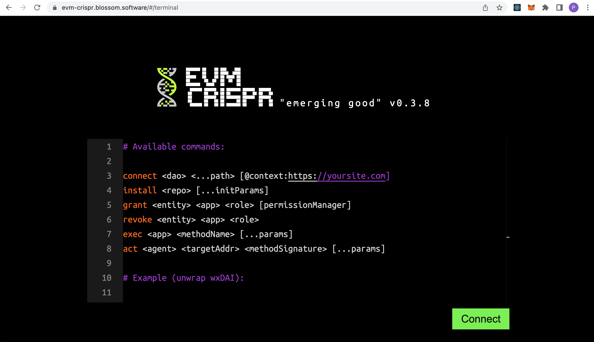
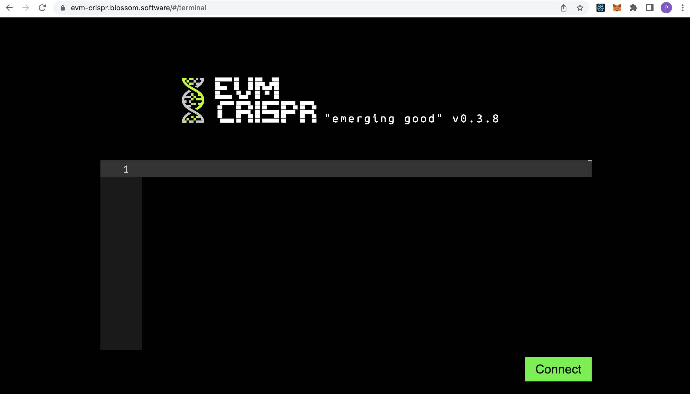
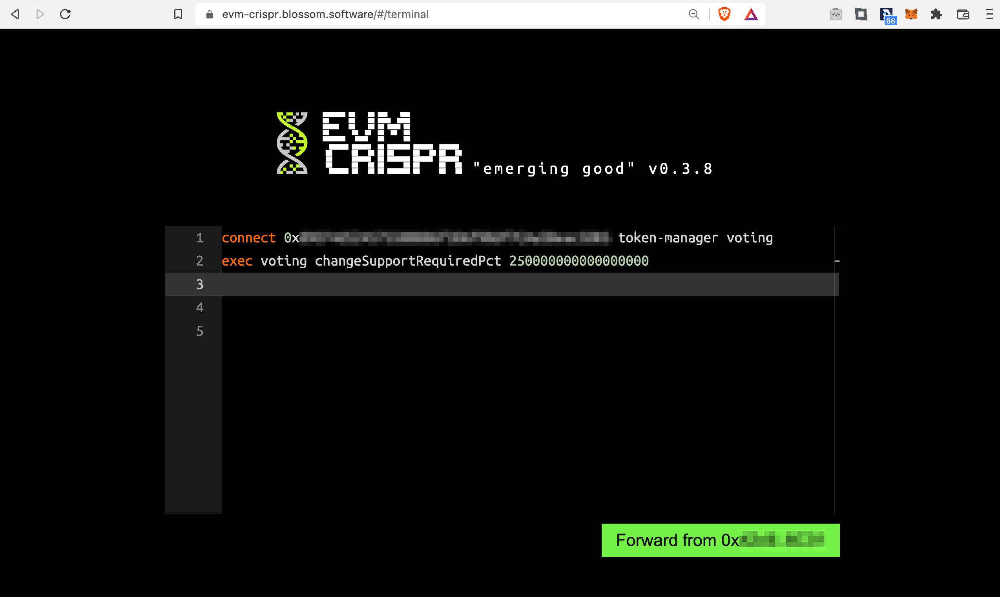
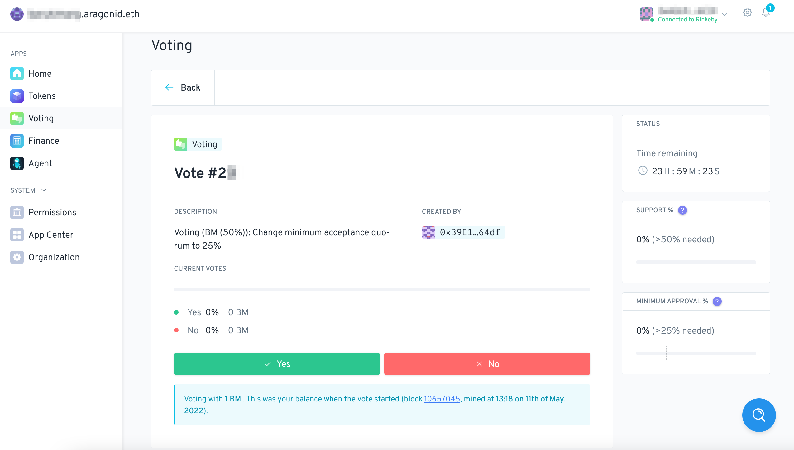
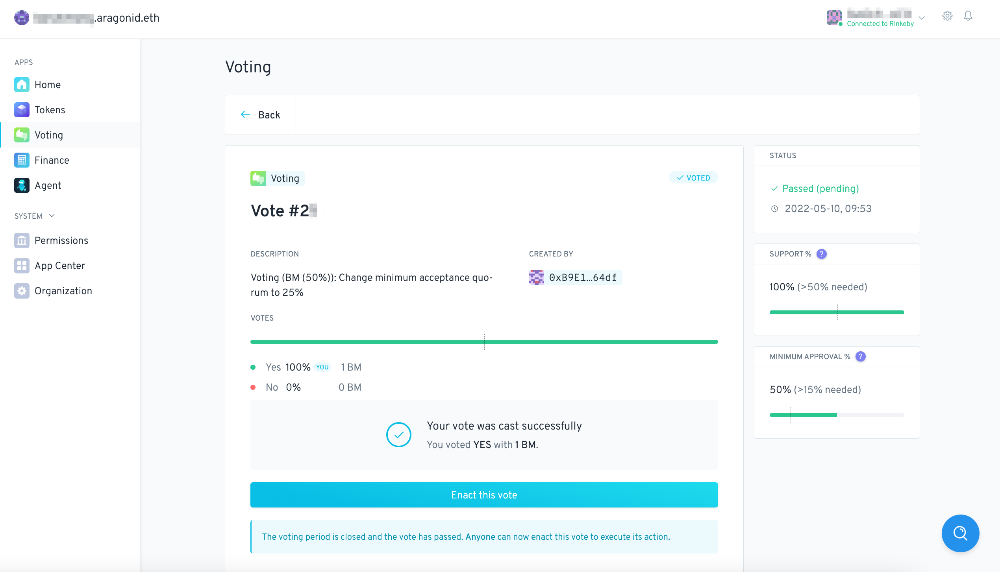

# Cambiar Quórum usando EVMcrispr


Esta guía le mostrará cómo cambiar el quórum mínimo (participación) necesario para que se aprueben los votos en su DAO usando [**EVMcrispr**](https://evm-crispr.blossom.software/#/) (disponible actualmente solo en inglés).

EVMcrispr es una poderosa herramienta que combina un lenguaje específico de dominio con una biblioteca Javascript para interactuar con las DAO de Aragon.


Primero, abra EVMcrispr [aquí](https://evm-crispr.blossom.software/#/) (disponible actualmente solo en inglés) y haga clic en 'Abrir terminal'. Ahora, debería aparecer esta pantalla:

<figure><figcaption></figcaption></figure>

A continuación, elimine todo el texto en la terminal:

<figure><figcaption></figcaption></figure>

Haga clic en 'Conectar' para conectarse a su proveedor Web3 (Metamask para la mayoría de los usuarios).


**Advertencia**

Asegúrese de conectar una cuenta a EVMcrispr que también tenga permiso de firma en su DAO.


Ahora vamos a escribir los comandos para cambiar el porcentaje de quórum mínimo.

Para cambiar el porcentaje de quórum mínimo para su DAO, deberá conectarse a su DAO con `connect <dao-name-or-address`. A continuación, agregamos `token-manager voting`porque la `token-manager`aplicación tiene lo `CREATE_VOTES_ROLE`necesario para reenviar acciones a `voting`la aplicación con la que interactuaremos. Esto es lo que tenemos hasta ahora:

```
connect <dao-name-or-address> token-manager voting
```

Ahora escribiremos la segunda línea de comando para la terminal EVMcrispr. Lo primero que hay que añadir es `exec`que es un comando que se utiliza para realizar transacciones DAOs. A continuación, agregamos `voting`la aplicación con la que interactuaremos. Esto es lo que tenemos hasta ahora:

```
connect <dao-name-or-address> token-manager voting
exec voting
```

Sin embargo, no estamos listos. Cuando buscamos en el código fuente de la aplicación de votación en [Github](https://github.com/aragon/aragon-apps/blob/631048d54b9cc71058abb8bd7c17f6738755d950/apps/voting/contracts/Voting.sol) , podemos encontrar una función para cambiar el porcentaje de quórum mínimo aceptado, esto es exactamente lo que necesitamos:

```solidity
function changeMinAcceptQuorumPct(uint64 _minAcceptQuorumPct)
    external
    authP(MODIFY_QUORUM_ROLE, arr(uint256(_minAcceptQuorumPct), uint256(minAcceptQuorumPct)))
{
    require(_minAcceptQuorumPct <= supportRequiredPct, ERROR_CHANGE_QUORUM_PCTS);
    minAcceptQuorumPct = _minAcceptQuorumPct;

    emit ChangeMinQuorum(_minAcceptQuorumPct);
}
```

Ahora añadiremos esta función a los comandos para que la terminal la llame. Tendremos que agregar `changeMinAcceptQuorumPct(uint64 _minAcceptQuorumPct)`, pero primero lo reemplazaremos `uint64 _minAcceptQuorumPct`con el porcentaje de quórum mínimo deseado.

Esto se expresa como un porcentaje de `10^18`, por ejemplo `100% = 10^18`y `1% = 10^16`. Digamos que desea un nuevo quórum mínimo del 25 %, luego debe agregar 16 ceros a los 25 que llegan a`250000000000000000`


**Advertencia**

¡El **porcentaje de quórum mínimo nunca puede ser mayor que el porcentaje de apoyo requerido** para los votos dentro de su DAO! Así que asegúrese de que el porcentaje de soporte requerido de su DAO sea del 55% o más. De lo contrario, use un porcentaje inferior al porcentaje de soporte requerido para este tutorial (de lo contrario, se encontrará con un problema más adelante).


Ahora agregue `changeMinAcceptQuorumPct 250000000000000000`a los comandos para la terminal:

```
connect <dao-name-or-address> token-manager voting
exec voting changeMinAcceptQuorumPct 250000000000000000
```

¡Los comandos están listos! Cópielos/péguelos en la terminal y haga clic en el botón 'Adelante...':

<figure><figcaption></figcaption></figure>

Firme la transacción desde su proveedor Web3 y ahora debería ejecutarse con éxito.

**Advertencia**

Use su dirección DAO en caso de su nombre DAO en caso de este error:

`Error: ENS <dao-name>.aragonid.eth not found in rinkeby, please introduce the address of the DAO instead.`

Ya casi estamos listos, pero primero abra su DAO en el navegador web. La URL debe ser:

`https://client.aragon.org/#/<dao-name-or-address>`

A continuación, vaya a la aplicación de votación, ya que este cambio ha generado automáticamente un voto. Ahora usted (y suficientes miembros de su DAO) deben aprobar la votación para que se apruebe:

<figure><figcaption></figcaption></figure>


**Advertencia**

La voluntad de cambio sólo podrá ser **promulgada** cuando se haya agotado el tiempo de votación restante. En el caso de este ejemplo, el Tiempo Restante es`23H:59M:12S`☝


​Cuando se agote el tiempo de votación, haga clic en 'Promulgar este voto' y firme la transacción con su proveedor Web3:

<figure><figcaption></figcaption></figure>

​Una vez hecho esto, el Porcentaje de Quórum mínimo debería haberse ajustado al 25%. Puede verificar esto creando un nuevo voto. Cuando abre la votación, `MINIMUM APPROVAL`debería haberse ajustado a `>25% needed`.


Si llegó hasta aquí, ¡bien hecho!👏​​

