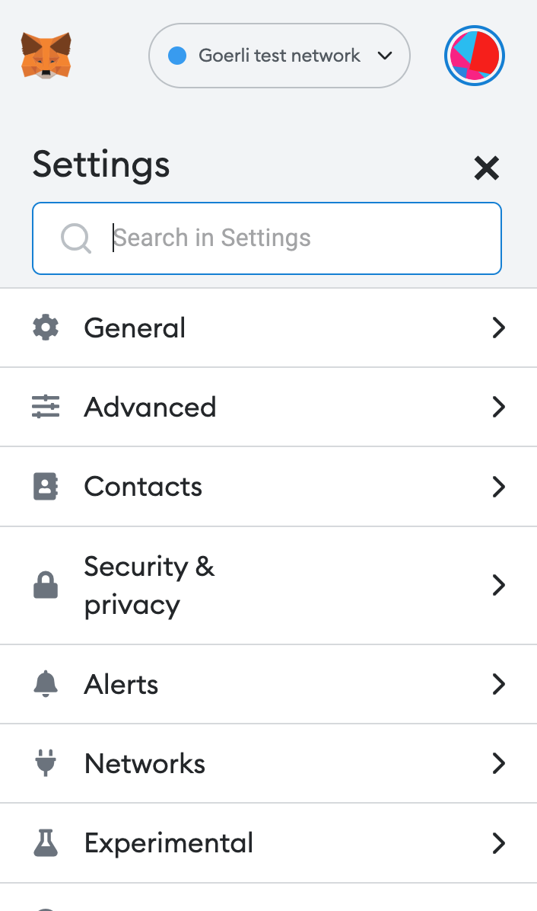
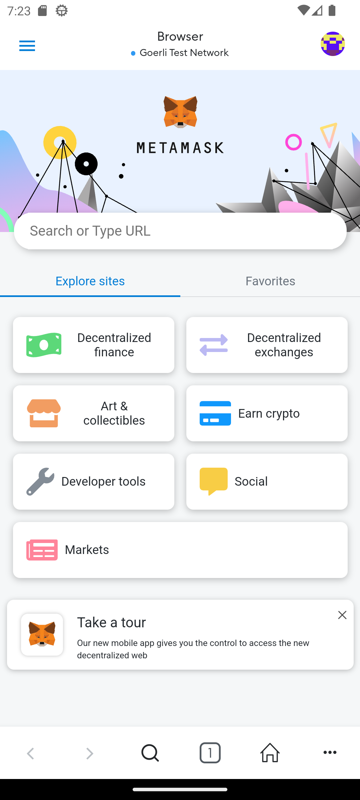
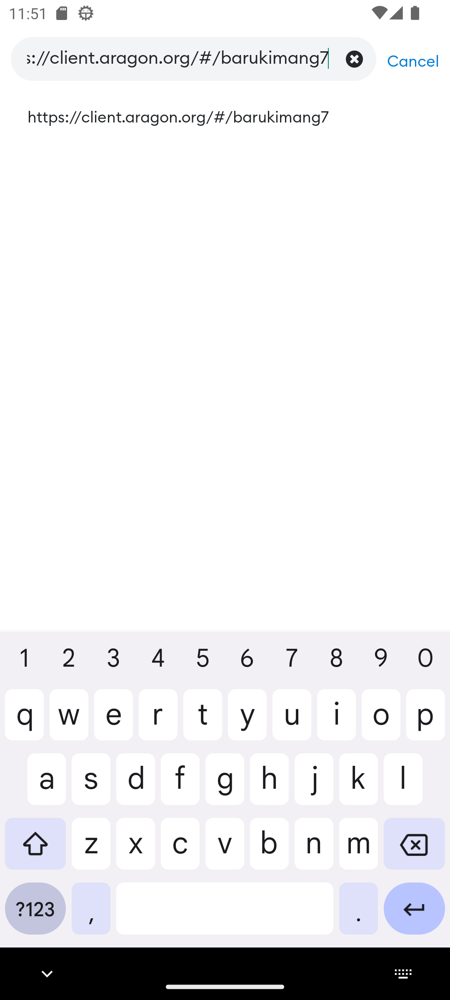
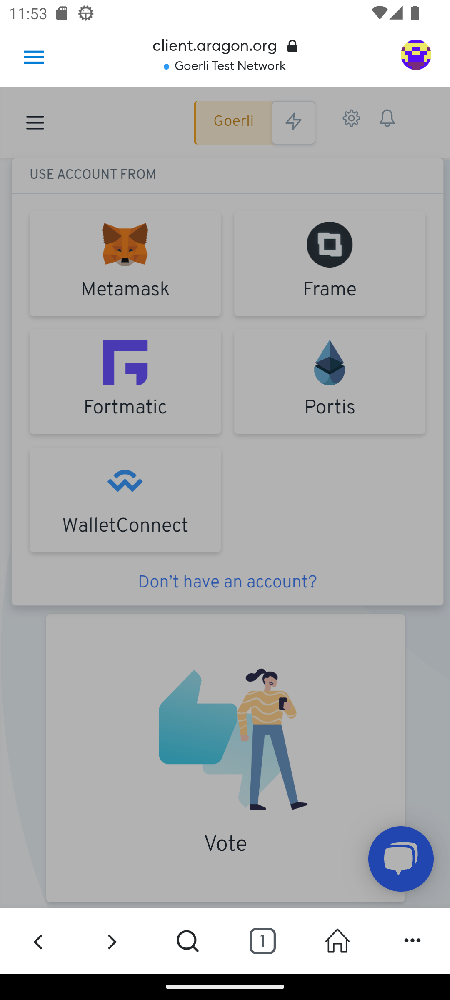
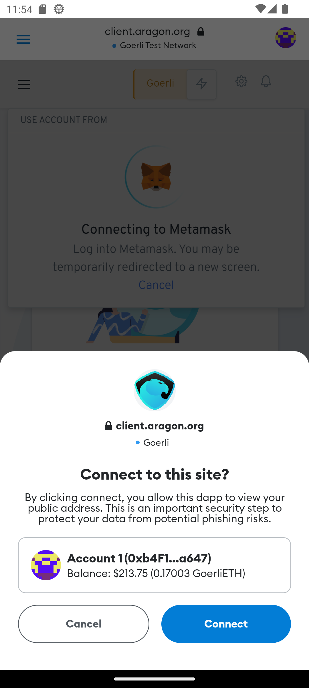
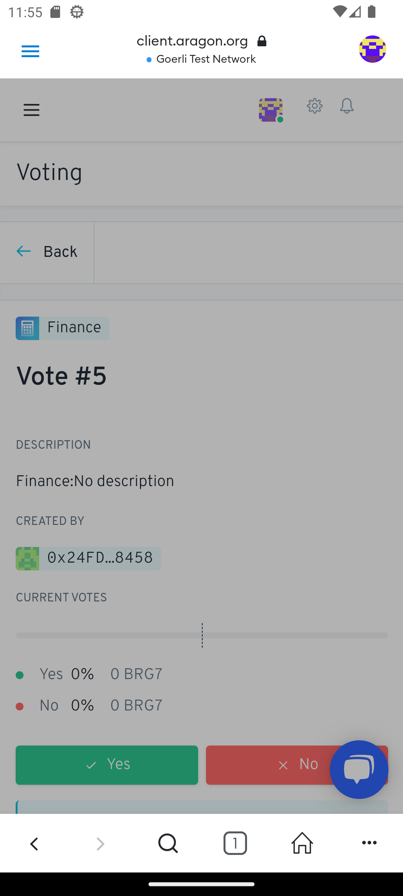
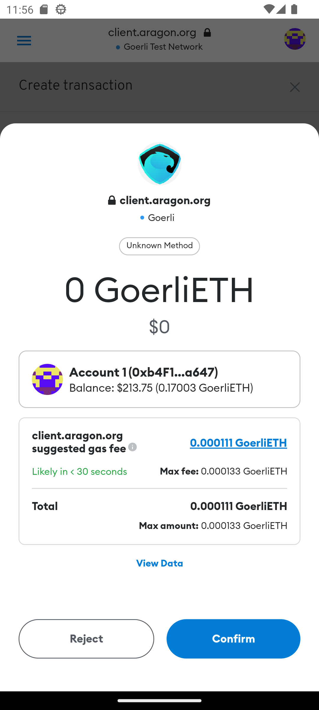
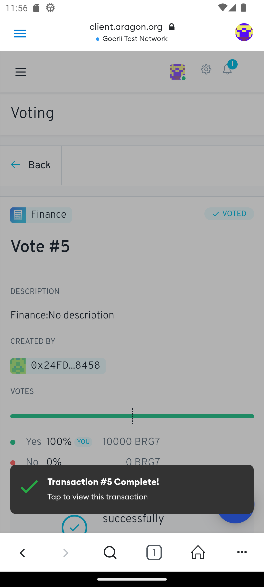
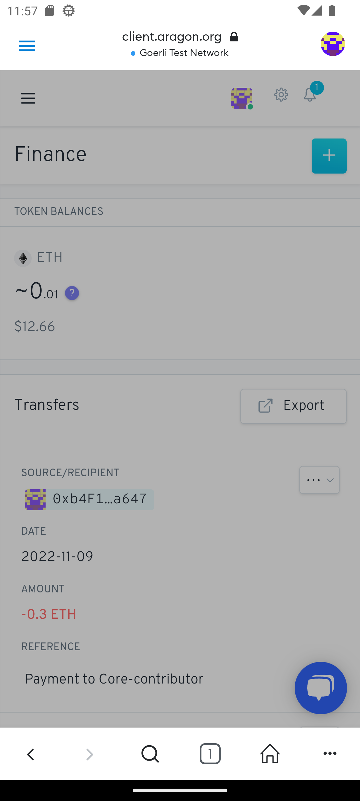

# 🏗 How to Operate your DAO from your Mobile Phone


For this example we will use the **MetaMask** Web3 Wallet since it can be used on Desktop with a browser extension and Mobile Phone app with an inbuilt browser.


First up: download the MetaMask app for your Android or iOS phone:






In this example, your DAO peer has initiated a transaction of 0.3 ETH to a Core-contributor. This has generated a Vote, which you will approve from your Mobile Phone while you are 'flixing' on your couch :popcorn:&#x20;


Open the MetaMask app at your phone and 'Get started':

<figure><figcaption></figcaption></figure>

Now there is a possibility to import your Desktop MetaMask wallet into your Mobile Phone wallet. To do so press 'Import using Secret Recovery Phrase':

<figure><figcaption></figcaption></figure>

You will now need to enter the Secret Recovery Phrase. To do so open the MetaMask Desktop extension wallet, and click on the 'account circle' at the top right hand corner and then click 'Settings':


Make sure that it is the wallet which created the DAO or which owns DAO-tokens.


<figure><figcaption></figcaption></figure>

Click on 'Security and privacy':

<figure><figcaption></figcaption></figure>

Click on 'Reveal Secret Recovery Phrase' and then copy your phrase:


It is **recommended to copy the Secret Recovery Phrase by writing it on a piece of paper**. Be careful sharing it electronically since anyone who gets access to your phrase can sign transactions at your DAO, and can access funds in your MetaMask wallet!


<figure><figcaption></figcaption></figure>

Now head back to your Mobile Phone. Enter the Secret Recovery Phrase, create a new wallet password and press 'IMPORT':

<figure><figcaption></figcaption></figure>

You should now see your Wallet imported in the MetaMask app! To make sure you are connected to the network where your DAO has been deployed, click on 'Wallet':

<figure><figcaption></figcaption></figure>

Select the right Network (in case of this example it is Goerli Test Network):

<figure><figcaption></figcaption></figure>

Now back in the Wallet screen, press on the 'hamburger icon' in the upper left hand corner. A side window should open. Press here on 'Browser' to open the inbuilt MetaMask app browser:

<figure><figcaption></figcaption></figure>

Press on the 'Search or Type URL' box:

<figure><figcaption></figcaption></figure>

Now head over to your DAO on the Desktop and copy it's URL. In the case of this example the URL is: [https://client.aragon.org/#/barukimang7](https://client.aragon.org/#/barukimang7)

Paste the URL into the MetaMask browser page and confirm:

<figure><figcaption></figcaption></figure>

The DAO should now open in the browser. Time to connect the MetaMask Mobile Phone wallet, press on the :zap:-symbol:

<figure><figcaption></figcaption></figure>

Press 'Metamask':

<figure><figcaption></figcaption></figure>

Press 'Connect':

<figure><figcaption></figcaption></figure>

You should now see a connection between your DAO and your MetaMask mobile wallet!


A similar Web3 Wallet connection is **NOT** possible using another mobile phone browser.


Time to approve the Vote which has been initiated by your DAO peer. So press 'Vote':

<figure><figcaption></figcaption></figure>

Your peer told you approval of Vote #5 is needed. You the Vote, press on it:

<figure><figcaption></figcaption></figure>

To approve the Vote, press 'Yes':

<figure><figcaption></figcaption></figure>

Now press 'Create transaction':

<figure><figcaption></figcaption></figure>

'Confirm' the transaction:

<figure><figcaption></figcaption></figure>

The Voting transaction has processed and the Vote has passed!


Passing of the Vote depends on meeting the minimum required support and approval for the Vote.


<figure><figcaption></figcaption></figure>

To check whether the transaction of 0.3 to the Core-contributor has been executed, click the lowest of the two 'hamburger icon' in the top left hand corner, and select 'Finance'. In Finance you can see the payment has been done!

<figure><figcaption></figcaption></figure>

Victory! :medal:

You can now operate your DAO like a real boss :video\_game:
