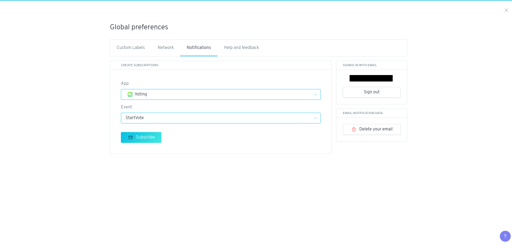
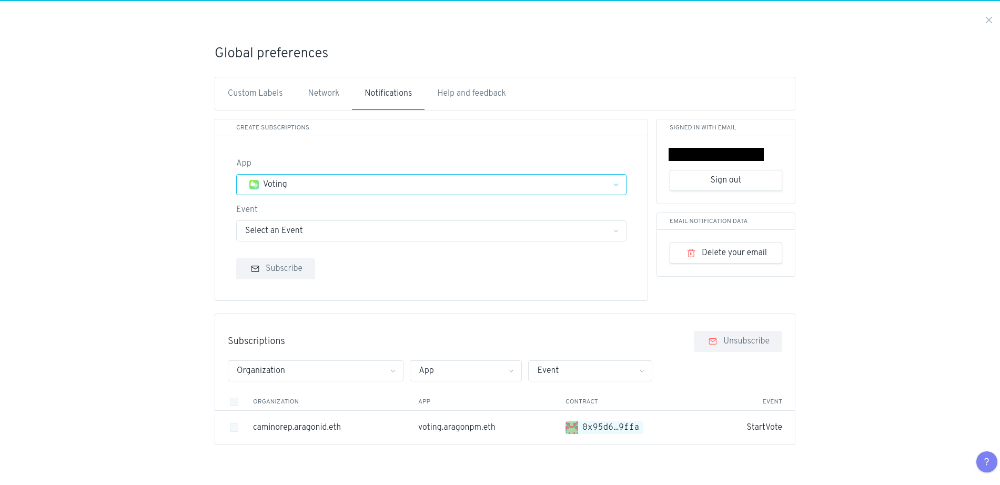

# Home


In this section, we explore the Home page of your DAO, the menu and the main section.


## Home page

The **Home page** welcomes you to your organization and offers you several options for different actions you can take.

### The Home page is a simple landing page that shows you:

* The **name of the organization** (on the top left) you have created and loaded.
* The **wallet address** and the **network** in use (on the top right).
* As well as different actions that you can take using the **pre-installed apps** in your organization.

You can also use the menu on the left-hand side of the screen to view the different **apps** that are currently installed for your organization.

In the example (shown in the image), the organization _**camino.aragonid.eth**_ has the Token Manager, Voting, Finance, and Agent apps installed, plus default Permissions, App Center, and Organization System apps.

So in this DAO we can perform the actions of assign _Tokens_, _Vote_, _Check Finance_, and _Create Payments_.

## Menu features

In the menu on the top left and right sides of the screen, there are several features that you may find useful.

Note that many of these features take advantage of the _local storage_ in your browser, so if you clear your browser data then you may lose this data unless you make a backup.

### Network connection indicator

The network connection indicator (located on the top right) will tell you if the Aragon client you are using is connected to one of the supported networks or not (either Ethereum, Polygon, Harmony, Goerli, and so on).

* <mark style="color:red;">Red light</mark>: your Aragon client isn't connected to the node. The connection has failed.
* <mark style="color:green;">Green light</mark>: your Aragon client is well connected to the node and it is working properly. The client is successfully connected to the network.

### Enable account


To use the Aragon client, you must first allow Aragon to access your Ethereum account (your web3 wallet).


This will allow the Aragon client to send transactions to your Ethereum account for signing and to read information about your Ethereum account, such as the address and token balances.


For more info about Ethereum account and web3 Metamask wallet read [here](../../set-up-metamask/).


If not already connected, click _**Enable account**_ and approve the access request in your Ethereum provider to complete the process.

### Favorite organization

You can click on the organization name at the top left of the screen and click the _star_ icon next to it to add the organization to your favorites.

Then even if you go to another organization, you can click on the _**organization name**_ and see your list of favorites that you can easily navigate to.

### Activity status

Click the _**alarm bell**_ icon (on the right) to see the status of any transactions you have made using Aragon.

You can clear the status history by clicking the _**Clear history**_ button once you have made a transaction.

### Global preference

Click the \_**gear** \_ icon (on the top right) to manage your global preferences. These preferences will be saved locally and used across every Aragon organization you use.

## **Custom labels**

Click on any Ethereum address throughout the Aragon client to give it a custom label, such as the name of the person or organization that owns the address. Enter the label and save.

These labels will then show up in your global preferences (the _gear_ icon on the top right) under the Custom Labels tab. You can import a list of labels provided by someone else, and also export or any labels you have created.

Make sure to export your labels from time to time to ensure you have a backup in case the local storage in your browser where the labels are stored is accidentally or intentionally cleared.

## **Notifications**

You can opt-in to email notifications about activity in organizations that you are interested in on the Notifications tab of your global preferences.

Enter your email address and then click the activation link in your email to sign up.


If you don't receive the email in your inbox folder, please check your Spam folder.


Then you can add "actions" in your organization that you want to get notified about whenever they happen.

## **Apps menu**

On the left side bar are listed all the apps installed on your DAO. For access to an app click on its name. For more info about the apps go [here](what-are-apps/).

## **System menu**

On the left side bar click on the _**System**_ menu to reveal the System settings that come with every Aragon organization template by default:

* Permissions
* App Center
* Organization


For more info go about the settings go [here](system-setting/).


> <mark style="color:purple;">**Do you have a question? Leave your comments here at our Discourse forum**</mark>** 👇**


