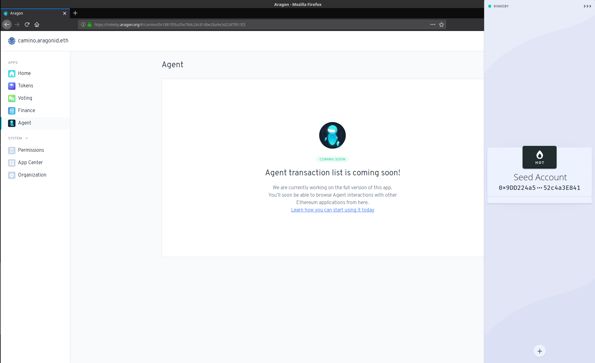

# Usando Agent com Frame


Nesta seção, vamos orientá-lo sobre como usar o Agent App com Frame wallet.


## Como usar o aplicativo Agent? 

A maneira mais fácil de usar o aplicativo Agent para interagir diretamente com outros contratos inteligentes Ethereum é usando o recurso de _conta inteligente_ do Frame. Frame é um provedor Ethereum nativo de desktop com suporte nativo para o aplicativo Agent.


Se você já tem o Frame instalado e uma "conta ativa" adicionada, você pode pular para a seção **Adicionar seu agente Aragon** .



Se você não tiver o Frame instalado, acesse [aqui](../../../../setting-up-a-frame-wallet.md).


## **Envie ETH (ou teste ETH) para sua conta de atuação** 


Antes de começar, prepare-se enviando ETH (ou teste ETH) para sua conta de atuação.


Sua **conta de atuação** é a conta que contém pelo menos um (ou parcial, se for divisível) **token de votação** em sua organização e é a conta que você usará para **interagir com contratos inteligentes** por meio do Agente.

O ETH que você envia para essa conta é usado para pagar a gasolina sempre que o aplicativo Agent estiver interagindo com outros contratos inteligentes. Certifique-se de completar o ETH em sua conta de atuação sempre que estiver acabando, para que você não sofra erros de falta de gás ao interagir com outros contratos inteligentes.

## **Adicione sua conta de atuação** 

Abra o aplicativo de desktop Frame e clique no botão _**de sinal**_ de adição para adicionar sua conta de atuação. Você pode adicioná-lo usando uma carteira de hardware ou uma carteira quente.


Neste exemplo, usaremos uma carteira quente, pois estamos usando o Rinkeby Testnet e não dinheiro real na Ethereum Mainnet. No entanto, é recomendável que você use uma carteira de hardware.


## **Adicione seu Aragon Agent**  

* Vá para a mesma tela no Frame que você usou para adicionar sua conta de atuação e adicione seu Aragon Agent na seção _**Contas inteligentes**_ .
* Digite o _nome_ da sua organização Aragon e clique em _**Avançar**_ .

* Em seguida, selecione a conta de atuação, escolhendo a conta com o endereço que contém os tokens de votação da sua organização, se você tiver mais de uma conta para selecionar.

* Selecione o endereço de atuação, escolhendo o endereço que contém os tokens de votação da sua organização.

* Seu Aragon Agent agora aparecerá na lista de contas disponíveis para usar com o Frame.

## **Usando seu Aragon Agent** 

Clique no logotipo da Aragon para usar sua conta de agente. Digite sua senha se estiver usando uma conta ativa. Agora você está pronto para interagir com qualquer outro contrato inteligente Ethereum diretamente com seu Aragon agent.


Lembre-se de que, dependendo das permissões definidas em sua organização, os detentores de tokens de sua organização podem precisar visitar o aplicativo Voting e votar em cada transação feita usando o aplicativo Agent.


