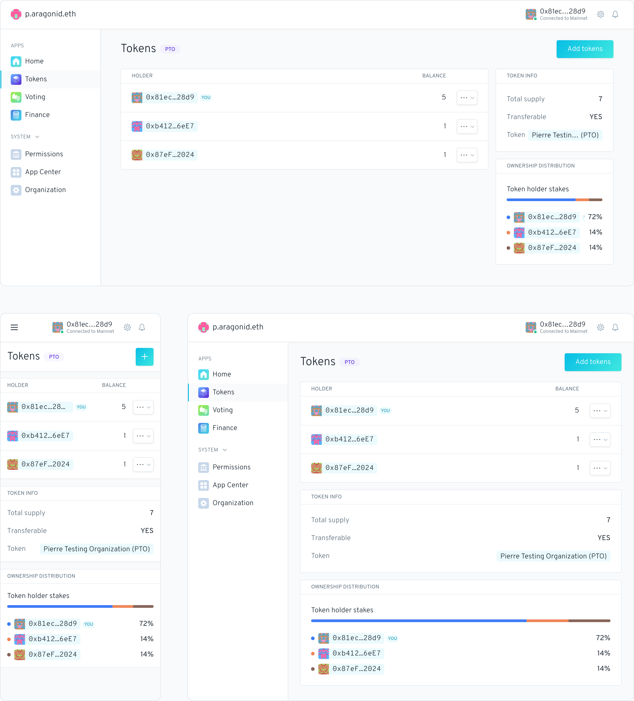

# Como criar uma estrutura legal com a Otoco


Ser uma DAO é ótimo, mas às vezes são necessários contratos com entidades do 'mundo real', e eles também precisam que você seja uma entidade do 'mundo real'. Este é um tutorial sobre como configurar um "Delaware Series LLC" padrão com a [**Otoco** ](https://otoco.io/)e para integrá-lo na sua DAO do _Aragon Client._&#x20;

Custo para fazer isso? Menos de 5 dólares!


Então, você começou uma nova DAO Aragon chamada "Awesome Music", um Selo Musical descentralizado. Tudo está funcionando bem, você está colaborando com pessoas online em diferentes países.&#x20;

Mas logo você descobre que um músico de Música Clássica insiste em ter um contrato legal com a sua DAO em vez de um acordo de tokens.&#x20;

Isso precisa que a DAO seja registrado no mundo legal como uma LLC. Mas como diabos eu faço isso? Nos deixe mostrar como!​

Abra a DAO no _Aragon Client_ clicando no link a seguir: [https://client.aragon.org/#/awsmmusic/](https://client.aragon.org/#/awsmmusic/) (Este _Client_ de exemplo está na Ethereum Mainnet).


Connecte a sua carteira Web3 na **Ethereum Mainnet**, para fazer a DAO aparecer no _Aragon Client_.

Ao lado do Ethereum Mainnet, o Otoco também está disponível no **Goerli Testnet**, **Polygon Mainnet** e **Mumbai Testnet**, para que você possa integrar sua DAO _Client_ também nessas redes com o Otoco!


Você deve ver a tela a seguir. Clique em '_Atribuir Tokens_':

Aqui você pode ver alguns dos Detentores de Token, artistas que se inscreveram na "Awesome Music".

<figure><figcaption></figcaption></figure>

Agora vamos para [Otoco](https://otoco.io/) , para criar uma estrutura legal para a sua DAO. Segue o link [https://otoco.io/ ](https://otoco.io/)

Clique em '_Spin up your project now_'.

Selecione 'Ethereum Mainnet' e clique em '_Começar na próxima tela'_ (Get started on next screen).

Selecione '_Só eu_' (Just me) e depois '_Continuar_'.

No momento as únicas opções estão nos EUA.

Selecione '_verificar_' (check) e depois '_continuar_'.

Agora é hora de conectar a sua carteira Web3. Pré-selecione a conta na sua carteira que também possui os tokens da DAO e a rede correta, neste caso tokens 'AWSMM' e 'Ethereum Mainnet'.


Se você conectar uma conta da sua Carteira Web3 à Otoco que não possui os tokens da DAO, a integração não funcionará.


Clique em '_Conectar Carteira_':

Verifique se a sua carteira foi conectada com sucesso. Nesta tela clique em '_Ativar Empresa_'. Agora, uma transação deve aparecer na sua carteira Web3. Confirme a transação:

<figure><figcaption></figcaption></figure>

Assim que a transação for processada, você deverá ver a seguinte tela. Clique em 'Ir para o Painel' (Go do Dashpanel)


Ótimo, agora temos **uma estrutura legal configurada para nossa DAO**!&#x20;

Agora vamos integra-la à DAO no _Aragon Client_!


No painel de Otoco, clique em 'Tokens' na barra de menu à esquerda:

Você deverá ver a seguinte tela:

Agora precisamos de algumas informações da DAO. Volte para o _aplicativo Tokens_ do Awesome Music. Aqui está o link: [https://client.aragon.org/#/awsmmusic/0xd181ce5f2e300e13f8327f3208da8903e026a048/](https://client.aragon.org/#/awsmmusic/0xd181ce5f2e300e13f8327f3208da8903e026a048/)

Clique no nome do token 'awsmm.. (AWSMM)' na caixa 'TOKEN INFO'.

Em seguida, copie o endereço do token clicando no símbolo de cópia:

Agora volte para a tela de Otoco e cole o endereço onde diz '_cole seu endereço de contrato de token ERC-20 aqui_' e clique em '_Anexar Token_':

Na sua carteira Web3, uma transação deve aparecer. Confirme a transação e espere que ela seja processada.

<figure><figcaption></figcaption></figure>


Excelente, a sua DAO do _Aragon Client_ agora foi integrada à estrutura legal da Otoco!


Você deverá ver a tela abaixo. Clique em 'SHOW' para ver aparecer todos os detentores dos tokens de Awesome Music:

Você deve ver uma lista dos detentores atuais:

Agora, se voltarmos à DAO no Aragon, você pode ver que todos os detentores de tokens estão representados na Estrutura Legal.

Agora, por último, vamos dar uma olhada nos documentos oficiais da LLC, como o Certificado de Constituição. Para fazer isso, clique em 'Arquivos' (Files) na barra de menu à esquerda. Você deve ver o seguinte:

<figure><figcaption></figcaption></figure>

Você pode baixar os documentos da LLC aqui.

Isso foi tudo, boa sorte agora com a sua DAO no mundo legal!:thumbsup:
