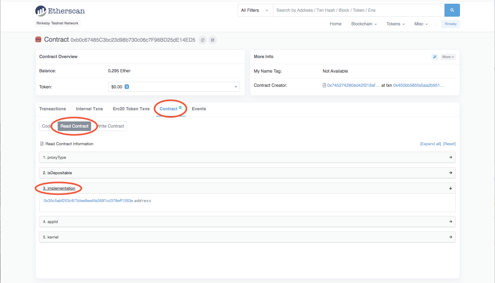
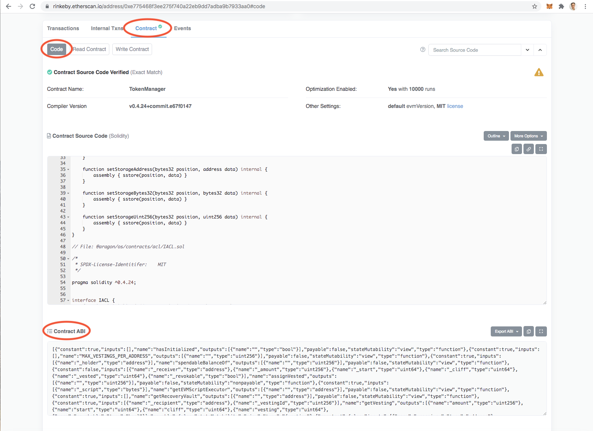

# Using the Client DAO with the Govern DAO


In this article, we will show how to use the Client DAO with the Govern Execution Engine and how you can incorporate optimistic governance within your Aragon Client DAO.

We are going to use Aragon Govern to schedule, challenge, and execute proposals that will take effect on the Aragon Client DAO.

This will replace the Voting App with a cheaper governance mechanism that will also lower users' governance fatigue.



Aragon Govern is in Beta and the UI might have changed from the time of this article.


## Prerequisites:

1\. An Aragon Client DAO: you can create one [here](https://client.aragon.org).

2\. An Aragon Govern DAO: you can create one [here](https://aragon.org/aragon-govern).


Please, make sure both DAOs are on the same network.


3\. Grant the Govern Executor address desired permissions within the Aragon Client DAO. Follow [this](../aragon-client/explore-template-dao/system-setting/permissions-setting.md) article to learn how to do this. You should grant the permissions you want the Aragon Govern DAO to be able to schedule execution for.

If you want to replace the governance mechanism, then grant the Govern Executor the same set of permissions that the Voting App currently has and then revoke the Voting App's permissions. We would not recommend changing the Permission Manager from the Voting App as it will make setting up permissions complicated in the future.

## To get the Govern Executor Address:

1\. Go to your Aragon Govern DAO and press "DAO Settings"

2\. Copy the address from the Govern Executor Address field

## Linked Execution:

1\. Go to your Aragon Govern DAO and press _**New Transaction**_

2\. Populate \*\* **\_**Title**\_ and \_**Justification\*\*\_ fields

3\. Press the _**Add new transaction**_ button

4\. Select the \*\* _**External Contract**_ \*\* option

5\. Enter "0x4c0960a290be920c92c5c2538e6d9d9e4d50e397" or any other unverified contract from Etherscan. We will change it later.

This is a workaround due to current Govern UI limitations. Hopefully, in the future, you will be able to avoid this step.

6\. When prompted with an \*\* **\_**Input contract address\_\*\* change it with the address of the App from the Aragon Client DAO you would like to interact with.

You can find it on the \*\* _**Organisations**_ \*\* page of your DAO portal. Look at the "INSTALLED ARAGON APPS" section there.

7\. Into the \*\* **\_**Input function ABI\_ \*\* field enter the ABI obtained with the following steps:

1\. Find the base contract of the selected Aragon App that you would like to interact with

a. Open the address that you have used in step 4 on [Etherscan](https://etherscan.io).

b. Go to _**Contract**_

c. Select \*\* **\_**Read contract\_ \*\*

d. Expand \*\* **\_**Implementation**\_** \*\*

e. Open the address that appeared under _**implementation**_ on [Etherscan](https://etherscan.io).

2\. Copy the ABI of the opened address to the field in Step 5

a. Go to _Contract_

b. Select \*\* _**Code**_ \*\*

c. Locate \*\* **\_**Contract ABI\_ \*\*

d. Copy the ABI to the Govern Form ABI input field

e. You should see a page similar to the following

8\. Press the \*\* _**Select**_ \*\* button and select the method you would like to invoke on the Client DAO App, then press _**Select**_.

Here we will interact with the \*\* _**Finance**_ \*\* app and we have selected to create a new payout from the Client DAO vault.

9\. Populate input parameters for this function call. Here, we will create a new immediate payment from the Finance app. It will transfer 0.1 ETH (represented by a 0x0..0 token address) to the 0x424... address.

10\. Press the _**Add new transaction**_ button you would like to add more contract interactions to this proposal. Otherwise, press the _**Schedule**_ button.

11\. Once the challenge period is over, you will be able to execute the actions that will take effect on the Aragon Client DAO.

## Possible Issues


If action execution fails there has been a mistake either in permissions, method parameters, or in the ABI and contract address. If you have not granted the right permissions to the Govern Executor Address please do so and try to execute the action again. If a mistake has been made in method parameters or ABI and contract address you will have to redo the whole process.

If you are populating fractional numbers, add 18 zeros to the original value. For example, if you want to invoke the immediateTransfer method that will transfer 10.5 tokens, you will have to input 10.5\*10^18 = 10500000000000000000 into the amount field.


#### <mark style="color:purple;">Do you have a question? Leave your comments here at our Discourse forum</mark> 👇


