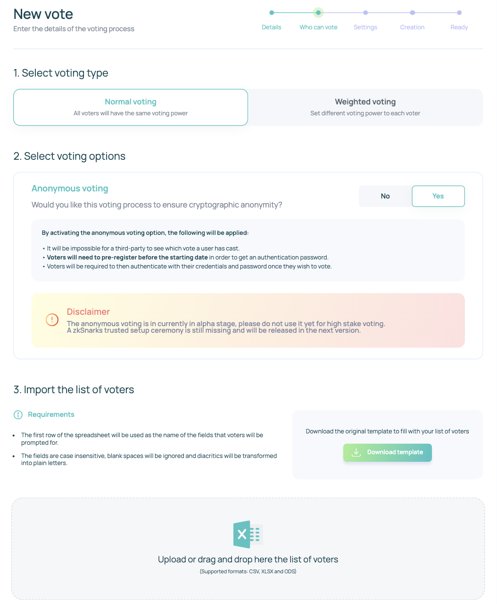
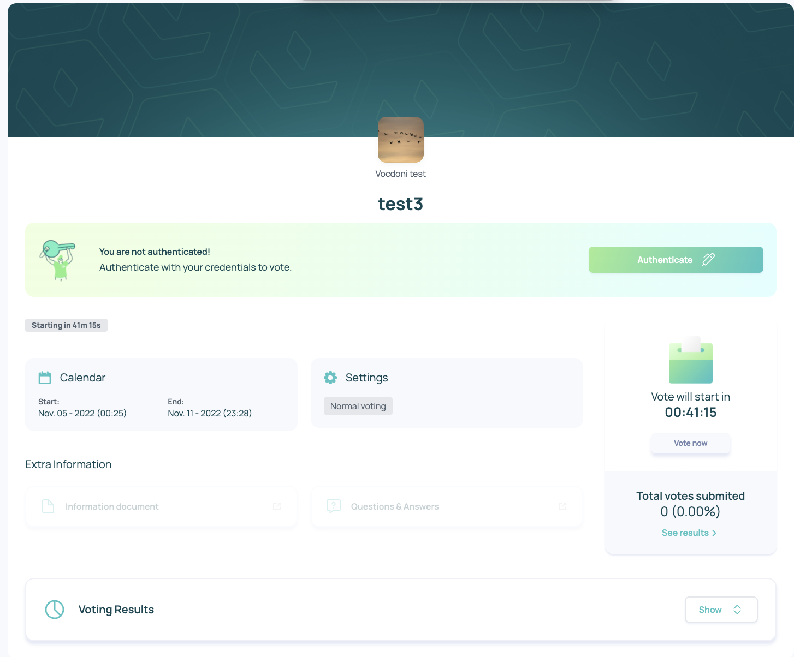

# Creating a voting proposal


In this section, you will learn how to create a voting process in the Aragon Vocdoni Organization.


## Steps for creating a voting proposal

### 1. Create a Vote

On the top right click on the name of your entity/organization select the **Dashboard** option.

Click on the _**Create a voting process**_ and fill in the fields on the _**New Vote**_ page.

### 2. New Vote - Details page


**Title:** the title of your voting process

**Header image:** the header to your voting process

**Documentation (optional field):** here you can add an URL to the documentation related to this voting process (it could be a link to a web, a cloud, a folder)

**Questions and Answers (optional field):** here you can add an URL to a question and answer system (it could be a forum, e-mail, website, telegram group)

**Video stream link (optional field):** here you can add an URL to a video (like a Youtube video)

**Description:** the description of the voting process

**Question:** the question of the voting process (what is the vote about). Each question has a Title, a Description, and Options (these are the options among which the users can choose at the voting time). More options can be added using the **Add an option** button.


The voting process can have more than one question. More questions can be added using the _**Add a question**_ button.

The _**Preview**_ button shows a preview of the voting proposal.

### 3. Who can Vote Page

On the _**Who can Vote**_ page you can:

* _**Select voting type**_**:**&#x20;
  * _normal voting_ (where all the voters have the same voting power)&#x20;
  * _weighted voting_ (where voters may have different voting power)
* _**Select voting options**_**:** you can enable anonymous voting (_**yes**_ or _**no**_ option). In our example, we have enabled the anonymous voting option.
* _**Import the list of voters**_**:** only the voters on the list can vote in the voting process. To create the list of voters you can download the available template (_**Download template**_ button), adjust the fields (you can add for example the National Id) and then drag and drop the file (.csv, .xlsx, .ods formats are supported).


**Anonymous voting** allows users to vote with the **cryptographic assurance** that nobody can correlate their identity with the contents of their ballot. You can read more about anonymous voting [here](https://blog.aragon.org/introducing-vocdoni-anonymous-voting/).


<figure><figcaption>
Who can vote page
</figcaption></figure>

When the list of voters loading is completed a **Form preview** is shown. This form will be filled in but the community in order to vote. Accept the disclaimer and **continue.**

<figure><figcaption>
Form for the voters
</figcaption></figure>

### 4. Settings Page

On the _**Settings**_ page enter:

The **Calendar** settings:

* _**Start Date**_**:** the start date at which votes are accepted. It could start on a specific date or start right away. The start date of the voting process must start at least 10 min in the future.
* _**End Date**_**:** the date until votes are accepted.


Anonymous voting requires an **additional voter pre-registration** step, which begins immediately after the process creation is completed and will last until the voting start date.


The **Results Availability**:

* _**In Real-Time:**_ the voting results are shown as soon as the first vote is submitted
* _**After vote**_**:** the voting results are shown only when the voting process is closed.

<figure><figcaption></figcaption></figure>

### 5. Creation page

After clicking the _**Continue**_ button the vote process will be created.

### 6. Ready page

After the vote is set, the _**ready page**_ will show the voting process link.&#x20;


Share the voting process link with the voters. :partying\_face:


### 7 . Vote details

To access, the vote information goes to the _**Dashboard**_ and click on the Vote.&#x20;

<figure><figcaption></figcaption></figure>

A **Vote details** page will be open.

<figure><figcaption>
Vote details page
</figcaption></figure>

The **preview** button on the top-left allows you to **pre-register** (in case of anonymous voting) or **authenticate** (in case of no-anonymous voting) for the upcoming vote.&#x20;

#### **Case 1: Pre-register for** an anonymous voting&#x20;

A _**Pre-register**_ button allows the user to pre-register for the upcoming vote process.&#x20;

<figure><figcaption></figcaption></figure>

#### Case 2: A**uthenticate** for a no-anonymous voting&#x20;

An _**Authenticate**_ button allows the user to authenticate for the upcoming vote process.&#x20;

<figure><figcaption></figcaption></figure>


If you need to cancel or end a vote, go to the _**Dashboard**_ and click the vote you need to cancel or end. On the _**Vote details**_ page click the _**Cancel Vote**_ or _**End Vote**_ button.



If you need to **share the voting link** with the community go to the _**Dashboard**_ and click the vote. On the _**Vote details**_ page is available the link.


> <mark style="color:purple;">**Do you have a question? Leave your comments here at our Discourse forum**</mark>** 👇**


