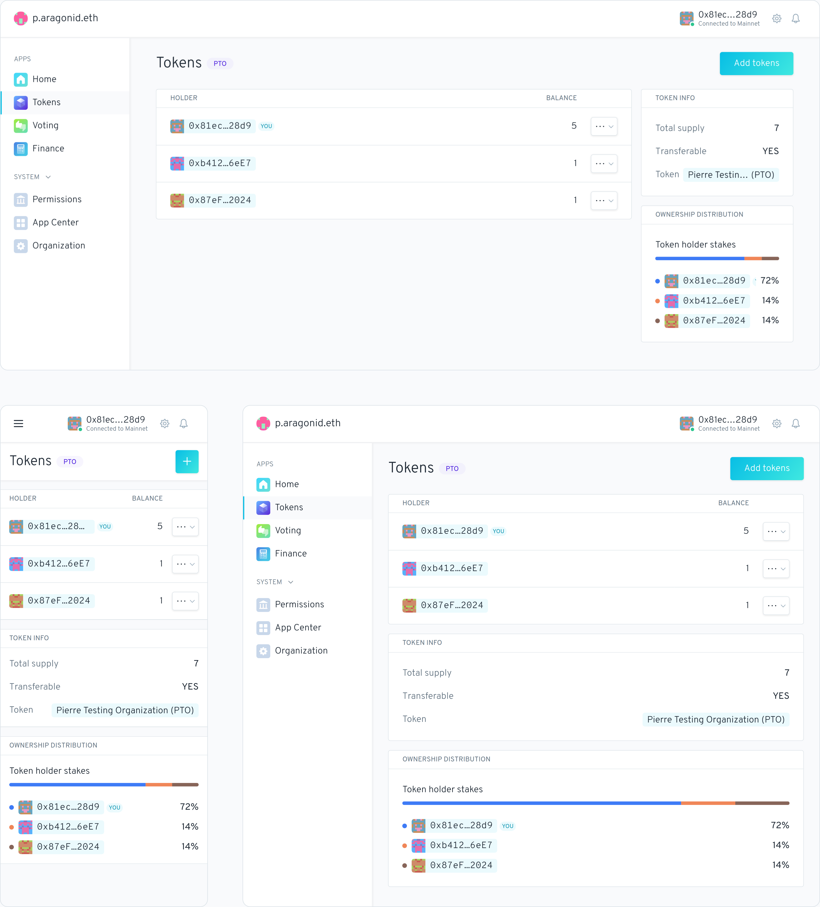
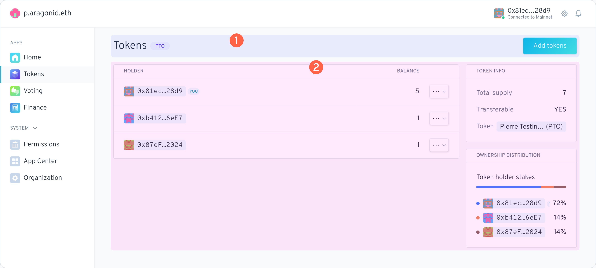
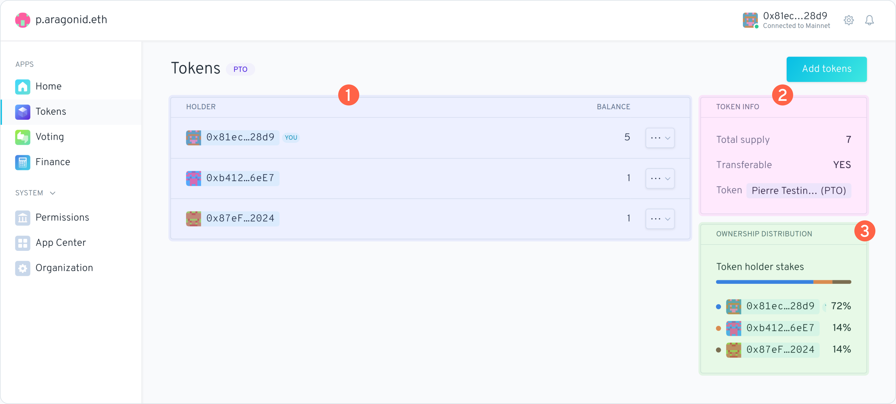

# Configurando uma carteira MultiSig


Nesta seção, veremos como as DAOs do _Aragon Client_ podem ser geridas por uma carteira MultiSig.



Aqui vamos usar o [Gnosis Safe MultiSig](https://gnosis-safe.io/), no entanto, você pode seguir uma abordagem parecida para qualquer outra carteira MultiSig que suporte a interação do contrato.


## Configurar as permissões necessárias 


As DAOs do _Aragon Client_ têm acesso a um sistema de controle, onde cada ação é protegida por um conjunto de registros de permissão. Somente alguém com permissões específicas pode agir.&#x20;

\
**É por isso que precisamos atribuir à carteira MultiSig uma série de permissões que correspondam às ações desejadas.**&#x20;

\
Você pode ler mais sobre isso [aqui](aragon-client/explore-template-dao/system-setting/permissions-setting.md).


****\
****Neste exemplo, uma DAO do _Aragon Client_ tem um saldo de tokens ETH armazenados em seu Cofre (_Vault_) e você deseja iniciar um pagamento para compensar um colaborador DAO por seu trabalho. **Mostraremos como iniciar uma retirada de parte dos ETH para o Colaborador**.\
****\
****Comece abrindo a sua DAO do Aragon Client, você deve ver um painel parecido como na imagem abaixo. Clique no menu à esquerda em '_Permissões_':

<figure><figcaption></figcaption></figure>

Queremos adicionar novas permissões para o seu MultiSig, então clique nesta tela em '_Nova permissão_'

<figure><figcaption></figcaption></figure>

Você deve ver a seguinte janela lateral aparecer. Clique em '_Selecionar um aplicativo_':

<figure><figcaption></figcaption></figure>

Para este exemplo, queremos iniciar uma retirada de ETH pelo MultiSig. Isso geralmente é feito no aplicativo '_Finanças_' da DAO, então selecione '_Finance_' aqui e clique em '_Selecionar uma entidade_':

<figure><figcaption></figcaption></figure>

Como precisamos adicionar o endereço do seu MultiSig, clique aqui em '_Custom Address_...':

<figure><figcaption></figcaption></figure>

Agora vá para o seu Gnosis Safe, copie seu endereço e cole o endereço do seu MultiSig na caixa 'GRANT PERMISSION TO'. Em seguida, clique em '_Selecionar uma ação_':

<figure><figcaption></figcaption></figure>


Não se esqueça de remover as letras da frente do endereço Gnosis Safe, **eth:** ou **gor:** ou diferente dependendo da rede que você usa! Caso contrário não vai funcionar.. \
\
O endereço deve começar com: **0x**


Neste caso queremos iniciar um novo pagamento, então clique em '_Criar novos pagamentos_':

<figure><figcaption></figcaption></figure>

Agora que você preencheu as caixas necessárias, clique em '_Adicionar permissão_':

<figure><figcaption></figcaption></figure>

Aqui o aplicativo avisa que a permissão não pode ser modificada diretamente, mas que será criado um voto para alterar a permissão. Clique em '_Criar transação_':

<figure><figcaption></figcaption></figure>

Uma transação deve aparecer na sua carteira Web3, '_Confirme_' a transação:

<figure><figcaption></figcaption></figure>

Depois que a transação for processada, vá para o aplicativo '_Voting_' da sua DAO. Você deve ver que um voto aberto foi gerado. Clique na votação:

<figure><figcaption></figcaption></figure>

Agora confirme o voto clicando em '_Sim_':

<figure><figcaption></figcaption></figure>

Clique aqui em '_Criar transação_' e confirme a transação que deve aparecer na sua Carteira Web3:

<figure><figcaption></figcaption></figure>

No nosso exemplo, confirmou que a votação foi aprovada:

<figure><figcaption></figcaption></figure>


Pode ser preciso que a maioria dos membros da DAO votem para que a votação seja aprovada. Isso depende das configurações de **SUPORTE** e **APROVAÇÃO MÍNIMA** da sua DAO.


Agora vá para o aplicativo '_Permissões_' para verificar se a permissão para o seu MultiSig foi adicionada. No nosso caso, clique no aplicativo '_Finanças_' e, em seguida, revela a permissão '_Criar novos pagamentos'_. Agora vemos que o endereço MultiSig apareceu!

<figure><figcaption></figcaption></figure>

### Iniciar o pagamento no MultiSig 

Feito isso, podemos iniciar um pagamento no MultiSig!

(Neste caso) volte para o Gnosis Safe e pressione '_Nova Transação_'. Na janela pop-up que aparece, pressione '_Interação do Contrato_':

Agora precisamos do '_Endereço do contrato_' do aplicativo com o qual queremos interagir, que é o aplicativo '_Finanças'_ neste caso:

<figure><figcaption></figcaption></figure>

Então volte a sua DAO no _Aragon Client_, abra o aplicativo '_Organização'_, clique no endereço em (neste caso) '_FINANCE_' e copie o endereço:

<figure><figcaption></figcaption></figure>

Agora cole o endereço no campo _'Endereço do contrato'_ no Gnosis Safe:

<figure><figcaption></figcaption></figure>


Se o campo '_ABI_' for preenchido automaticamente, REMOVA todo o conteúdo do campo, pois precisaremos de uma '_ABI_' diferente


Agora precisamos obter a '_ABI_' do contrato base do aplicativo com o qual interagimos, que é o aplicativo '_Finanças'_ nesse caso. Clique em '_Finance App_' na caixa abaixo:


Você pode encontrar links Etherscan para os contratos inteligentes dos aplicativos mais usados ​​abaixo:

* [Aplicativo Token](https://etherscan.io/address/0xde3A93028F2283cc28756B3674BD657eaFB992f4#code)
* [Aplicativo Finanças](https://etherscan.io/address/0x836835289A2E81B66AE5d95b7c8dBC0480dCf9da#code)
* [Aplicativo Votação](https://etherscan.io/address/0xb935C3D80229d5D92f3761b17Cd81dC2610e3a45#code)


Na página Etherscan, role para baixo até ver a caixa '_Contract ABI_'. Clique no símbolo _Copiar_, para copiar a _ABI_ do contrato inteligente:

<figure><figcaption></figcaption></figure>

Cole a _ABI_ no campo '_ABI_' do Gnosis Safe e clique em '_Método_':

<figure><figcaption></figcaption></figure>

Pesquise aqui por '_newImmediatePayment_', já que queremos fazer um pagamento imediato neste exemplo, e selecione-o:

<figure><figcaption></figcaption></figure>

Agora encontre o '_endereço do token_' do token que você deseja enviar. Neste caso estamos enviando ETH. O endereço de ETH é: `0x0000000000000000000000000000000000000000`

Adicione o '_endereço do destinatário_', neste exemplo aquele do Contribuidor.

Em seguida, adicione a '_quantidade_'. Nesse caso, enviaremos ao Contribudor da DAO uma quantia de 0,1 ETH.


Para o campo '_quantitade_', adicione 18 casas decimais ao valor original. Por exemplo, se você quiser acionar o método _**newImmediatePayment**_ para transferir 10,5 tokens, será necessário inserir 10,5 \* 10 ^ 18 = **`10500000000000000000`** no campo do valor.


No nosso exemplo, a quantia é 0.1 \* 10 ^ 18 = `100000000000000000`

Após, você pode adicionar uma '_reference string_' como referência de pagamento, e clique em '_Revisar_':

<figure><figcaption></figcaption></figure>

Role para baixo e teste a transação clicando em '_Simular_'. Se tudo estiver bem, deve exibir '_Sucesso_'. Se sim, clique em '_Enviar_':

<figure><figcaption></figcaption></figure>


**Se a simulação falhou** e você receber avisos (como um erro de estimativa de gás), provavelmente houve um erro nas permissões, nos parâmetros do método, na ABI ou no endereço do contrato. Por favor, faça a configuração novamente


Uma transação deve aparecer na sua carteira Web3. '_Confirme_' a transação e espere que ela seja processada. Se tudo correu bem, a transação é executada.

<figure><figcaption></figcaption></figure>

Volte pela última vez a sua DAO no _Aragon Client_ :fingers\_crossed: e abra o aplicativo '_Finanças'_. No nosso exemplo, vemos que uma '_Compensação do Contribudor_' de 0,1 ETH está sendo exibida na visão geral das '_Transferências_'

<figure><figcaption></figcaption></figure>

Conseguimos! :partying\_face: Parabens! :medal:

<mark style="color:purple;">****</mark>

<mark style="color:purple;">**Você tem uma pergunta? Deixe seus comentários aqui em nosso fórum Discourse**</mark>** 👇**


