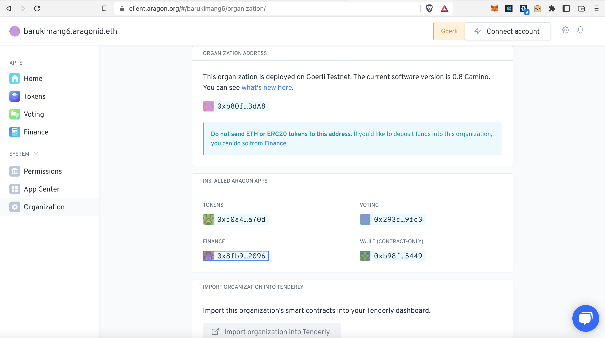

# Configurando uma carteira MultiSig


Nesta seção, veremos como as DAOs do _Aragon Client_ podem ser geridas por uma carteira MultiSig.



Aqui vamos usar o [Gnosis Safe MultiSig](https://gnosis-safe.io/), no entanto, você pode seguir uma abordagem parecida para qualquer outra carteira MultiSig que suporte a interação do contrato.


## Configurar as permissões necessárias 


As DAOs do _Aragon Client_ têm acesso a um sistema de controle, onde cada ação é protegida por um conjunto de registros de permissão. Somente alguém com permissões específicas pode agir.&#x20;

\
**É por isso que precisamos atribuir à carteira MultiSig uma série de permissões que correspondam às ações desejadas.**&#x20;

\
Você pode ler mais sobre isso [aqui](aragon-client/explore-template-dao/system-setting/permissions-setting.md).


****\
****Neste exemplo, uma DAO do _Aragon Client_ tem um saldo de tokens ETH armazenados em seu Cofre (_Vault_) e você deseja iniciar um pagamento para compensar um colaborador DAO por seu trabalho. **Mostraremos como iniciar uma retirada de parte dos ETH para o Colaborador**.\
****\
****Comece abrindo a sua DAO do Aragon Client, você deve ver um painel parecido como na imagem abaixo. Clique no menu à esquerda em 'Permissões':

<figure><figcaption></figcaption></figure>

Queremos adicionar novas permissões para o seu MultiSig, então clique nesta tela em 'Nova permissão'

<figure><figcaption></figcaption></figure>

Você deve ver a seguinte janela lateral aparecer. Clique em 'Selecionar um aplicativo':

<figure><figcaption></figcaption></figure>

Para este exemplo, queremos iniciar uma retirada de ETH pelo MultiSig. Isso geralmente é feito no aplicativo 'Finanças' da DAO, então selecione '_Finance_' aqui e clique em 'Selecionar uma entidade':

<figure><figcaption></figcaption></figure>

Como precisamos adicionar o endereço do seu MultiSig, clique aqui em '_Custom Address_...':

<figure><figcaption></figcaption></figure>

Agora vá para o seu Gnosis Safe, copie seu endereço e cole o endereço do seu MultiSig na caixa 'GRANT PERMISSION TO'. Em seguida, clique em 'Selecionar uma ação':

<figure><figcaption></figcaption></figure>


Não se esqueça de remover as letras da frente do endereço Gnosis Safe, **eth:** ou **gor:** ou diferente dependendo da rede que você usa! Caso contrário não vai funcionar.. \
\
O endereço deve começar com: **0x**


Neste caso queremos iniciar um novo pagamento, então clique em 'Criar novos pagamentos':

<figure><figcaption></figcaption></figure>


Aqui, atribuímos permissões ao MutliSig para gerenciar pagamentos e alterar os parâmetros de suporte a votação no DAO. No entanto, como continuamos votando como Gerente de Permissões, os membros da comunidade poderão votar para remover essas permissões, revogando efetivamente esse controle MultiSigs sobre o DAO\_.\_


### Executando ações 

1\. Acesse o site [Gnosis Safe](https://gnosis-safe.io/) e conecte-se ao DApp deles.

2\. Abra seu cofre.

3\. Pressione o botão _Nova **transação**_ e selecione _**Interação do contrato**_.

4\. Forneça o endereço do App Aragon com o qual você gostaria de interagir.

Você pode encontrá-lo na página _**Organizações**_ do seu portal DAO. Veja a seção **\_Aplicativos Aragon instalados\_** lá.

5\. Isso preencherá automaticamente o campo ABI. Exclua o conteúdo que apareceu lá.

6\. Encontre o contrato base do aplicativo Aragon selecionado com o qual você gostaria de interagir.

* Abra o endereço que você usou na etapa 4 no [etherscan](https://etherscan.io/)
* Ir para o _**contrato**_
* Selecione _**Ler contrato**_
* Expandir _**implementação**_
* Abra o endereço que apareceu em _**Implementação**_ no [etherscan](https://etherscan.io/)

7\. Copie a ABI do endereço aberto para o campo da etapa 5.

* Ir para o _**contrato**_
* Selecionar _**código**_
* Localize _**o Contrato ABI**_
* Copie a ABI para o campo de entrada Gnosis Safe ABI

8\. Selecione o método que deseja usar e preencha os parâmetros.

Aqui vamos criar um novo pagamento imediato a partir do aplicativo Finanças. Ele transferirá **0,1 ETH** (representado por um endereço de token 0x0..0) para o endereço _0x424...._

9\. Pressione _**Revisar**_ e _**Enviar**_ . Depois que um número suficiente de pessoas assinar a transação, você poderá visualizá-la no Etherscan e, uma vez confirmada, deverá entrar em vigor no DAO.

## Possíveis problemas 


Certifique-se de ter as permissões para invocar este método do endereço Gnosis Safe.



Se a estimativa de gás falhar e você receber avisos, provavelmente houve um erro nas permissões, nos parâmetros do método ou na ABI e no endereço do contrato. Por favor, faça a configuração novamente.



Se você estiver preenchendo números fracionários, adicione 18 zeros ao valor original. Por exemplo, se você quiser invocar o método **imediatoTransfer** que transferirá 10,5 tokens, você terá que inserir 10,5\*10^18 = 10500000000000000000 no campo de valor.



Se a ABI não estiver sendo exibida em uma rede (Rinkeby, por exemplo), obtenha a ABI semelhante de outro DAO em uma rede diferente (Ethereum Mainnet, por exemplo).


> <mark style="color:purple;">**Você tem uma pergunta?Deixe seus comentários aqui em nosso fórum Aragon**</mark>** 👇**


