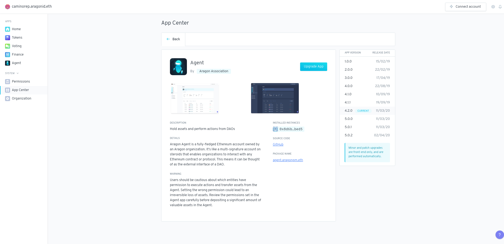

# Centre d'applications

Le _**App Center**_ (Centre d'applications) comporte des onglets permettant de mettre à niveau les applications actuellement installées et de parcourir les applications actuellement disponibles (certaines applications ne sont plus maintenues pour être reconnues par une étiquette "non maintenu").&#x20;

Pour mettre à niveau une application existante, il suffit de cliquer sur le bouton _**Upgrade app**_ (Mettre à niveau) l'application et d'ouvrir un vote pour mettre à niveau l'application si vous n'avez pas la permission directe de mettre à niveau l'application.

.png>)

> <mark style="color:purple;">**Vous avez une question ? Laissez vos commentaires ici sur notre forum Discourse**</mark>** **<mark style="color:purple;">****</mark><mark style="color:purple;">** **</mark><mark style="color:purple;"><mark style="color:purple;">**(**<mark style="color:purple;"></mark><mark style="color:purple;">**en anglais)**</mark>** 👇**


