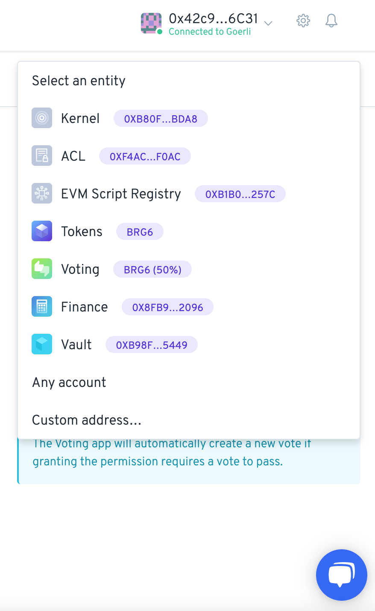
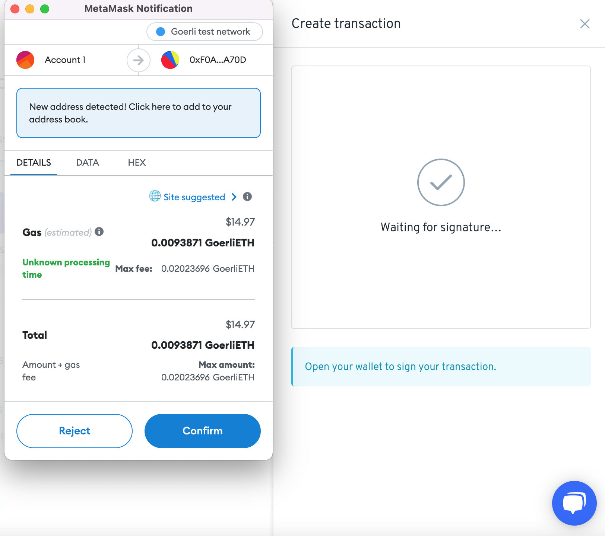
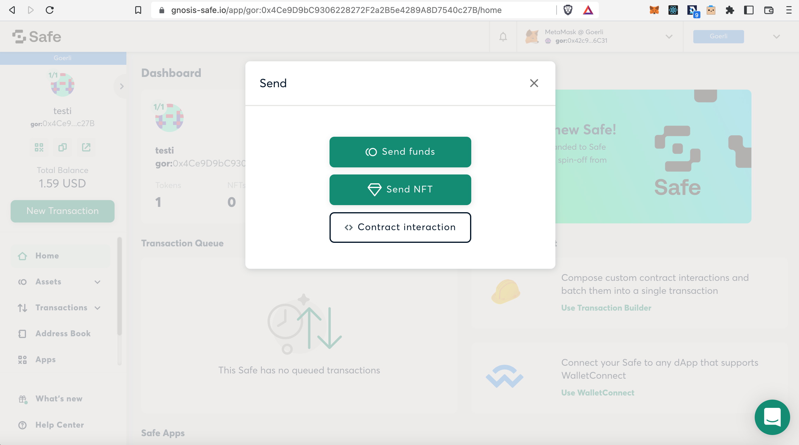
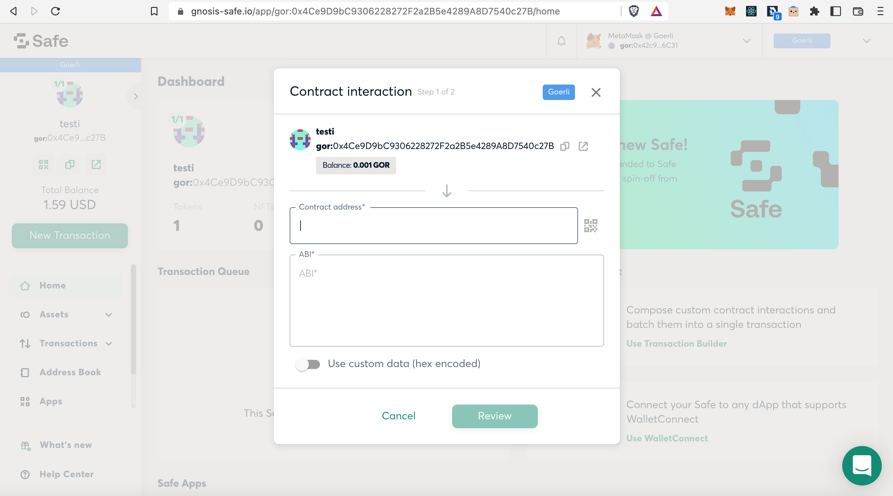
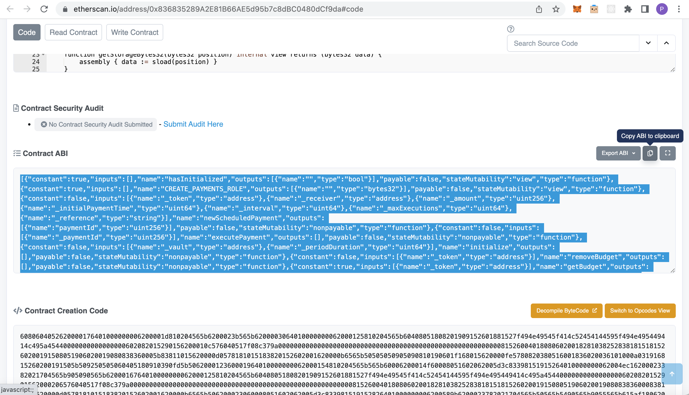
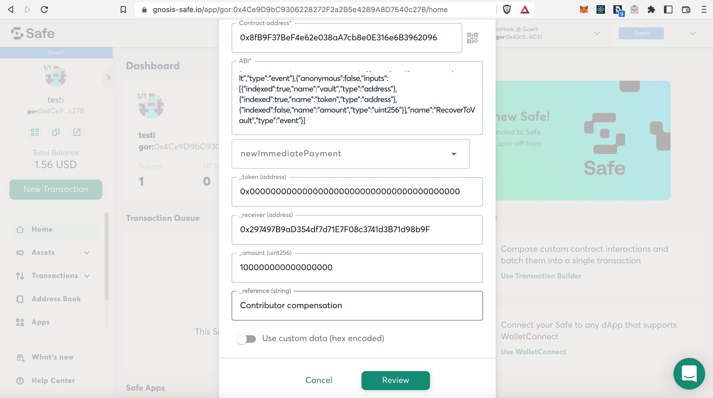

# 🏗 Setting up a Gnosis Safe MultiSig Wallet


Here we are going to use [**Gnosis Safe MultiSig**](https://gnosis-safe.io), however, you could follow a similar approach for any other MultiSig wallet that supports contract interaction.


###

## Setting up the necessary permissions


Aragon Client DAOs have access to a control system, where each action is protected by a set of permission records. Only someone with specific permissions can act.

**That is why we need to assign the MultiSig wallet to a range of permissions in the DAO that correspond with the desired actions.**

You can read more about permission settings [here](aragon-client/explore-template-dao/system-setting/permissions-setting.md).


In this example an Aragon Client DAO has a balance of ETH tokens stored in its Vault and you want to initiate a payment to compensate a DAO Contributor for her work. We will show how to **initiate a withdrawal of some of the ETH to the Contributor.**

Start by opening your Aragon Client DAO, you should see a similar dashboard as in the image below. Click in the left hand menu on 'Permissions':

<figure><figcaption></figcaption></figure>

We want to add new permissions for your MultiSig, so click in this screen on 'New permission':

<figure><figcaption></figcaption></figure>

You should see the following side-window appear. Click on 'Select an app':

<figure><figcaption></figcaption></figure>

For this example we want to initiate a withdrawal of ETH by the MultiSig. This is usually done from the Finance app of the DAO, so select 'Finance' here and then click on 'Select an entity':

<figure><figcaption></figcaption></figure>

Since we need to add the address of your MultiSig, click here on 'Custom address...':

<figure><figcaption></figcaption></figure>

Now go to your Gnosis Safe, copy its address and paste the address of your MultiSig in the 'GRANT PERMISSION TO' box. Then click on 'Select an action':

<figure><figcaption></figcaption></figure>


Do not forget to remove the letters from the front of the Gnosis Safe address,**`eth:`**or**`gor:`**or different depending on the network you use! Otherwise it won't work..

The address should start with: **`0x`**


In this case we want to initiate a new payment, so click on 'Create new payments':

<figure><figcaption></figcaption></figure>

Now you filled the required boxes, click on 'Add permission':

<figure><figcaption></figcaption></figure>

Here the app warns that the permission can not be directly changed, but that a vote will be created to change the permission. Click on 'Create transaction':

<figure><figcaption></figcaption></figure>

A transaction should pop-up in your Web3 Wallet, 'Confirm' the transaction:

<figure><figcaption></figcaption></figure>

Once the transaction has processed, head over to the 'Voting' app of your DAO. You should see that an open vote has been generated. Click on the vote:

<figure><figcaption></figcaption></figure>

Now confirm the vote by clicking 'Yes':

<figure><figcaption></figcaption></figure>

Click here on 'Create transaction' and confirm the transaction that should pop-up in your Web3 Wallet:

<figure><figcaption></figcaption></figure>

In our example it confirmed that the vote has passed:

<figure><figcaption></figcaption></figure>


More DAO members might need to approve the vote for the vote to pass. This depends on the **SUPPORT** and **MINIMUM APPROVAL** settings of your DAO


Now head over to the 'Permissions' app to check whether the permission for your MultiSig has been added. In our case click on the **Finance** app, and then unfold the 'Create new payments' permission. We now see that the MultiSig address has appeared!

<figure><figcaption></figcaption></figure>

## Initiate payment at the MultiSig

Now that's done we can initiate a payment at the MultiSig!

Head back to the (in this case) Gnosis Safe and press on 'New Transaction'. In the pop-up window which appears, press 'Contract Interaction':

<figure><figcaption></figcaption></figure>

We now need the 'Contract address' of the app we want to interact with, which is the Finance app in this case:

<figure><figcaption></figcaption></figure>

So head back to your Aragon Client DAO, open the **Organization** app, click on the address under (in this case) 'FINANCE', and copy the address:

<figure><figcaption></figcaption></figure>

Paste the address in the 'Contract address' field back in the Gnosis Safe:

<figure><figcaption></figcaption></figure>


If the 'ABI' field automatically populates, **REMOVE** all the contents in the field, since we will need a different ABI


Now we need to get the ABI of the base contract of the app we interact with, which is the **Finance** app in this case. Click on 'Finance App' in the box below:


You can find Etherscan links to the smart contracts of the most used apps below:

* [Tokens App](https://etherscan.io/address/0xde3A93028F2283cc28756B3674BD657eaFB992f4#code)
* [Finance App](https://etherscan.io/address/0x836835289A2E81B66AE5d95b7c8dBC0480dCf9da#code)
* [Voting App](https://etherscan.io/address/0xb935C3D80229d5D92f3761b17Cd81dC2610e3a45#code)


On the Etherscan page, scroll down until you see the 'Contract ABI' box. Click on the Copy symbol, to copy the ABI of the smart contract:

<figure><figcaption></figcaption></figure>

Paste the ABI in the 'ABI' field in the Gnosis Safe, and click on 'Method':

<figure><figcaption></figcaption></figure>

Search here for 'newImmediatePayment', since we want to do an immediate payment in this example, and select it:

<figure><figcaption></figcaption></figure>

Now find the 'token address' of the token you want to send. In this case we are sending ETH. The token address of ETH is: `0x0000000000000000000000000000000000000000`

Add the 'receiver address' of in this example the Contributor.

Then add the 'amount'. In this case we will send the DAO Contributor an amount of 0.1 ETH.


For the 'amount' field, add 18 decimals to the original value. For example, if you want to invoke the**`newImmediatePayment`**method to transfer 10.5 tokens, you will have to input 10.5 \* 10 ^ 18 = **`10500000000000000000`** into the amount field.


In our example the amount is 0.1 \* 10 ^ 18 = `100000000000000000`

Then you can add a 'reference string' as a payment reference, and click on 'Review':

<figure><figcaption></figcaption></figure>

Scroll down and test the transaction by clicking on 'Simulate'. If all is well it should display 'Success'. If so, click on 'Submit':

<figure><figcaption></figcaption></figure>


If the **simulation has failed** and you get warnings (like a gas estimation error) there has likely been a mistake either in permissions, method parameters, or ABI and contract address. Please go through the setup again


A transaction should pop-up in your Web3 Wallet. 'Confirm' the transaction and wait for it to be processed. If all good, it executed:

<figure><figcaption></figcaption></figure>

Head back for the last time to your Aragon Client DAO :fingers\_crossed:, and open the **Finance** app. In our example we see that a 'Contributor compensation' of 0.1 ETH is displaying in the 'Transfers' overview:

<figure><figcaption></figcaption></figure>

We did it! :partying\_face: Well done! :medal:

