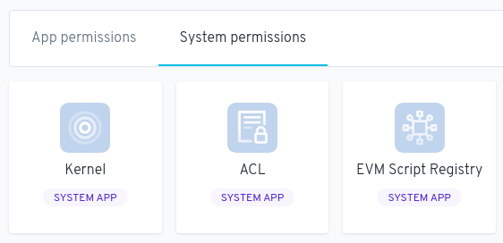
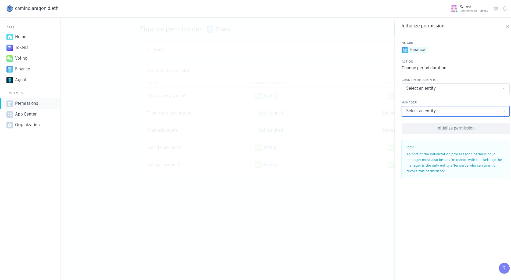

# अनुमतियाँ सेटिंग



इस खंड में, हम अनुमतियाँ सेटिंग की गहराई से खोज करते हैं। आप इस पृष्ठ के अंत में एक समर्पित वीडियो पा सकते हैं।


## अनुमति ऐप क्या है?

अनुमतियाँ ऐप \*\*\*\* का उपयोग उन सभी मौजूदा अनुमतियों को देखने के लिए किया जाता है जो किसी संगठन में सेट की गई हैं और आवश्यकतानुसार अनुमतियाँ जोड़ने या हटाने के लिए उपयोग की जाती हैं।&#x20;

अनुमतियाँ ऐप द्वारा सेट की गई अनुमतियाँ परिभाषित करती हैं कि किन संस्थाओं के पास किसी संगठन में विभिन्न क्रियाओं को करने के लिए कौन सी अनुमतियाँ हैं।&#x20;

उदाहरण के लिए, किसी भी खाते में वोट बनाने की अनुमति हो सकती है लेकिन किसी संगठन में केवल टोकन धारकों के पास वोट डालने की अनुमति हो सकती है।

## ऐप द्वारा ब्राउज़ करें

अनुमति ऐप संगठन में इंस्टॉल किए गए प्रत्येक ऐप की सूची और उस **ऐप का पता या टोकन प्रतीक** दिखाता है। आप ऐप अनुमतियां और सिस्टम अनुमतियां बदल सकते हैं।

### प्रत्येक ऐप में है:

* ऐप पर किए जा **सकने वाले कार्यों की एक सूची**,
* &#x20;उन **कार्रवाइयों की सूची जिन्हें अन्य संस्थाओं को ऐप पर करने की अनुमति दी गई है,**&#x20;
* **अनुमतियों की एक सूची जो ऐप को दी गई है।**


नीचे दी गई छवि उन कार्यों की सूची दिखाती है जिन्हें वित्त ऐप (एक्शन कॉलम) द्वारा निष्पादित किया जा सकता है, अन्य इकाइयां जिनके पास इन कार्यों को करने की अनुमति है (इकाई कॉलम को असाइन किया गया) और जिनके पास इस इकाई को अनुमति देने का अधिकार है (स्तंभ द्वारा प्रबंधित)।


### उदाहरण

अगर हमें वित्त ऐप **\_Create new payments \_** बनाना है, तो यह कार्रवाई वोटिंग ऐप में वोट से होकर गुजरेगी। इसके पीछे कारण यह है कि वित्त ऐप में नया भुगतान बनाएं कार्रवाई वोटिंग इकाई को सौंपी गई है।

### उपलब्ध अनुमतियाँ

उपलब्ध अनुमतियां अनुभाग दिखाता है:

* ऐप पर क्या कार्रवाई की जा सकती है,&#x20;
* **प्रत्येक क्रिया को करने के लिए किस इकाई(**एन्टिटी) **** को अनुमति है,&#x20;
* **कौन सी इकाई(**एन्टिटी) **प्रत्येक क्रिया** का प्रबंधन करती है। इस इकाई को "प्रबंधक" कहा जाता है।

एक **प्रबंधक** के पास यह चुनने की **क्षमता होती है कि किन संस्थाओं को कार्रवाई करने की अनुमति है** (अनुमति असाइन करें) और उस कार्रवाई के **प्रबंधक को बदलने की क्षमता (भूमिका प्रबंधित करें)**। इन क्रियाओं को तीन बिंदुओं के तहत ड्रॉप-डाउन मेनू का उपयोग करके किया जा सकता है।

.png>)

### अनुमतियां असाइन करें

_तीन बिंदुओं_ पर ड्रॉप-डाउन मेनू पर क्लिक करें और _अनुमति प्रदान(_ऐड पर्मिशन) __ करें चुनें। ऑन ऐप मेनू के तहत एक ऐप, एंटिटी को असाइन करें मेनू के तहत एक _एंटिटी और एक एक्शन चुनें(_असाइन एन्टिटी)

### भूमिका प्रबंधित करें

\*\* _तीन बिंदु_ पर ड्रॉप-डाउन मेनू पर क्लिक करें और _**प्रबंधन भूमिका\*\* चुनें।**_ अपडेट\*\*\*\* मेनू के अंतर्गत एक **अपडेट** का चयन करें।


यदि कोई प्रबंधक किसी अन्य निकाय को प्रबंधक भूमिका पुन: असाइन किए बिना अनुमति के प्रबंधक के रूप में स्वयं को हटा देता है, तो उस क्रिया का प्रबंधन डिफ़ॉल्ट रूप से उस निकाय के लिए होता है जो ACL ऐप में **अनुमतियाँ बनाएँ(**क्रीऐट पर्मिशन)**\***\*\*\* क्रिया का प्रबंधन करता है।&#x20;

नीचे दिए गए उदाहरण में, कार्रवाई का प्रबंधन वोटिंग ऐप को सौंपा जाएगा.



यदि कार्रवाई का प्रबंधक 0x0000000000000000000000000000000000000001 के रूप में सेट किया गया है तो कोई नया प्रबंधक सेट नहीं किया जा सकता है और उस क्रिया के लिए दी गई अनुमतियां हमेशा के लिए लॉक हो जाएंगी।


### अनुमति प्रारंभ करें

यदि किसी कार्रवाई को अभी तक प्रबंधक नहीं दिया गया है, तो इसे प्रारंभ किया जाना चाहिए। किसी क्रिया को आरंभ करने के लिए, उस निकाय का पता (अनुमति प्रदान करें) दर्ज करें जिसे आप क्रिया का प्रबंधन करना चाहते हैं, चुनें कि आप किस निकाय को कार्रवाई करने की अनुमति देना चाहते हैं, फिर अनुमति आरंभ करने के लिए _आरंभिक अनुमति_ बटन पर क्लिक करें, यदि आप ऐसा करने की अनुमति है।

### इकाई(एन्टिटी) द्वारा ब्राउज़ करें

मुख्य अनुमति पृष्ठ पर वापस, आपके पास **निकाय(**एन्टिटी) **द्वारा ब्राउज़ करें अनुभाग** में किसी संगठन में सेट की गई सभी अनुमतियों का एक नज़र में दृश्य प्राप्त करने की क्षमता है।&#x20;

यहां, आप तुरंत देख सकते हैं कि किन संस्थाओं को संगठन में कौन-सी कार्रवाई करने की अनुमति दी गई है।

&#x20;\*\* _विवरण देखें(_व्यू डिटैल)_\*\*_ पर क्लिक करने से आप उस इकाई के लिए अनुमति पृष्ठ पर पहुंच जाएंगे।.

### अनुमति जोड़ें

किसी निकाय को किसी ऐप पर कार्रवाई करने की अनुमति देने के लिए, **अनुमति जोड़ें बटन** पर क्लिक करें, चुनें कि आप किस ऐप को इकाई पर कार्रवाई करना चाहते हैं, चुनें कि आप किस इकाई को अनुमति देना चाहते हैं, फिर उस क्रिया का चयन करें जिसे आप चाहते हैं इकाई को प्रदर्शन करने की अनुमति देने के लिए।.

प्रत्येक ऐप में अलग-अलग क्रियाएं होती हैं जिन्हें करने के लिए एक इकाई को अनुमति दी जा सकती है।&#x20;

किसी निकाय को इन ऐप्स पर इन कार्रवाइयों को करने की अनुमति देने से वे निम्न कार्य कर सकेंगे:

#### एसीएल (एक्सेस कंट्रोल लिस्ट**)**

* अनुमतियां बनाएं: ऐसी अनुमतियां बनाएं जो अभी तक किसी भी ऐप में प्रारंभ नहीं हुई हैं जो इस एसीएल इंस्टेंस का उपयोग करती हैं`*`

> `*`_ये कार्रवाइयां बहुत संवेदनशील हैं और संस्था को इन कार्यों को करने की अनुमति देंगी जिससे आपके संगठन का लगभग पूर्ण नियंत्रण हो जाएगा।_

#### ईवीएम (एथेरियम वर्चुअल मशीन) स्क्रिप्ट रजिस्ट्री

* निष्पादक(इग्ज़ेक्यटर) जोड़ें: संगठन में एक निष्पादक जोड़ें&#x20;
* निष्पादकों को सक्षम और अक्षम करें: किसी संगठन में निष्पादकों को सक्षम और अक्षम करें\*`*`

> `*` _ये कार्रवाइयां बहुत संवेदनशील कार्रवाइयां हैं जो इकाई को इन कार्यों को करने की अनुमति देगी, जो आपके संगठन का लगभग पूर्ण नियंत्रण है।_


एक निष्पादक एक संगठन में स्क्रिप्ट चलाने के लिए एक दुभाषिया है। किसी संगठन के सभी ऐप स्क्रिप्ट को निष्पादित करने के लिए संगठन के निष्पादकों का उपयोग करते हैं जो ऐप को भेजे गए लेन-देन का हिस्सा होते हैं। प्रत्येक स्क्रिप्ट में एक पहचानकर्ता होता है जो यह निर्धारित करता है कि स्क्रिप्ट चलाने के लिए किस निष्पादक का उपयोग किया जाता है।&#x20;

उदाहरण के लिए, जब भी वोटिंग ऐप को वोट लेनदेन भेजा जाता है, तो ऐप एक स्क्रिप्ट चलाता है, फिर लेन-देन में स्क्रिप्ट को निष्पादित करने के लिए एक निष्पादक का उपयोग करता है। आप [आरागॉन डेवलपर पोर्टल](https://hack.aragon.org/) में निष्पादकों के बारे में अधिक दस्तावेज प्राप्त कर सकते हैं।


#### गुठली(कर्नल)

* ऐप्स प्रबंधित करें: ऐप्स इंस्टॉल करें, ऐप्स अपग्रेड करें, और किसी संगठन में डिफ़ॉल्ट ऐप्स बदलें। संगठन में ACL और EVM स्क्रिप्ट रजिस्ट्री डिफ़ॉल्ट ऐप हैं। जिसके पास भी इस क्रिया को करने की अनुमति है, वह संगठन के डिफ़ॉल्ट वॉल्ट अनुबंध को भी बदल सकता है (जो कि वह वॉल्ट है जिसे टोकन भेजे जाएंगे यदि टोकन किसी ऐप के पते पर भेजे जाते हैं जो टोकन जमा स्वीकार करने के लिए नहीं है)।  `*`

> `*` ये कार्रवाइयां बहुत संवेदनशील कार्रवाइयां हैं जो इकाई को इन कार्यों को करने की अनुमति देगी, जो आपके संगठन का लगभग पूर्ण नियंत्रण है।

#### टोकन

* टकसाल(मिन्ट) टोकन: नए टोकन बनाएं और उन्हें एक निर्दिष्ट पते पर स्थानांतरित करें&#x20;
* टोकन जारी करें(इशू): नए टोकन बनाएं और उन्हें संगठन के टोकन ऐप में स्थानांतरित करें, बाद में एक निर्दिष्ट इकाई को असाइनमेंट के लिए&#x20;
* टोकन असाइन करें: टोकन ऐप द्वारा रखे गए टोकन को एक निर्दिष्ट इकाई में स्थानांतरित करें निहित रद्द करना: एक निर्दिष्ट इकाई से टोकन निहित रद्द करना&#x20;
* टोकन जलाएं: टोकनधारक द्वारा रखे गए टोकन हटाएं, कुल टोकन आपूर्ति को कम करें

#### मतदान(वोटिंग)

* नए वोट बनाएं: एक नया वोट बनाएं&#x20;
* समर्थन संशोधित करें: समर्थन पैरामीटर को संशोधित करें कोरम&#x20;
* संशोधित करें: न्यूनतम अनुमोदन% पैरामीटर संशोधित करें

\_\_


****

**न्यूनतम स्वीकृति%** कुल टोकन आपूर्ति का प्रतिशत है जो प्रस्ताव के लिए समर्थन प्रस्ताव को वैध माने जाने वाले प्रस्ताव से अधिक होना चाहिए।

&#x20;**उदाहरण 1**

&#x20;यदि न्यूनतम स्वीकृति% 20% पर सेट है, तो बकाया टोकन आपूर्ति के 20% से अधिक को वोट को वैध माने जाने के लिए एक प्रस्ताव को अनुमोदित करने के लिए मतदान करना होगा। यदि कोई वोट गणपूर्ति नहीं करता है, तो यह विफल हो जाएगा, भले ही अधिक टोकन ने प्रस्ताव को मंजूरी देने के लिए मतदान किया हो, इसके खिलाफ मतदान करने से। उदाहरण 2&#x20;

यदि न्यूनतम अनुमोदन% को 20% पर सेट किया जाता है और बकाया टोकन आपूर्ति के 10% को प्रस्ताव के खिलाफ वोट दिया जाता है, लेकिन समर्थन में केवल 15% वोट दिया जाता है, तो प्रस्ताव विफल हो जाएगा क्योंकि यह न्यूनतम अनुमोदन% सीमा तक नहीं पहुंचा है।



_समर्थन_ एक प्रस्ताव पर वोटों का प्रतिशत है कि प्रस्ताव को मंजूरी देने के लिए कुल समर्थन से अधिक होना चाहिए। उदाहरण के लिए, यदि "समर्थन" को 51% पर सेट किया गया है, तो प्रस्ताव पर 51% से अधिक मतों को प्रस्ताव के पारित होने के लिए "हां" में वोट करना होगा।


#### वित्त

* नए भुगतान बनाएं: वित्त ऐप से दूसरी इकाई में स्थानांतरण बनाएं&#x20;
* भुगतान निष्पादित करें: एक इकाई के लिए एक आवर्ती भुगतान को ट्रिगर करें&#x20;
* अवधि बदलें अवधि: लेखा अवधि के बीच सेकंड में अवधि को संशोधित करें&#x20;
* बजट बदलें: संशोधित करें कि दी गई लेखा अवधि के भीतर कितने टोकन खर्च किए जा सकते हैं&#x20;
* भुगतान प्रबंधित करें: आवर्ती भुगतान सक्षम और अक्षम करें

#### वॉल्ट

* वॉल्ट के टोकन ट्रांसफर करें: वॉल्ट ऐप द्वारा रखे गए ट्रांसफर टोकन



> <mark style="color:purple;">क्या आपको कोई प्रश्न पूछना है? हमारे प्रवचन मंच पर अपनी टिप्पणियाँ यहाँ छोड़ें</mark> **👇**


